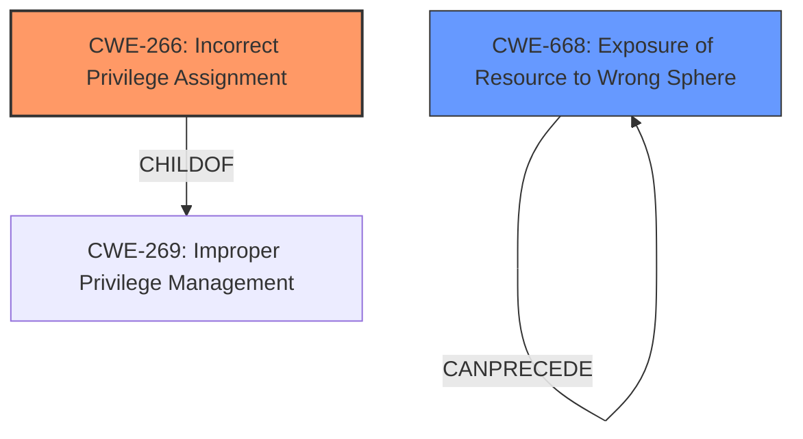

# Raw Analyzer Response for CVE-2024-47761

# Summary
| CWE ID  | CWE Name                                                     | Confidence | CWE Abstraction Level | CWE Vulnerability Mapping Label | CWE-Vulnerability Mapping Notes |
| :------- | :----------------------------------------------------------- | :--------- | :-------------------- | :------------------------------ | :------------------------------ |
| CWE-266 | Incorrect Privilege Assignment                               | 0.85      | Base                  | Primary                         | Allowed                         |
| CWE-668 | Exposure of Resource to Wrong Sphere                         | 0.60      | Class                  | Secondary                       | Discouraged                     |

## Evidence and Confidence

*   **Confidence Score:** 0.80
*   **Evidence Strength:** MEDIUM

## Relationship Analysis
The primary relationship that influenced my decision was the parent-child relationship between CWE-269 (Improper Privilege Management) and CWE-266 (Incorrect Privilege Assignment). While CWE-269 was a top result from the retriever, the provided guidance discourages its use due to its generality. CWE-266, a more specific base-level weakness, aligns better with the root cause of the vulnerability, where an administrator is incorrectly granted the privilege to access password reset notifications for other users.

## Vulnerability Chain
The vulnerability chain starts with the **incorrect privilege assignment** (CWE-266) to an administrator, allowing them access to sensitive password reset notifications. This leads to the **exposure of sensitive information** (CWE-668) within the notifications, which then enables the administrator to **take control of accounts with higher privileges**.

## Summary of Analysis
My analysis is primarily based on the vulnerability description and the CVE Reference Links Content Summary. The key piece of evidence is that "an administrator with access to the sent notifications contents can take control of an account with higher privileges." This indicates a problem with how privileges are assigned, making CWE-266 the most appropriate primary CWE. The retriever results also pointed towards privilege management issues, further supporting this choice. The "Privileges vs Permissions Guidance" helped to confirm that this was a privilege issue and not a permission issue.

I considered CWE-269 (Improper Privilege Management) but chose CWE-266 (Incorrect Privilege Assignment) because it is a more specific, base-level weakness, as guided by MITRE. CWE-269 is too general and is discouraged.

I considered CWE-668 (Exposure of Resource to Wrong Sphere) as a secondary weakness because the password reset notifications are exposed to an administrator who should not have access to them. The administrator is in the wrong control sphere for this resource.

I am confident in this assessment because it directly addresses the **root cause** of the vulnerability, as described in the provided information.

Relevant CWE Information:

# Enhanced Context (25 CWEs)
The following CWEs were identified as potentially relevant to this vulnerability:

## CWE-266: Incorrect Privilege Assignment
**Abstraction Level**: Base
**Similarity Score**: 0.79
**Source**: dense

**Description**:
A product **incorrectly assigns a privilege** to a particular actor, creating an **unintended sphere of control** for that actor.

**Mapping Guidance**:
- Usage: Allowed
- Rationale: This CWE entry is at the Base level of abstraction, which is a preferred level of abstraction for mapping to the root causes of vulnerabilities.

## CWE-668: Exposure of Resource to Wrong Sphere
**Abstraction Level**: Class
**Similarity Score**: 0.75
**Source**: dense

**Description**:
The product exposes a resource to the wrong control sphere, providing unintended actors with inappropriate access to the resource.

**Mapping Guidance**:
- Usage: Discouraged
- Rationale: CWE-668 is high-level and is often misused as a catch-all when lower-level CWE IDs might be applicable. It is sometimes used for low-information vulnerability reports [REF-1287]. It is a level-1 Class (i.e., a child of a Pillar). It is not useful for trend analysis.