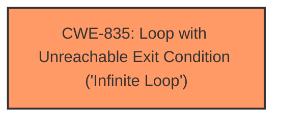

# Analysis for CVE-2024-47794

# Summary
| CWE ID | CWE Name | Confidence | CWE Abstraction Level | CWE Vulnerability Mapping Label | CWE-Vulnerability Mapping Notes |
|---|---|---|---|---|---|
| CWE-835 | Loop with Unreachable Exit Condition ('Infinite Loop') | 1.0 | Base | Allowed | Primary CWE: The vulnerability description explicitly states an **infinite loop** caused by a combination of tail calls and freplace. |

## Evidence and Confidence

*   **Confidence Score:** 1.0
*   **Evidence Strength:** HIGH

## Relationship Analysis
The primary relationship that influenced the decision was the direct match of the vulnerability description to the definition of CWE-835. While other CWEs like CWE-674 (Uncontrolled Recursion) were considered, the description explicitly indicates a looping condition rather than a recursive function call.

## Vulnerability Chain
The vulnerability chain consists of the following:
1.  The **root cause** is the combination of tail calls and freplace, leading to an **infinite loop** due to the tail_call_cnt resetting each time entry_freplace is executed.
2.  The **impact** of this **infinite loop** is a kernel panic.

## Summary of Analysis
The analysis is based on the explicit description of an **infinite loop** within the provided text. The evidence clearly points to CWE-835 as the most appropriate classification.

The vulnerability description states: "There is a potential **infinite loop** issue that can occur when using a combination of tail calls and freplace... This results in an **infinite loop** entry_tc -> subprog_tc -> entry_freplace --tailcall-> entry_tc."

The provided evidence directly supports the selection of CWE-835. The description clearly defines the problem as an **infinite loop**.

Relevant CWE Information:

# Enhanced Context (25 CWEs)
The following CWEs were identified as potentially relevant to this vulnerability:

## CWE-835: Loop with Unreachable Exit Condition ('Infinite Loop')
**Abstraction Level**: Base
**Similarity Score**: 0.73
**Source**: dense

**Description**:
The product contains an iteration or loop with an exit condition that cannot be reached, i.e., an **infinite loop**.

**Mapping Guidance**:
- Usage: Allowed
- Rationale: This CWE entry is at the Base level of abstraction, which is a preferred level of abstraction for mapping to the root causes of vulnerabilities.
###
## Vulnerability Description
In the Linux kernel, the following vulnerability has been resolved bpf Prevent tailcall **infinite loop** caused by freplace There is a potential **infinite loop** issue that can occur when using a combination of tail calls and freplace. In an upcoming selftest, the attach target for entry_freplace of tailcall_freplace.c is subprog_tc of tc_bpf2bpf.c, while the tail call in entry_freplace leads to entry_tc. This results in an **infinite loop** entry_tc -> subprog_tc -> entry_freplace --tailcall-> entry_tc. The problem arises because the tail_call_cnt in entry_freplace resets to zero each time entry_freplace is executed, causing the tail call mechanism to never terminate, eventually leading to a kernel panic. To fix this issue, the solution is twofold 1. Prevent updating a program extended by an freplace program to a prog_array map. 2. Prevent extending a program that is already part of a prog_array map with an freplace program. This ensures that * If a program or its subprogram has been extended by an freplace program, it can no longer be updated to a prog_array map. * If a program has been added to a prog_array map, neither it nor its subprograms can be extended by an freplace program. Moreover, an extension program should not be tailcalled. As such, return -EINVAL if the program has a type of BPF_PROG_TYPE_EXT when adding it to a prog_array map. Additionally, fix a minor code style issue by replacing eight spaces with a tab for proper formatting.

### Vulnerability Description Key Phrases
- **rootcause:** **infinite loop**
- **impact:** kernel panic
- **product:** Linux kernel
- **component:** bpf

## Retriever Results

### Top Combined Results

| Rank | CWE ID | Name | Abstraction | Usage  | Retrievers | Individual Scores |
|------|--------|------|-------------|-------|------------|-------------------|
| 1 | 674 | Uncontrolled Recursion | Class | Allowed-with-Review | sparse | 1.226 |
| 2 | 835 | Loop with Unreachable Exit Condition ('Infinite Loop') | Base | Allowed | sparse | 1.178 |
| 3 | 667 | Improper Locking | Class | Allowed-with-Review | sparse | 1.167 |
| 4 | 457 | Use of Uninitialized Variable | Variant | Allowed | sparse | 1.154 |
| 5 | 770 | Allocation of Resources Without Limits or Throttling | Base | Allowed | sparse | 1.117 |
| 6 | 367 | Time-of-check Time-of-use (TOCTOU) Race Condition | Base | Allowed | sparse | 1.116 |
| 7 | 362 | Concurrent Execution using Shared Resource with Improper Synchronization ('Race Condition') | Class | Allowed-with-Review | sparse | 1.115 |
| 8 | 194 | Unexpected Sign Extension | Variant | Allowed | sparse | 1.109 |
| 9 | 1050 | Excessive Platform Resource Consumption within a Loop | Base | Allowed | dense | 0.460 |
| 10 | 456 | Missing Initialization of a Variable | Variant | Allowed | graph | 0.003 |

## Complete CWE Specifications

CWE-674: Uncontrolled Recursion

CWE-835: Loop with Unreachable Exit Condition ('Infinite Loop')

CWE-667: Improper Locking

CWE-457: Use of Uninitialized Variable

CWE-770: Allocation of Resources Without Limits or Throttling

CWE-367: Time-of-check Time-of-use (TOCTOU) Race Condition

CWE-362: Concurrent Execution using Shared Resource with Improper Synchronization ('Race Condition')

CWE-194: Unexpected Sign Extension

CWE-1050: Excessive Platform Resource Consumption within a Loop

CWE-456: Missing Initialization of a Variable

Based on the above information, provide your analysis. 
Consider the following key aspects:

1. **Content Matching**
   - Match the vulnerability description against CWE descriptions
   - Identify technical indicators that align with specific CWE characteristics
   - Pay special attention to CWEs with high relevance scores

2. **Relationship Analysis**
   - Evaluate hierarchical relationships (ChildOf, ParentOf) to find the optimal level of specificity
   - Examine chain relationships (CanPrecede, CanFollow, RequiredBy, Requires) to identify potential vulnerability chains
   - Consider peer relationships (PeerOf, CanAlsoBe) that may offer alternative classifications
   - Assess abstraction levels (Pillar, Class, Base, Variant) to ensure appropriate granularity

3. **Mapping Guidance Analysis**
   - Consider the official MITRE mapping guidance when selecting CWEs
   - Pay attention to Usage recommendations (ALLOWED, DISCOURAGED, PROHIBITED)
   - Review the provided rationale for mapping decisions
   - Consider suggested alternative mappings where appropriate

4. **Mitigation Analysis**
   - Consider how the potential mitigations align with the vulnerability description
   - Use mitigation information to help understand the nature of the weakness
   - Evaluate whether the mitigations would address the specific vulnerability described

5. **Evidence-Based Decision Making**
   - Use specific evidence from the vulnerability description to justify your classification
   - Consider how relationship context enhances your understanding of the vulnerability
   - Evaluate confidence based on both direct evidence and relationship insights
   - Consider the retriever scores as supporting evidence for your decisions

Your response should be detailed and well-structured, incorporating evidence, relationship analysis, 
mapping guidance, and mitigation insights. Remember to explicitly reference how these factors 
influenced your classification decisions.