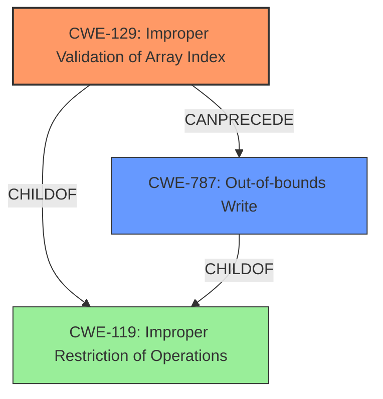

# Enhanced Analysis for CVE-2024-47796

# Summary
| CWE ID | CWE Name | Confidence | CWE Abstraction Level | CWE Vulnerability Mapping Label | CWE-Vulnerability Mapping Notes |
|---|---|---|---|---|---|
| CWE-129 | Improper Validation of Array Index | 0.9 | Variant |  Primary | Allowed |
| CWE-787 | Out-of-bounds Write | 0.8 | Base | Secondary | Allowed |

## Evidence and Confidence

*   **Confidence Score:** 0.85
*   **Evidence Strength:** HIGH

## Relationship Analysis
The primary weakness is **CWE-129 Improper Validation of Array Index**, which directly reflects the **improper array index validation** reported in the vulnerability description. This leads to **CWE-787 Out-of-bounds Write**, a common consequence when array indices are not properly validated. **CWE-129** is a variant, providing a specific view of the issue, while **CWE-787** is a base that shows a potential impact of the **improper validation**. **CWE-129** can precede **CWE-787**.



## Vulnerability Chain
The vulnerability chain begins with **CWE-129 Improper Validation of Array Index**. Due to this **improper validation**, an **out-of-bounds write** occurs (**CWE-787**), leading to potential memory corruption and crashes. The root cause is the **improper array index validation**, with the **out-of-bounds write** being a direct consequence.

## Summary of Analysis
The analysis is primarily based on the provided evidence, specifically the **Vulnerability Description Key Phrases** and the **CVE Reference Links Content Summary**. The vulnerability description explicitly mentions "**improper array index validation**" as the root cause and "**out-of-bounds write**" as the weakness. The CVE summary further confirms the **improper array index validation**.

The graph relationships highlight that **CWE-129** can lead to **CWE-787**. This connection supports the selection of these two CWEs as the primary and secondary aspects of the vulnerability.

**CWE-129** is chosen because it is a Variant level and represents the specific **improper validation** of the array index. **CWE-787** accurately captures the direct consequence of the **improper validation**, which is an **out-of-bounds write**.

Other CWEs Considered but Not Used:

*   **CWE-119 Improper Restriction of Operations within the Bounds of a Memory Buffer**: While relevant, it's a Class-level CWE and less specific than **CWE-129** and **CWE-787**.
*   **CWE-125 Out-of-bounds Read**: The vulnerability description indicates an **out-of-bounds write**, not a read, making **CWE-125** less appropriate.
*   **CWE-190 Integer Overflow or Wraparound**: There is no evidence in the vulnerability description to suggest an integer overflow or wraparound condition.
*   **CWE-1285 Improper Validation of Specified Index, Position, or Offset in Input**: Similar to **CWE-129**, but **CWE-129** focuses specifically on array indices, which is more accurate given the description.
*   **CWE-1284 Improper Validation of Specified Quantity in Input**: This is too general and does not specifically address the array index validation issue.
*   **CWE-122 Heap-based Buffer Overflow**: While a potential consequence, the primary issue is the **improper array index validation**, which leads to the overflow.
*   **CWE-131 Incorrect Calculation of Buffer Size**: There is no evidence to suggest that the buffer size calculation is incorrect; the issue is with the index used to access the buffer.
*   **CWE-193 Off-by-one Error**: There is no specific mention or indication of an off-by-one error in the description.


## CWE Relationship Analysis

Current CWEs represent these abstraction levels: .


### Vulnerability Chain Analysis

**Chain starting from CWE-1284:**
- 1284 (Improper Validation of Specified Quantity in Input) - ROOT


**Chain starting from CWE-125:**
- 125 (Out-of-bounds Read) - ROOT


### CWE Relationship Diagram

```mermaid
graph TD
    classDef primary fill:#f96,stroke:#333,stroke-width:2px
    classDef secondary fill:#69f,stroke:#333
    classDef tertiary fill:#9e9,stroke:#333
```