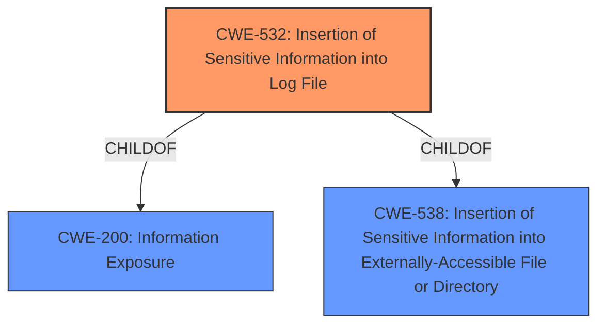

# Enhanced Analysis for CVE-2024-47805

# Summary

| CWE ID  | CWE Name                                                        | Confidence | CWE Abstraction Level | CWE Vulnerability Mapping Label | CWE-Vulnerability Mapping Notes |
| :------- | :-------------------------------------------------------------- | :--------- | :-------------------- | :------------------------------ | :------------------------------ |
| CWE-532 | Insertion of Sensitive Information into Log File                | 0.8        | Base                  | Allowed                         | Primary CWE                     |
| CWE-312 | Cleartext Storage of Sensitive Information                      | 0.6        | Base                  | Allowed                         | Secondary Candidate             |
| CWE-256 | Plaintext Storage of a Password                                 | 0.5        | Base                  | Allowed                         | Secondary Candidate             |
| CWE-522 | Insufficiently Protected Credentials                            | 0.4        | Class                 | Allowed-with-Review             | Secondary Candidate             |

## Evidence and Confidence

*   **Confidence Score:** 0.7
*   **Evidence Strength:** MEDIUM

## Relationship Analysis

The primary relationship that influenced the decision was the hierarchical relationship between CWE-532 (Insertion of Sensitive Information into Log File) and its parent CWEs. While the vulnerability specifically exposes encrypted values, the fact that these values are not properly redacted when accessing the `config.xml` file through the REST API or CLI aligns well with the concept of inserting sensitive information into a location (the `config.xml` file) where it should not be.



## Vulnerability Chain

The vulnerability chain starts with the **improper** handling of sensitive information leading to information exposure.

1.  **Root Cause:** The Credentials Plugin does not properly redact encrypted values of credentials using the `SecretBytes` type. This is a form of **improper** handling of sensitive data.
2.  The sensitive information (`SecretBytes` values) is then inserted into the `config.xml` file.
3.  Exposure: The `config.xml` file is accessible via REST API or CLI, leading to potential exposure of the sensitive information to unauthorized users with Item/Extended Read permissions.

## Summary of Analysis

The initial analysis focused on identifying the root cause of the vulnerability and mapping it to the most appropriate CWE. The primary evidence supporting this analysis comes from the "CVE Reference Links Content Summary," which explicitly states that the plugin "did not redact encrypted values of credentials using the `SecretBytes` type." This indicates a failure to properly handle sensitive data, which aligns with the description of CWE-532.

The retriever results also suggested CWE-256 (Plaintext Storage of a Password) and CWE-522 (Insufficiently Protected Credentials). However, the vulnerability is not about storing passwords in plaintext or generally insufficient protection of credentials. Instead, it's about exposing encrypted values due to a lack of proper redaction during access.

The selection of CWE-532 is based on the evidence that the plugin **inserts** sensitive, albeit encrypted, information into a file (`config.xml`) that is then accessible through specific channels (REST API/CLI). While the information is encrypted, the lack of redaction means that it's still considered exposed.

Other CWEs Considered:

*   CWE-256 (Plaintext Storage of a Password): While related to credential storage, this CWE doesn't accurately reflect the vulnerability because the credentials are not stored in plaintext. They are encrypted, but the encrypted values are exposed due to a **lack** of redaction.
*   CWE-522 (Insufficiently Protected Credentials): This is a broader category, and while it could apply, CWE-532 provides a more specific description of the vulnerability.
*   CWE-312 (Cleartext Storage of Sensitive Information): Similar to CWE-256, this doesn't fit because the data is not stored in cleartext.

Ultimately, CWE-532 was chosen because it best captures the essence of the vulnerability: the **insertion** of sensitive information (encrypted credential values) into a location where it can be improperly accessed due to a **lack** of redaction.

#


## CWE Relationship Analysis

Current CWEs represent these abstraction levels: .


### Vulnerability Chain Analysis

**Chain starting from CWE-538:**
- 538 (Insertion of Sensitive Information into Externally-Accessible File or Directory) - ROOT


**Chain starting from CWE-256:**
- 256 (Plaintext Storage of a Password) - ROOT


### CWE Relationship Diagram

```mermaid
graph TD
    classDef primary fill:#f96,stroke:#333,stroke-width:2px
    classDef secondary fill:#69f,stroke:#333
    classDef tertiary fill:#9e9,stroke:#333
```