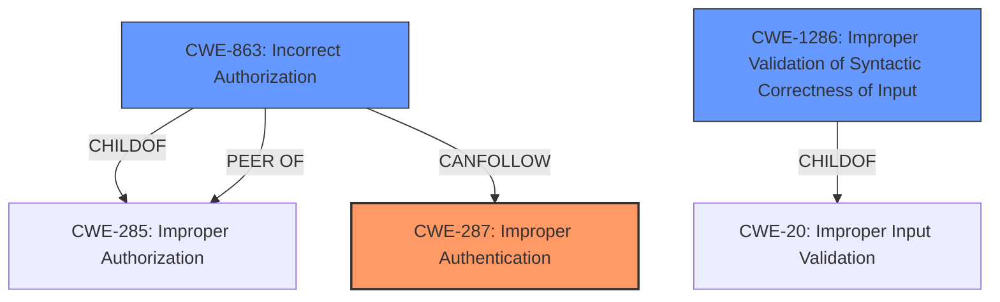

# Analysis Report for CVE-2024-4784

# Vulnerability Analysis Report: CVE-2024-4784

## Description

An issue was discovered in GitLab EE starting from version 16.7 before 17.0.6, version 17.1 before 17.1.4 and 17.2 before 17.2.2 that allowed bypassing the password re-entry requirement to approve a policy.

## Vulnerability Description Key Phrases

- **Impact:** bypass password re-entry requirement to approve policy
- **Product:** GitLab EE
- **Version:** 16.7 before 17.0.6, 17.1 before 17.1.4, 17.2 before 17.2.2

## Analysis (with Relationship Data)

# Summary
| CWE ID | CWE Name | Confidence | CWE Abstraction Level | CWE Vulnerability Mapping Label | CWE-Vulnerability Mapping Notes |
|---|---|---|---|---|---|
| CWE-287 | Improper Authentication | 0.9 | Class | Primary | Discouraged |
| CWE-863 | Incorrect Authorization | 0.7 | Class | Secondary | Allowed-with-Review |
| CWE-1286 | Improper Validation of Syntactic Correctness of Input | 0.6 | Base | Secondary | Allowed |

## Evidence and Confidence

*   **Confidence Score:** 0.8
*   **Evidence Strength:** MEDIUM

## Relationship Analysis
The primary relationship that influenced the CWE selection is the hierarchical relationship between CWE-287 (Improper Authentication) and its potential child CWEs, as well as the relationship between authorization and authentication. Since the vulnerability involves bypassing password re-entry, **Improper Authentication** is the root cause, leading to **Incorrect Authorization**, but it is better to classify the vulnerability under the **Improper Authentication** Class since there is no authentication. Additionally, **Improper Validation of Syntactic Correctness of Input** exists because the application does not validate the password that should have been entered. Abstraction levels were considered, with preference given to Base and Variant levels where possible, but the lack of a direct match led to choosing higher-level Class CWEs.



## Vulnerability Chain
The vulnerability chain starts with the **improper authentication** check, or lack thereof (**CWE-287**). This leads to a bypass of the intended security policy, resulting in **incorrect authorization** (**CWE-863**). The root cause is the **insufficient input validation** (**CWE-1286**) of the password re-entry field.
  - **Root Cause:** **CWE-287 Improper Authentication**, lack of proper password validation.
  - **Weakness:** **CWE-863 Incorrect Authorization**, which allows unauthorized actions.
  - **Enabler:** **CWE-1286 Improper Validation of Syntactic Correctness of Input**.

## Summary of Analysis
The primary assessment focuses on identifying the root cause of the vulnerability as a failure to properly authenticate the user when re-entering their password to approve a policy. The evidence clearly indicates that the password re-entry requirement is bypassed due to a **lack of validation**, making **CWE-287 Improper Authentication** the most appropriate primary classification. The relationship graph highlights how **incorrect authorization** (**CWE-863**) stems from the initial **improper authentication**, forming a chain. While **CWE-863** could be considered, it's more accurately a consequence of the authentication failure.

Supporting Evidence:

*   "allowed bypassing the password re-entry requirement to approve a policy" - This indicates a failure in authentication.
*   "Specifically, when the `require_password_to_approve` setting is enabled in the policy, the approval modal appears to request a password but does not actually validate the provided input." - This confirms the **lack of validation**.

CWEs Considered but Not Used:

*   CWE-285: Improper Authorization - While authorization is affected, the root cause is the bypassed authentication, so this is a secondary effect.
*   CWE-1390: Weak Authentication - This is similar to CWE-287, but CWE-287 is more general and applicable as the password re-entry is completely bypassed, not just weakly authenticated.
*   CWE-639: Authorization Bypass Through User-Controlled Key - This doesn't fit as the bypass isn't happening through a user-controlled key.
*   CWE-472: External Control of Assumed-Immutable Web Parameter - This is not applicable as the password field should not be an immutable field.
*   CWE-1284: Improper Validation of Specified Quantity in Input - This CWE is about validating a quantity, which is not relevant in this context.
*   CWE-78: Improper Neutralization of Special Elements used in an OS Command ('OS Command Injection') - This is unrelated to the vulnerability description.
* CWE-549: Missing Password Field Masking - This relates to password visibility, rather than bypass of password authentication.
* CWE-400: Uncontrolled Resource Consumption - This relates to resource exhaustion, which is not relevant in the context.
* CWE-755: Improper Handling of Exceptional Conditions - This is not the root cause, although it might be triggered by the lack of proper authentication.

The selected CWEs are at the optimal level of specificity given the available evidence. While more specific variants might exist, the current evidence supports the chosen Class and Base CWEs as the most accurate representation of the vulnerability's root cause and contributing factors.


## CWE Relationship Analysis

Current CWEs represent these abstraction levels: .


### Vulnerability Chain Analysis

**Chain starting from CWE-1390:**
- 1390 (Weak Authentication) - ROOT


**Chain starting from CWE-863:**
- 863 (Incorrect Authorization) - ROOT


### CWE Relationship Diagram

```mermaid
graph TD
    classDef primary fill:#f96,stroke:#333,stroke-width:2px
    classDef secondary fill:#69f,stroke:#333
    classDef tertiary fill:#9e9,stroke:#333
```


*Report generated on 2025-07-13 18:32:05*
