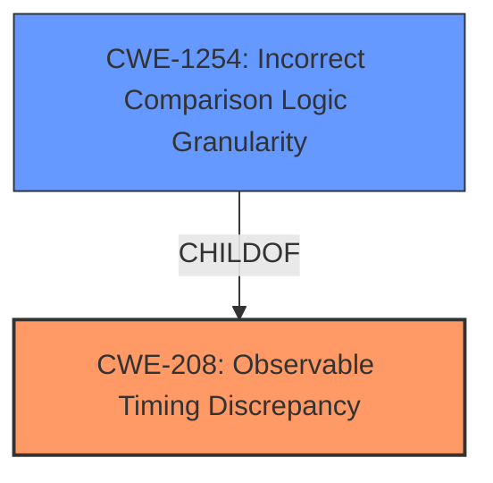

# Analysis Report for CVE-2024-47869

# Vulnerability Analysis Report: CVE-2024-47869

## Description

Gradio is an open-source Python package designed for quick prototyping. This vulnerability involves a ****timing attack**** in the way Gradio compares hashes for the `analytics_dashboard` function. Since the comparison is not done in constant time, an attacker could exploit this by measuring the response time of different requests to infer the correct hash byte-by-byte. This can lead to unauthorized access to the analytics dashboard, especially if the attacker can repeatedly query the system with different keys. Users are advised to upgrade to `gradio>4.44` to mitigate this issue. To mitigate the risk before applying the patch, developers can manually patch the `analytics_dashboard` dashboard to use a **constant-time comparison** function for comparing sensitive values, such as hashes. Alternatively, access to the analytics dashboard can be disabled.

## Vulnerability Description Key Phrases

- **Rootcause:** timing attack
- **Impact:** unauthorized access to the analytics dashboard
- **Product:** Gradio
- **Version:** before 4.44
- **Component:** analytics_dashboard function

## Analysis (with Relationship Data)

# Summary
| CWE ID | CWE Name | Confidence | CWE Abstraction Level | CWE Vulnerability Mapping Label | CWE-Vulnerability Mapping Notes |
|---|---|---|---|---|---|
| CWE-208 | Observable Timing Discrepancy | 1.0 | Base | Allowed | Primary CWE: The vulnerability is due to the **timing attack**.|
| CWE-1254 | Incorrect Comparison Logic Granularity | 0.7 | Base | Allowed | Secondary Candidate: Comparison logic is performed in a non-constant time manner. |

## Evidence and Confidence

*   **Confidence Score:** 0.9
*   **Evidence Strength:** HIGH

## Relationship Analysis
The primary CWE is CWE-208 (**Observable Timing Discrepancy**). CWE-1254 (**Incorrect Comparison Logic Granularity**) is a child of CWE-208, indicating that the granularity of the comparison logic is the specific reason why the timing discrepancy is observable.



## Vulnerability Chain
The vulnerability chain starts with the **incorrect implementation of the hash comparison** within the `analytics_dashboard` function. This leads to a **timing attack** vulnerability, which in turn allows for **unauthorized access** to the analytics dashboard.

1.  **Root Cause:** Non-constant-time hash comparison.
2.  **Weakness:** CWE-208 (**Observable Timing Discrepancy**) because the execution time varies and is observable by an attacker.
3.  **Impact:** Unauthorized access to the analytics dashboard.

## Summary of Analysis
The primary vulnerability is CWE-208 (**Observable Timing Discrepancy**), because the vulnerability arises from the non-constant-time comparison, allowing an attacker to infer information based on the timing. The evidence clearly supports this, as the description states that the **timing attack** allows inference of the correct hash byte-by-byte. CWE-1254 (**Incorrect Comparison Logic Granularity**) is also relevant because the vulnerability exists due to the comparison logic being vulnerable to a timing attack, but CWE-208 is a better fit as it is the more general form of the timing issue, and the high retriever score supports it.

The description provides strong evidence such as, "Since the comparison is not done in constant time, an attacker could exploit this by measuring the response time of different requests to infer the correct hash byte-by-byte." This directly shows the **timing attack** and the ability to observe the discrepancy.

The selected CWEs are at the optimal level of specificity. CWE-208 (**Observable Timing Discrepancy**) accurately describes the general issue of timing discrepancies being observable, while CWE-1254 (**Incorrect Comparison Logic Granularity**) gives more detail.

Relevant CWE Information:

# Enhanced Context (25 CWEs)
The following CWEs were identified as potentially relevant to this vulnerability:

## CWE-208: Observable Timing Discrepancy
**Abstraction Level**: Base
**Similarity Score**: 0.72
**Source**: dense

**Description**:
Two separate operations in a product require different amounts of time to complete, in a way that is observable to an actor and reveals security-relevant information about the state of the product, such as whether a particular operation was successful or not.

**Mapping Guidance**:
- Usage: Allowed
- Rationale: This CWE entry is at the Base level of abstraction, which is a preferred level of abstraction for mapping to the root causes of vulnerabilities.


## CWE-941: Incorrectly Specified Destination in a Communication Channel
**Abstraction Level**: Base
**Similarity Score**: 0.69
**Source**: dense

**Description**:
The product creates a communication channel to initiate an outgoing request to an actor, but it does not correctly specify the intended destination for that actor.

**Mapping Guidance**:
- Usage: Allowed
- Rationale: This CWE entry is at the Base level of abstraction, which is a preferred level of abstraction for mapping to the root causes of vulnerabilities.


## CWE-203: Observable Discrepancy
**Abstraction Level**: Base
**Similarity Score**: 0.67
**Source**: dense

**Description**:
The product behaves differently or sends different responses under different circumstances in a way that is observable to an unauthorized actor, which exposes security-relevant information about the state of the product, such as whether a particular operation was successful or not.

**Mapping Guidance**:
- Usage: Allowed
- Rationale: This CWE entry is at the Base level of abstraction, which is a preferred level of abstraction for mapping to the root causes of vulnerabilities.


## CWE-1286: Improper Validation of Syntactic Correctness of Input
**Abstraction Level**: Base
**Similarity Score**: 0.66
**Source**: dense

**Description**:
The product receives input that is expected to be well-formed - i.e., to comply with a certain syntax - but it does not validate or incorrectly validates that the input complies with the syntax.

**Mapping Guidance**:
- Usage: Allowed
- Rationale: This CWE entry is at the Base level of abstraction, which is a preferred level of abstraction for mapping to the root causes of vulnerabilities.


## CWE-204: Observable Response Discrepancy
**Abstraction Level**: Base
**Similarity Score**: 0.66
**Source**: dense

**Description**:
The product provides different responses to incoming requests in a way that reveals internal state information to an unauthorized actor outside of the intended control sphere.

**Mapping Guidance**:
- Usage: Allowed
- Rationale: This CWE entry is at the Base level of abstraction, which is a preferred level of abstraction for mapping to the root causes of vulnerabilities.


## CWE-367: Time-of-check Time-of-use (TOCTOU) Race Condition
**Abstraction Level**: Base
**Similarity Score**: 0.66
**Source**: dense

**Description**:
The product checks the state of a resource before using that resource, but the resource's state can change between the check and the use in a way that invalidates the results of the check. This can cause the product to perform invalid actions when the resource is in an unexpected state.

**Mapping Guidance**:
- Usage: Allowed
- Rationale: This CWE entry is at the Base level of abstraction, which is a preferred level of abstraction for mapping to the root causes of vulnerabilities.


## CWE-346: Origin Validation Error
**Abstraction Level**: Class
**Similarity Score**: 0.66
**Source**: dense

**Description**:
The product does not properly verify that the source of data or communication is valid.

**Mapping Guidance**:
- Usage: Allowed-with-Review
- Rationale: This CWE entry is a Class and might have Base-level children that would be more appropriate


## CWE-407: Inefficient Algorithmic Complexity
**Abstraction Level**: Class
**Similarity Score**: 0.65
**Source**: dense

**Description**:
An algorithm in a product has an inefficient worst-case computational complexity that may be detrimental to system performance and can be triggered by an attacker, typically using crafted manipulations that ensure that the worst case is being reached.

**Mapping Guidance**:
- Usage: Allowed-with-Review
- Rationale: This CWE entry is a Class and might have Base-level children that would be more appropriate


## CWE-209: Generation of Error Message Containing Sensitive Information
**Abstraction Level**: Base
**Similarity Score**: 0.65
**Source**: dense

**Description**:
The product generates an error message that includes sensitive information about its environment, users, or associated data.

**Mapping Guidance**:
- Usage: Allowed
- Rationale: This CWE entry is at the Base level of abstraction, which is a preferred level of abstraction for mapping to the root causes of vulnerabilities.


## CWE-201: Insertion of Sensitive Information Into Sent Data
**Abstraction Level**: Base
**Similarity Score**: 0.65
**Source**: dense

**Description**:
The code transmits data to another actor, but a portion of the data includes sensitive information that should not be accessible to that actor.

**Mapping Guidance**:
- Usage: Allowed
- Rationale: This CWE entry is at the Base level of abstraction, which is a preferred level of abstraction for mapping to the root causes of vulnerabilities.


## CWE-208: Observable Timing Discrepancy
**Abstraction Level**: Base
**Similarity Score**: 847.48
**Source**: sparse

**Description**:
Two separate operations in a product require different amounts of time to complete, in a way that is observable to an actor and reveals security-relevant information about the state of the product, such as whether a particular operation was successful or not.

**Mapping Guidance**:
- Usage: Allowed
- Rationale: This CWE entry is at the Base level of abstraction, which is a preferred level of abstraction for mapping to the root causes of vulnerabilities.


## CWE-2


## CWE Relationship Analysis

Current CWEs represent these abstraction levels: .


### Vulnerability Chain Analysis

**Chain starting from CWE-203:**
- 203 (Observable Discrepancy) - ROOT


**Chain starting from CWE-407:**
- 407 (Inefficient Algorithmic Complexity) - ROOT


### CWE Relationship Diagram

```mermaid
graph TD
    classDef primary fill:#f96,stroke:#333,stroke-width:2px
    classDef secondary fill:#69f,stroke:#333
    classDef tertiary fill:#9e9,stroke:#333
```


*Report generated on 2025-07-13 18:34:26*
