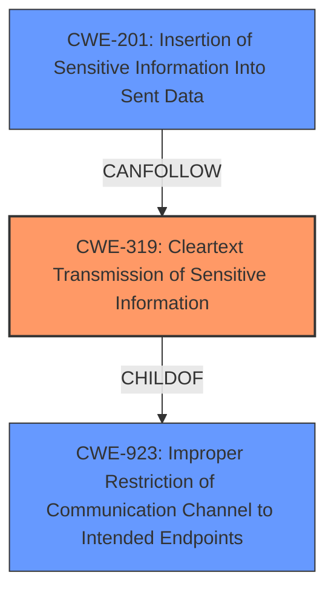

# Analysis Report for CVE-2024-47871

# Vulnerability Analysis Report: CVE-2024-47871

## Description

Gradio is an open-source Python package designed for quick prototyping. This vulnerability involves ****insecure communication**** between the FRP (Fast Reverse Proxy) client and server when Gradios `share=True` option is used. HTTPS is not enforced on the connection, allowing attackers to intercept and read files uploaded to the Gradio server, as well as modify responses or data sent between the client and server. This impacts users who are sharing Gradio demos publicly over the internet using `share=True` without proper encryption, exposing sensitive data to potential eavesdroppers. Users are advised to upgrade to `gradio>=5` to address this issue. As a workaround, users can avoid using `share=True` in production environments and instead host their Gradio applications on servers with HTTPS enabled to ensure secure communication.

## Vulnerability Description Key Phrases

- **Weakness:** insecure communication
- **Impact:** ['intercept and read files uploaded to the Gradio server', 'modify responses or data sent between the client and server']
- **Attacker:** attackers
- **Product:** Gradio
- **Version:** before 5
- **Component:** share=True option

## Analysis (with Relationship Data)

# Summary
| CWE ID | CWE Name | Confidence | CWE Abstraction Level | CWE Vulnerability Mapping Label | CWE-Vulnerability Mapping Notes |
|---|---|---|---|---|---|
| CWE-319 | Cleartext Transmission of Sensitive Information | 0.9 | Base | Allowed | Primary CWE |
| CWE-201 | Insertion of Sensitive Information Into Sent Data | 0.7 | Base | Allowed | Secondary Candidate |
| CWE-923 | Improper Restriction of Communication Channel to Intended Endpoints | 0.6 | Class | Allowed-with-Review | Secondary Candidate |

## Evidence and Confidence

*   **Confidence Score:** 0.8
*   **Evidence Strength:** HIGH

## Relationship Analysis
The primary CWE is CWE-319, which describes the root cause of transmitting sensitive information in cleartext. CWE-201 is a related CWE that can occur when sensitive data is inserted into sent data. CWE-923 is a higher-level class that describes improper restriction of communication channels, and the cleartext transmission can be seen as a specific instance of this.



## Vulnerability Chain
The vulnerability chain starts with **insecure communication** due to the lack of HTTPS enforcement (CWE-319). This leads to the potential **insertion of sensitive information** into transmitted data (CWE-201), which can be intercepted by attackers. The root cause is the **lack of encryption**, and the impact is the exposure of sensitive data and potential modification of data in transit.

## Summary of Analysis
The primary weakness is **insecure communication** which stems from the **lack of HTTPS enforcement**. This aligns directly with CWE-319 (Cleartext Transmission of Sensitive Information). The vulnerability description states, "HTTPS is not enforced on the connection, allowing attackers to intercept and read files uploaded to the Gradio server, as well as modify responses or data sent between the client and server." This provides strong evidence for CWE-319.

CWE-201 (Insertion of Sensitive Information Into Sent Data) is a plausible secondary CWE because the intercepted data could include sensitive information. However, the primary issue is the cleartext transmission itself.

CWE-923 (Improper Restriction of Communication Channel to Intended Endpoints) is a more general class of weakness, and while it could apply, CWE-319 is a more specific and accurate representation of the root cause.

The selected CWEs are at the optimal level of specificity, with CWE-319 being a Base-level CWE that directly addresses the vulnerability's root cause.

CWEs considered but not used:

*   CWE-346 (Origin Validation Error): Not applicable because the issue is not related to origin validation.
*   CWE-212 (Improper Removal of Sensitive Information Before Storage or Transfer): Not applicable because the sensitive information is not being improperly stored or transferred in the context of this vulnerability, but rather transmitted in cleartext.
*   CWE-295 (Improper Certificate Validation): Not applicable as the issue is the absence of HTTPS, not the validation of certificates.
*   CWE-941 (Incorrectly Specified Destination in a Communication Channel): Not applicable because the destination is not incorrectly specified, but the channel is insecure.


## CWE Relationship Analysis

Current CWEs represent these abstraction levels: .


### Vulnerability Chain Analysis

**Chain starting from CWE-295:**
- 295 (Improper Certificate Validation) - ROOT


**Chain starting from CWE-346:**
- 346 (Origin Validation Error) - ROOT


### CWE Relationship Diagram

```mermaid
graph TD
    classDef primary fill:#f96,stroke:#333,stroke-width:2px
    classDef secondary fill:#69f,stroke:#333
    classDef tertiary fill:#9e9,stroke:#333
```


*Report generated on 2025-07-13 18:34:40*
