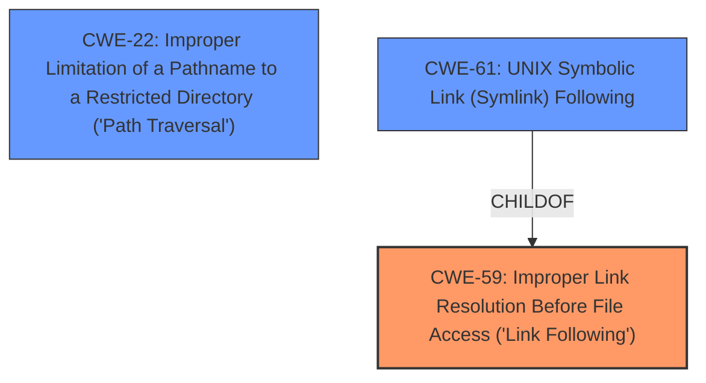

# Raw Analyzer Response for CVE-2024-47877

# Summary
| CWE ID  | CWE Name                                                                 | Confidence | CWE Abstraction Level | CWE Vulnerability Mapping Label | CWE-Vulnerability Mapping Notes |
| :-------- | :----------------------------------------------------------------------- | :---------- | :---------------------- | :------------------------------ | :------------------------------ |
| CWE-59    | Improper Link Resolution Before File Access ('Link Following')          | 0.9         | Base                    | Allowed                       | Primary CWE                   |
| CWE-22    | Improper Limitation of a Pathname to a Restricted Directory ('Path Traversal') | 0.7         | Base                    | Allowed                       | Secondary Candidate             |
| CWE-61    | UNIX Symbolic Link (Symlink) Following                                   | 0.6         | Compound                | Allowed                       | Secondary Candidate             |

## Evidence and Confidence

*   **Confidence Score:** 0.8
*   **Evidence Strength:** HIGH

## Relationship Analysis
The primary relationship is that CWE-59 **Improper Link Resolution Before File Access ('Link Following')** is a parent of CWE-61 **UNIX Symbolic Link (Symlink) Following**. Both CWE-59 and CWE-22 **Improper Limitation of a Pathname to a Restricted Directory ('Path Traversal')** can lead to vulnerabilities related to file system access. CWE-59 is chosen as the primary because the vulnerability description specifically mentions "create a symlink outside the extraction target directory". CWE-22 is related because the **weakness** allows writing outside the target directory, but it doesn't have the explicit symlink focus.

## Vulnerability Chain
The vulnerability chain starts with a maliciously crafted archive containing a symlink. The `extract` library **does not properly** sanitize this symlink, leading to **improper** link resolution and potential path traversal, allowing the attacker to **create symlinks outside the extraction target directory**. This, in turn, can lead to arbitrary file system access and potential privilege escalation.

## Summary of Analysis
The primary CWE is CWE-59 **Improper Link Resolution Before File Access ('Link Following')**, as it directly addresses the core issue of the application **not properly** handling symlinks during archive extraction. This allows an attacker to bypass intended directory restrictions. The evidence supporting this choice is the vulnerability description's mention of creating symlinks outside the extraction directory and the CVE Reference Links Content Summary stating: "The `extract` library fails to properly sanitize symlink paths, allowing an attacker to create symbolic links pointing outside of the intended extraction directory."

CWE-22 **Improper Limitation of a Pathname to a Restricted Directory ('Path Traversal')** is a secondary candidate, as the creation of a symlink outside the target directory also constitutes a path traversal **weakness**. The "CVE Reference Links Content Summary" also states: "The primary vulnerability is a path traversal issue via symlinks."

CWE-61 **UNIX Symbolic Link (Symlink) Following** is another secondary candidate because the vulnerability involves symbolic links on a UNIX-like system.

The retriever results and graph relationships support these choices. CWE-59 is the most relevant, followed by CWE-22 and CWE-61. The final selection is based on the evidence provided in the vulnerability description and CVE details.
The selected CWEs are at the optimal level of specificity, addressing the root cause and associated **weakness**es without being overly broad or abstract.

Relevant CWE Information:

# Enhanced Context (25 CWEs)
The following CWEs were identified as potentially relevant to this vulnerability:

## CWE-59: Improper Link Resolution Before File Access ('Link Following')
**Abstraction Level**: Base
**Similarity Score**: 0.76
**Source**: dense

**Description**:
The product attempts to access a file based on the filename, but it **does not properly** prevent that filename from identifying a link or shortcut that resolves to an unintended resource.

**Mapping Guidance**:
- Usage: Allowed
- Rationale: This CWE entry is at the Base level of abstraction, which is a preferred level of abstraction for mapping to the root causes of vulnerabilities.

## CWE-61: UNIX Symbolic Link (Symlink) Following
**Abstraction Level**: Compound
**Similarity Score**: 0.76
**Source**: dense

**Description**:
The product, when opening a file or directory, **does not sufficiently** account for when the file is a symbolic link that resolves to a target outside of the intended control sphere. This could allow an attacker to cause the product to operate on unauthorized files.

**Mapping Guidance**:
- Usage: Allowed
- Rationale: This is a well-known Composite of multiple **weakness**es that must all occur simultaneously, although it is attack-oriented in nature.

## CWE-23: Relative Path Traversal
**Abstraction Level**: Base
**Similarity Score**: 0.70
**Source**: dense

**Description**:
The product uses external input to construct a pathname that should be within a restricted directory, but it **does not properly** neutralize sequences such as ".." that can resolve to a location that is outside of that directory.

**Mapping Guidance**:
- Usage: Allowed
- Rationale: This CWE entry is at the Base level of abstraction, which is a preferred level of abstraction for mapping to the root causes of vulnerabilities.

## CWE-22: Improper Limitation of a Pathname to a Restricted Directory ('Path Traversal')
**Abstraction Level**: Base
**Similarity Score**: 0.70
**Source**: dense

**Description**:
The product uses external input to construct a pathname that is intended to identify a file or directory that is located underneath a restricted parent directory, but the product **does not properly** neutralize special elements within the pathname that can cause the pathname to resolve to a location that is outside of the restricted directory.

**Mapping Guidance**:
- Usage: Allowed
- Rationale: This CWE entry is at the Base level of abstraction, which is a preferred level of abstraction for mapping to the root causes of vulnerabilities.

## CWE-41: Improper Resolution of Path Equivalence
**Abstraction Level**: Base
**Similarity Score**: 0.70
**Source**: dense

**Description**:
The product is vulnerable to file system contents disclosure through path equivalence. Path equivalence involves the use of special characters in file and directory names. The associated manipulations are intended to generate multiple names for the same object.

**Mapping Guidance**:
- Usage: Allowed
- Rationale: This CWE entry is at the Base level of abstraction, which is a preferred level of abstraction for mapping to the root causes of vulnerabilities.

## CWE-427: Uncontrolled Search Path Element
**Abstraction Level**: Base
**Similarity Score**: 0.69
**Source**: dense

**Description**:
The product uses a fixed or controlled search path to find resources, but one or more locations in that path can be under the control of unintended actors.

**Mapping Guidance**:
- Usage: Allowed
- Rationale: This CWE entry is at the Base level of abstraction, which is a preferred level of abstraction for mapping to the root causes of vulnerabilities.

## CWE-125: Out-of-bounds Read
**Abstraction Level**: Base
**Similarity Score**: 0.69
**Source**: dense

**Description**:
The product reads data past the end, or before the beginning, of the intended buffer.

**Mapping Guidance**:
- Usage: Allowed
- Rationale: This CWE entry is at the Base level of abstraction, which is a preferred level of abstraction for mapping to the root causes of vulnerabilities.

## CWE-668: Exposure of Resource to Wrong Sphere
**Abstraction Level**: Class
**Similarity Score**: 0.68
**Source**: dense

**Description**:
The product exposes a resource to the wrong control sphere, providing unintended actors with inappropriate access to the resource.

**Mapping Guidance**:
- Usage: Discouraged
- Rationale: CWE-668 is high-level and is often misused as a catch-all when lower-level CWE IDs might be applicable. It is sometimes used for low-information vulnerability reports [REF-1287]. It is a level-1 Class (i.e., a child of a Pillar). It is not useful for trend analysis.

## CWE-367: Time-of-check Time-of-use (TOCTOU) Race Condition
**Abstraction Level**: Base
**Similarity Score**: 0.68
**Source**: dense

**Description**:
The product checks the state of a resource before using that resource, but the resource's state can change between the check and the use in a way that invalidates the results of the check. This can cause the product to perform invalid actions when the resource is in an unexpected state.

**Mapping Guidance**: