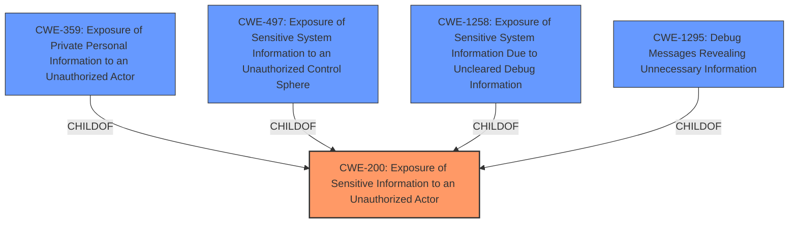

# Analysis for CVE-2024-47915

# Summary

| CWE ID | CWE Name | Confidence | CWE Abstraction Level | CWE Vulnerability Mapping Label | CWE-Vulnerability Mapping Notes |
|---|---|---|---|---|---|
| CWE-200 | Exposure of Sensitive Information to an Unauthorized Actor | 0.9 | Class | Allowed | Primary CWE |

## Evidence and Confidence

*   **Confidence Score:** 0.9
*   **Evidence Strength:** MEDIUM

## Relationship Analysis

The primary relationship considered was the hierarchical structure. CWE-200 is a class-level CWE, and while more specific base or variant CWEs exist (like CWE-359 or CWE-497), the provided description lacks the specific details to justify using them. The analysis considered child CWEs of CWE-200, but none were a sufficiently precise fit given the limited information available.

## Vulnerability Chain

The chain is relatively simple: a **vulnerability** leads to the **Exposure of Sensitive Information to an Unauthorized Actor.** This represents both the root cause and the impact.

## Summary of Analysis

The vulnerability description explicitly states "**impact:** **Exposure of Sensitive Information to an Unauthorized Actor**", pointing directly to CWE-200. While CWE-200 is a class-level CWE and discouraged for use according to MITRE guidance, the provided information is too generic to select a more specific CWE. The retriever results also list CWE-200 as the top candidate.

CWE-359 (**Exposure of Private Personal Information to an Unauthorized Actor**) and CWE-497 (**Exposure of Sensitive System Information to an Unauthorized Control Sphere**) were considered, but they require more specific information about the *type* of sensitive information being exposed (private personal information vs. system information). Since that is missing, the broader CWE-200 is more appropriate.