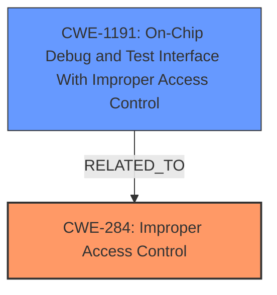

# Analysis Report for CVE-2024-47975

# Vulnerability Analysis Report: CVE-2024-47975

## Description

**Improper access control validation** in firmware of some Solidigm DC Products may allow an attacker with physical access to gain unauthorized access or an attacker with local access to potentially enable denial of service.

## Vulnerability Description Key Phrases

- **Rootcause:** Improper access control validation
- **Impact:** ['denial of service', 'gain unauthorized access']
- **Vector:** physical access
- **Attacker:** ["['attacker with physical access'", "'attacker with local access']"]
- **Product:** Solidigm DC Products

## Analysis (with Relationship Data)

# Summary
| CWE ID  | CWE Name                                                                          | Confidence | CWE Abstraction Level | CWE Vulnerability Mapping Label | CWE-Vulnerability Mapping Notes |
| :-------- | :---------------------------------------------------------------------------------- | :--------- | :---------------------- | :------------------------------ | :------------------------------ |
| CWE-284 | Improper Access Control                                                             | 0.85       | Pillar                  | Primary                         | Discouraged                   |
| CWE-1191 | On-Chip Debug and Test Interface With Improper Access Control                     | 0.75       | Base                    | Secondary                       | Allowed                        |

## Evidence and Confidence

*   **Confidence Score:** 0.80
*   **Evidence Strength:** MEDIUM

## Relationship Analysis
The primary classification is CWE-284, which is a high-level category. The more specific CWE-1191 is related as it describes a particular case of **improper access control** related to on-chip debug interfaces. The hierarchical relationship is that CWE-1191 could be a child of CWE-284, but it is not explicitly defined as such. However, it can be considered a related weakness due to the specific nature of the vulnerability affecting the on-chip debug interface. The abstraction levels influenced the selection because CWE-1191 is at the Base level, providing more specific details than the more abstract CWE-284 which is at the Pillar level.



## Vulnerability Chain
The chain of weaknesses starts with **improper access control validation**, which then leads to unauthorized access or denial of service.

Improper Access Control Validation -> Unauthorized Access / Denial of Service

CWE-284 and CWE-1191 represent the root cause, and unauthorized access and denial of service are the impacts.

## Summary of Analysis
The initial analysis focused on the **improper access control validation** as the root cause, aligning with CWE-284. Given that the vulnerability specifically mentions the **improper access control** in firmware and potentially affecting on-chip debug interfaces, CWE-1191 was considered a valuable addition.

The selection of CWE-284 is primarily based on the vulnerability description that explicitly mentions "**Improper access control validation**". The guidance provided indicates that if the root cause is unclear, CWE-284 is a viable option. However, given the context of the affected product (Solidigm DC Products) and potential for physical/local access, CWE-1191 was considered because it highlights a specific type of access control issue related to on-chip debug and test interfaces.

The evidence supporting this assessment is derived from the vulnerability description which states "**Improper access control validation** in firmware of some Solidigm DC Products may allow an attacker with physical access to gain unauthorized access or an attacker with local access to potentially enable denial of service."

The retriever results also highlight CWE-284 as a top match, further solidifying its selection. The retriever result for CWE-1191 also supports its selection and indicates it may be related to physical access.

The final selection includes both CWE-284 and CWE-1191 to provide a more comprehensive understanding of the vulnerability. CWE-284 serves as the general classification for **improper access control**, while CWE-1191 specifies a potential area of concern within the affected product's firmware.

Relevant CWE Information:

# Enhanced Context (25 CWEs)
The following CWEs were identified as potentially relevant to this vulnerability:

## CWE-345: Insufficient Verification of Data Authenticity
**Abstraction Level**: Class
**Similarity Score**: 0.76
**Source**: dense

**Description**:
The product does not sufficiently verify the origin or authenticity of data, in a way that causes it to accept invalid data.

**Mapping Guidance**:
- Usage: Discouraged
- Rationale: This CWE entry is a level-1 Class (i.e., a child of a Pillar). It might have lower-level children that would be more appropriate

## CWE-280: Improper Handling of Insufficient Permissions or Privileges 
**Abstraction Level**: Base
**Similarity Score**: 0.75
**Source**: dense

**Description**:
The product does not handle or incorrectly handles when it has insufficient privileges to access resources or functionality as specified by their permissions. This may cause it to follow unexpected code paths that may leave the product in an invalid state.

**Mapping Guidance**:
- Usage: Allowed
- Rationale: This CWE entry is at the Base level of abstraction, which is a preferred level of abstraction for mapping to the root causes of vulnerabilities.

## CWE-807: Reliance on Untrusted Inputs in a Security Decision
**Abstraction Level**: Base
**Similarity Score**: 0.75
**Source**: dense

**Description**:
The product uses a protection mechanism that relies on the existence or values of an input, but the input can be modified by an untrusted actor in a way that bypasses the protection mechanism.

**Mapping Guidance**:
- Usage: Allowed
- Rationale: This CWE entry is at the Base level of abstraction, which is a preferred level of abstraction for mapping to the root causes of vulnerabilities.

## CWE-703: Improper Check or Handling of Exceptional Conditions
**Abstraction Level**: Pillar
**Similarity Score**: 0.75
**Source**: dense

**Description**:
The product does not properly anticipate or handle exceptional conditions that rarely occur during normal operation of the product.

**Mapping Guidance**:
- Usage: Discouraged
- Rationale: This CWE entry is extremely high-level, a Pillar.

## CWE-274: Improper Handling of Insufficient Privileges
**Abstraction Level**: Base
**Similarity Score**: 0.75
**Source**: dense

**Description**:
The product does not handle or incorrectly handles when it has insufficient privileges to perform an operation, leading to resultant weaknesses.

**Mapping Guidance**:
- Usage: Discouraged
- Rationale: This CWE entry could be deprecated in a future version of CWE.

## CWE-303: Incorrect Implementation of Authentication Algorithm
**Abstraction Level**: Base
**Similarity Score**: 0.75
**Source**: dense

**Description**:
The requirements for the product dictate the use of an established authentication algorithm, but the implementation of the algorithm is incorrect.

**Mapping Guidance**:
- Usage: Allowed
- Rationale: This CWE entry is at the Base level of abstraction, which is a preferred level of abstraction for mapping to the root causes of vulnerabilities.

## CWE-1263: Improper Physical Access Control
**Abstraction Level**: Class
**Similarity Score**: 0.74
**Source**: dense

**Description**:
The product is designed with access restricted to certain information, but it does not sufficiently protect against an unauthorized actor with physical access to these areas.

**Mapping Guidance**:
- Usage: Allowed-with-Review
- Rationale: This CWE entry is a Class and might have Base-level children that would be more appropriate

## CWE-497: Exposure of Sensitive System Information to an Unauthorized Control Sphere
**Abstraction Level**: Base
**Similarity Score**: 0.74
**Source**: dense

**Description**:
The product does not properly prevent sensitive system-level information from being accessed by unauthorized actors who do not have the same level of access to the underlying system as the product does.

**Mapping Guidance**:
- Usage: Allowed
- Rationale: This CWE entry is at the Base level of abstraction, which is a preferred level of abstraction for mapping to the root causes of vulnerabilities.

## CWE-668: Exposure of Resource to Wrong Sphere
**Abstraction Level**: Class
**Similarity Score**: 0.74
**Source**: dense

**Description**:
The product exposes a resource to the wrong control sphere, providing unintended actors with inappropriate access to the resource.

**Mapping Guidance**:
- Usage: Discouraged
- Rationale: CWE-668 is high-level and is often misused as a catch-all when lower-level CWE IDs might be applicable. It is sometimes used for low-information vulnerability reports [REF-1287]. It is a level-1 Class (i.e., a child of a Pillar). It is not useful for trend analysis.

## CWE-696: Incorrect Behavior Order
**Abstraction Level**: Class
**Similarity Score**: 0.74
**Source**: dense

**Description**:
The product performs multiple related behaviors, but the behaviors are performed in the wrong order in ways which may produce resultant weaknesses.

**Mapping Guidance**:
- Usage: Allowed-with-Review
- Rationale: This CWE entry is a Class and might have Base-level children that would be more appropriate

## CWE-285: Improper Authorization
**Abstraction Level**: Class
**Similarity Score**: 1268.01
**Source**: sparse

**Description**:
The


## CWE Relationship Analysis

Current CWEs represent these abstraction levels: .


### Vulnerability Chain Analysis

**Chain starting from CWE-274:**
- 274 (Improper Handling of Insufficient Privileges) - ROOT


**Chain starting from CWE-280:**
- 280 (Improper Handling of Insufficient Permissions or Privileges ) - ROOT


### CWE Relationship Diagram

```mermaid
graph TD
    classDef primary fill:#f96,stroke:#333,stroke-width:2px
    classDef secondary fill:#69f,stroke:#333
    classDef tertiary fill:#9e9,stroke:#333
```


*Report generated on 2025-07-13 18:39:15*
