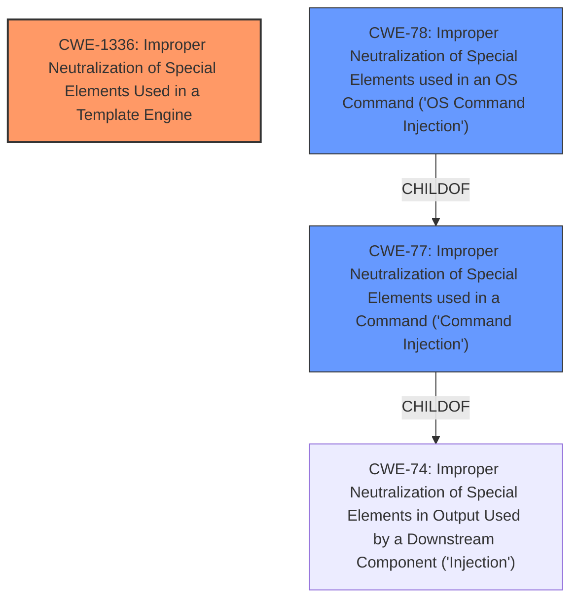

# Analysis Report for CVE-2024-48042

# Vulnerability Analysis Report: CVE-2024-48042

## Description

**Improper Neutralization of Special Elements Used in a Template Engine** vulnerability in Supsystic Contact Form by Supsystic allows Command Injection.This issue affects Contact Form by Supsystic from n/a through 1.7.28.

## Vulnerability Description Key Phrases

- **Rootcause:** Improper Neutralization of Special Elements Used in a Template Engine
- **Weakness:** command injection
- **Product:** Supsystic Contact Form
- **Version:** n/a through 1.7.28

## Analysis (with Relationship Data)

# Summary
| CWE ID  | CWE Name                                                                                   | Confidence | CWE Abstraction Level | CWE Vulnerability Mapping Label | CWE-Vulnerability Mapping Notes |
| :-------- | :----------------------------------------------------------------------------------------- | :---------- | :----------------------- | :------------------------------ | :------------------------------ |
| CWE-1336 | Improper Neutralization of Special Elements Used in a Template Engine                       | 1          | Base                     | Primary                         | Allowed                       |
| CWE-77  | Improper Neutralization of Special Elements used in a Command ('Command Injection')        | 0.7         | Class                    | Secondary                       | Allowed-with-Review           |
| CWE-78  | Improper Neutralization of Special Elements used in an OS Command ('OS Command Injection') | 0.5         | Base                    | Secondary                       | Allowed                      |

## Evidence and Confidence

*   **Confidence Score:** 0.8
*   **Evidence Strength:** HIGH

## Relationship Analysis
The primary CWE is CWE-1336, which is related to code injection via template engines. CWE-77 and CWE-78 are related to command injection, which can be a consequence of improper neutralization in a template engine. The relationship that most influenced the selection was the parent-child relationship between CWE-77 and CWE-74 (Improper Neutralization of Special Elements in Output Used by a Downstream Component ('Injection')), and between CWE-78 and CWE-77. CWE-1336 is more specific than CWE-77 since it identifies the use of template engines as the point of injection.



## Vulnerability Chain
The vulnerability chain starts with **Improper Neutralization of Special Elements Used in a Template Engine** (CWE-1336). This leads to **command injection** (CWE-77), which can further lead to OS Command Injection (CWE-78) allowing for execution of commands on the target website.

## Summary of Analysis
The initial assessment based on the vulnerability description and key phrases strongly pointed towards CWE-1336 as the primary weakness, due to the explicit mention of "Improper Neutralization of Special Elements Used in a Template Engine". The CVE Reference Links Content Summary confirmed the Remote Code Execution (RCE) vulnerability and the presence of an injection vulnerability (A3: Injection from OWASP Top 10).

The graph relationships further solidified this assessment, showing that command injection (CWE-77 and CWE-78) are often consequences of improper neutralization. CWE-1336 provides a more specific root cause by pinpointing the template engine as the source of the injection.

The selected CWEs are at the optimal level of specificity because CWE-1336 directly addresses the root cause (template engine injection), while CWE-77 and CWE-78 describe the type of injection that occurs as a result. The evidence from the vulnerability description, combined with the relationship analysis and the retriever results, supports this classification.

Relevant CWE Information:

# Enhanced Context (25 CWEs)
The following CWEs were identified as potentially relevant to this vulnerability:

## CWE-80: Improper Neutralization of Script-Related HTML Tags in a Web Page (Basic XSS)
**Abstraction Level**: Variant
**Similarity Score**: 0.78
**Source**: dense

**Description**:
The product receives input from an upstream component, but it does not neutralize or incorrectly neutralizes special characters such as "<", ">", and "&" that could be interpreted as web-scripting elements when they are sent to a downstream component that processes web pages.

**Mapping Guidance**:
- Usage: Allowed
- Rationale: This CWE entry is at the Variant level of abstraction, which is a preferred level of abstraction for mapping to the root causes of vulnerabilities.

*This CWE was not selected as it related to XSS, and not Command Injection.*

## CWE-96: Improper Neutralization of Directives in Statically Saved Code ('Static Code Injection')
**Abstraction Level**: Base
**Similarity Score**: 0.76
**Source**: dense

**Description**:
The product receives input from an upstream component, but it does not neutralize or incorrectly neutralizes code syntax before inserting the input into an executable resource, such as a library, configuration file, or template.

**Mapping Guidance**:
- Usage: Allowed
- Rationale: This CWE entry is at the Base level of abstraction, which is a preferred level of abstraction for mapping to the root causes of vulnerabilities.

*This CWE was not selected as it is less specific than CWE-1336.*

## CWE-1336: Improper Neutralization of Special Elements Used in a Template Engine
**Abstraction Level**: Base
**Similarity Score**: 0.76
**Source**: dense

**Description**:
The product uses a template engine to insert or process externally-influenced input, but it does not neutralize or incorrectly neutralizes special elements or syntax that can be interpreted as template expressions or other code directives when processed by the engine.

**Mapping Guidance**:
- Usage: Allowed
- Rationale: This CWE entry is at the Base level of abstraction, which is a preferred level of abstraction for mapping to the root causes of vulnerabilities.

*This CWE was selected as the primary CWE.*

## CWE-74: Improper Neutralization of Special Elements in Output Used by a Downstream Component ('Injection')
**Abstraction Level**: Class
**Similarity Score**: 0.75
**Source**: dense

**Description**:
The product constructs all or part of a command, data structure, or record using externally-influenced input from an upstream component, but it does not neutralize or incorrectly neutralizes special elements that could modify how it is parsed or interpreted when it is sent to a downstream component.

**Mapping Guidance**:
- Usage: Discouraged
- Rationale: CWE-74 is high-level and often misused when lower-level weaknesses are more appropriate.

*This CWE was not selected as it is too high-level.*

## CWE-1236: Improper Neutralization of Formula Elements in a CSV File
**Abstraction Level**: Base
**Similarity Score**: 0.75
**Source**: dense

**Description**:
The product saves user-provided information into a Comma-Separated Value (CSV) file, but it does not neutralize or incorrectly neutralizes special elements that could be interpreted as a command when the file is opened by a spreadsheet product.

**Mapping Guidance**:
- Usage: Allowed
- Rationale: This CWE entry is at the Base level of abstraction, which is a preferred level of abstraction for mapping to the root causes of vulnerabilities.

*This CWE was not selected as it related to CSV files, and not Command Injection.*

## CWE-138: Improper Neutralization of Special Elements
**Abstraction Level**: Class
**Similarity Score**: 0.75
**Source**: dense

**Description**:
The product receives input from an upstream component, but it does not neutralize or incorrectly neutralizes special elements that could be interpreted as control elements or syntactic markers when they are sent to a downstream component.

**Mapping Guidance**:
- Usage: Discouraged
- Rationale: This CWE entry is a level-1 Class (i.e., a child of a Pillar). It might have lower-level children that would be more appropriate

*This CWE was not selected as it is too high-level.*

## CWE-116: Improper Encoding or Escaping of Output
**Abstraction Level**: Class
**Similarity Score**: 0.74
**Source**: dense

**Description**:
The product prepares a structured message for communication with another component, but encoding or escaping of the data is either missing or done incorrectly. As a result, the intended structure of the message is not preserved.

**Mapping Guidance**:
- Usage: Allowed-with-Review
- Rationale: This CWE entry is a Class and might have Base-level children that would be more appropriate

*This CWE was not selected as it related to encoding issues, and not Command Injection.*

## CWE-472: External Control of Assumed-Immutable Web Parameter
**Abstraction Level**: Base
**Similarity Score**: 0.74
**Source**: dense

**Description**:
The web application does not sufficiently verify inputs that are assumed to be immutable but are actually externally controllable, such as hidden form fields.

**Mapping Guidance**:
- Usage: Allowed
- Rationale: This CWE entry is at the Base level of abstraction, which is a preferred level of abstraction


## CWE Relationship Analysis

Current CWEs represent these abstraction levels: .


### Vulnerability Chain Analysis

**Chain starting from CWE-116:**
- 116 (Improper Encoding or Escaping of Output) - ROOT


**Chain starting from CWE-77:**
- 77 (Improper Neutralization of Special Elements used in a Command ('Command Injection')) - ROOT


### CWE Relationship Diagram

```mermaid
graph TD
    classDef primary fill:#f96,stroke:#333,stroke-width:2px
    classDef secondary fill:#69f,stroke:#333
    classDef tertiary fill:#9e9,stroke:#333
```


*Report generated on 2025-07-13 18:41:26*
