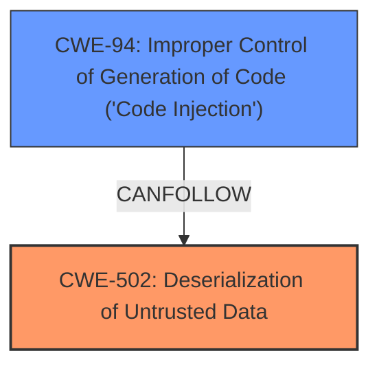

# Analysis Report for CVE-2024-48063

# Vulnerability Analysis Report: CVE-2024-48063

## Description

In PyTorch <=2.4.1, the RemoteModule has Deserialization RCE. NOTE this is disputed by multiple parties because this is intended behavior in PyTorch distributed computing.

## Vulnerability Description Key Phrases

- **Weakness:** deserialization
- **Impact:** ['RCE', 'remote code execution']
- **Product:** PyTorch
- **Version:** <= 2.4.1
- **Component:** RemoteModule

## Analysis (with Relationship Data)

# Summary
| CWE ID | CWE Name | Confidence | CWE Abstraction Level | CWE Vulnerability Mapping Label | CWE-Vulnerability Mapping Notes |
|---|---|---|---|---|---|
| CWE-502 | Deserialization of Untrusted Data | 1.0 | Base | Primary | Allowed |
| CWE-94 | Improper Control of Generation of Code ('Code Injection') | 0.7 | Base | Secondary | Allowed-with-Review |

## Evidence and Confidence

*   **Confidence Score:** 0.85
*   **Evidence Strength:** HIGH

## Relationship Analysis
The primary relationship that influenced my decision was the parent-child relationship between CWE-94 and CWE-502. CWE-502, Deserialization of Untrusted Data, can lead to CWE-94, Improper Control of Generation of Code ('Code Injection'), if the deserialized data contains malicious code. The vulnerability description explicitly mentions "deserialization RCE" and the "ability to inject malicious commands," strengthening this connection. The abstraction levels were also considered, preferring the Base level for both CWEs as they best represent the root cause and its immediate consequence.



## Vulnerability Chain
The vulnerability chain starts with **deserialization** of untrusted data (CWE-502). This **deserialization** leads to the improper control of code generation, resulting in code injection (CWE-94). The final impact is remote code execution (RCE).

CWE-502 (Root Cause) -> CWE-94 (Impact) -> RCE

## Summary of Analysis
The initial analysis focused on identifying the root cause and immediate impact of the vulnerability. The vulnerability description clearly indicates that the issue stems from **deserialization** and results in remote code execution. The "CVE Reference Links Content Summary" section provides strong evidence, stating that the vulnerability arises from "lack of proper sanitization or validation of data being deserialized" and the "ability to inject malicious commands."

Based on this evidence, CWE-502 (Deserialization of Untrusted Data) was selected as the primary CWE because it directly addresses the root cause. The description of CWE-502, "The product deserializes untrusted data without sufficiently ensuring that the resulting data will be valid," aligns perfectly with the vulnerability description.

CWE-94 (Improper Control of Generation of Code ('Code Injection')) was selected as a secondary CWE, as it represents the immediate consequence of the **deserialization** vulnerability. The evidence for this comes from the CVE summary, which mentions "command injection" and the ability to "execute arbitrary code."

The relationship between CWE-502 and CWE-94 further supports this classification. Deserialization of untrusted data can directly lead to code injection if the deserialized data contains malicious code.

The retriever results also support this classification, with CWE-502 being the top-ranked CWE. Other CWEs were considered but ultimately not selected because they did not accurately represent the root cause or immediate impact of the vulnerability. For example, CWE-22 (Improper Limitation of a Pathname to a Restricted Directory ('Path Traversal')) was considered due to the term "path," but it doesn't accurately reflect the **deserialization** nature of the vulnerability.

The final decision is based on a combination of direct evidence from the vulnerability description, relationship analysis, and retriever results. The selected CWEs are at the optimal level of specificity, representing both the root cause and immediate impact of the vulnerability.

Relevant CWE Information:

# Enhanced Context (25 CWEs)
The following CWEs were identified as potentially relevant to this vulnerability:

## CWE-502: Deserialization of Untrusted Data
**Abstraction Level**: Base
**Similarity Score**: 0.72
**Source**: dense

**Description**:
The product deserializes untrusted data without sufficiently ensuring that the resulting data will be valid.

**Mapping Guidance**:
- Usage: Allowed
- Rationale: This CWE entry is at the Base level of abstraction, which is a preferred level of abstraction for mapping to the root causes of vulnerabilities.

**How the Vulnerability Details Match:** The vulnerability description explicitly states that the issue is related to **deserialization** and that the product does not sufficiently ensure the validity of the resulting data.
**Security Implications and Potential Impact:** This can lead to remote code execution (RCE), as the attacker can inject malicious code during **deserialization**.
**Parent-Child Relationships or Chain Patterns:** This can lead to code injection (CWE-94).
**Whether the Weakness is Primary or Secondary in the Vulnerability:** This is the primary weakness.
**How the Official MITRE Mapping Guidance Influenced Your Decision:** The usage is "Allowed" and the rationale mentions that it is at the Base level of abstraction, which is preferred.

## CWE-94: Improper Control of Generation of Code ('Code Injection')
**Abstraction Level**: base
**Similarity Score**: 2.28
**Source**: graph

**Description**:
CWE-94: Improper Control of Generation of Code ('Code Injection')

**Mapping Guidance**:
- Usage: Allowed-with-Review
- Rationale: This entry is frequently misused for vulnerabilities with a technical impact of "code execution," which does not by itself indicate a root cause weakness, since dozens of weaknesses can enable code execution.

**How the Vulnerability Details Match:** The "CVE Reference Links Content Summary" states that there is "command injection".
**Security Implications and Potential Impact:** The potential impact is that an attacker can run arbitrary code on the system.
**Parent-Child Relationships or Chain Patterns:** This can be a result of CWE-502.
**Whether the Weakness is Primary or Secondary in the Vulnerability:** This is a secondary weakness and a consequence of the primary weakness CWE-502.
**How the Official MITRE Mapping Guidance Influenced Your Decision:** The usage is "Allowed-with-Review", indicating that this entry needs to be considered carefully. Since the root cause is due to deserialization of untrusted data (CWE-502), and that leads to code injection (CWE-94), the usage of Allowed-with-Review is appropriate in this situation.

### Other CWEs Considered but Not Used

*   **CWE-95: Improper Neutralization of Directives in Dynamically Evaluated Code ('Eval Injection')**: While related to code execution, it's more specific to 'eval' calls, which wasn't specified in the vulnerability description. Therefore, it was considered less accurate than CWE-94.
*   **CWE-22: Improper Limitation of a Pathname to a Restricted Directory ('Path Traversal')**: This was considered due to the possibility of file path manipulation during deserialization, but the core issue is the deserialization itself, not path traversal.
*   **CWE-73: External Control of File Name or Path**: Similar to CWE-22, this relates to file path manipulation, but the root cause remains **deserialization**.


## CWE Relationship Analysis

Current CWEs represent these abstraction levels: .


### Vulnerability Chain Analysis

**Chain starting from CWE-502:**
- 502 (Deserialization of Untrusted Data) - ROOT


**Chain starting from CWE-94:**
- 94 (Improper Control of Generation of Code ('Code Injection')) - ROOT


### CWE Relationship Diagram

```mermaid
graph TD
    classDef primary fill:#f96,stroke:#333,stroke-width:2px
    classDef secondary fill:#69f,stroke:#333
    classDef tertiary fill:#9e9,stroke:#333
```


*Report generated on 2025-07-13 18:42:01*
