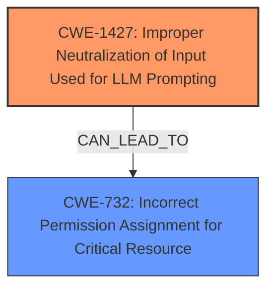

# Enhanced Analysis for CVE-2024-48144

# Summary
| CWE ID | CWE Name | Confidence | CWE Abstraction Level | CWE Vulnerability Mapping Label | CWE-Vulnerability Mapping Notes |
|---|---|---|---|---|---|
| CWE-1427 | Improper Neutralization of Input Used for LLM Prompting | 1.0 | Base | Allowed | Primary CWE |
| CWE-732 | Incorrect Permission Assignment for Critical Resource | 0.5 | Base | Allowed | Secondary Candidate |

## Evidence and Confidence

*   **Confidence Score:** 0.9
*   **Evidence Strength:** HIGH

## Relationship Analysis
The primary CWE is CWE-1427, which directly addresses the **prompt injection** vulnerability. There is no parent-child or chain relationship that directly applies. However, the impact suggests that unauthorized data access and exfiltration are possible, potentially linking to access control issues. The retriever results and vulnerability description clearly point to **prompt injection** as the root cause, so CWE-1427 is the most appropriate base-level weakness.



## Vulnerability Chain
The vulnerability chain starts with the **improper neutralization** of input used for LLM prompting (CWE-1427), leading to unauthorized access and exfiltration of data, potentially exploiting incorrect permission assignments (CWE-732). The root cause is clearly the **prompt injection** flaw.
- **Root Cause:** CWE-1427: Improper Neutralization of Input Used for LLM Prompting
- **Impact:** CWE-732: Incorrect Permission Assignment for Critical Resource (Potential Data Leakage)

## Summary of Analysis
The initial analysis correctly identified CWE-1427 as the primary weakness based on the clear description of a **prompt injection** vulnerability. The **lack of proper sanitization** and the ability to manipulate the AI's behavior through crafted messages directly align with CWE-1427. The secondary consideration of CWE-732 stems from the impact of data leakage, but the core issue remains the **prompt injection**. The final decision is strongly supported by the vulnerability description, CVE reference links, and retriever results. CWE-1427 is at the optimal level of specificity (Base) for this vulnerability.

Relevant CWE Information:

# Enhanced Context (25 CWEs)
The following CWEs were identified as potentially relevant to this vulnerability:

## CWE-1427: Improper Neutralization of Input Used for LLM Prompting
**Abstraction Level**: Base
**Similarity Score**: 0.72
**Source**: dense

**Description**:
The product uses externally-provided data to build prompts provided to
large language models (LLMs), but the way these prompts are constructed
causes the LLM to fail to distinguish between user-supplied inputs and
developer provided system directives.

**Mapping Guidance**:
- Usage: Allowed
- Rationale: This CWE entry is at the Base level of abstraction, which is a preferred level of abstraction for mapping to the root causes of vulnerabilities.

**CWE-1427:** This CWE is the best fit because the vulnerability is a **prompt injection** in a chatbox of an AI assistant. The vulnerability description explicitly states that an attacker can **access and exfiltrate all previous and subsequent chat data** via a crafted message, which matches the description of CWE-1427. The CVE Reference Links Content Summary confirms that the root cause is a **lack of proper sanitization or validation of user-provided input** in the chatbox. This allows an attacker to inject malicious prompts that the AI processes as commands rather than regular text. Confidence: 1.0

## CWE-138: Improper Neutralization of Special Elements
**Abstraction Level**: Class
**Similarity Score**: 0.70
**Source**: dense

**Description**:
The product receives input from an upstream component, but it does not neutralize or incorrectly neutralizes special elements that could be interpreted as control elements or syntactic markers when they are sent to a downstream component.

**Mapping Guidance**:
- Usage: Discouraged
- Rationale: This CWE entry is a level-1 Class (i.e., a child of a Pillar). It might have lower-level children that would be more appropriate

**CWE-138:** This CWE is too general. While it relates to improper neutralization, it doesn't capture the specific context of LLM **prompt injection**. Confidence: 0.2

## CWE-116: Improper Encoding or Escaping of Output
**Abstraction Level**: Class
**Similarity Score**: 0.70
**Source**: dense

**Description**:
The product prepares a structured message for communication with another component, but encoding or escaping of the data is either missing or done incorrectly. As a result, the intended structure of the message is not preserved.

**Mapping Guidance**:
- Usage: Allowed-with-Review
- Rationale: This CWE entry is a Class and might have Base-level children that would be more appropriate

**CWE-116:** This CWE is not the best fit because it relates to encoding or escaping of output, whereas the vulnerability is due to a **lack of sanitization of input** that is used to construct prompts. Confidence: 0.2

## CWE-74: Improper Neutralization of Special Elements in Output Used by a Downstream Component ('Injection')
**Abstraction Level**: Class
**Similarity Score**: 0.70
**Source**: dense

**Description**:
The product constructs all or part of a command, data structure, or record using externally-influenced input from an upstream component, but it does not neutralize or incorrectly neutralizes special elements that could modify how it is parsed or interpreted when it is sent to a downstream component.

**Mapping Guidance**:
- Usage: Discouraged
- Rationale: CWE-74 is high-level and often misused when lower-level weaknesses are more appropriate.

**CWE-74:** This CWE is too high-level. It doesn't specifically address the **prompt injection** aspect. Confidence: 0.2

## CWE-451: User Interface (UI) Misrepresentation of Critical Information
**Abstraction Level**: Class
**Similarity Score**: 0.69
**Source**: dense

**Description**:
The user interface (UI) does not properly represent critical information to the user, allowing the information - or its source - to be obscured or spoofed. This is often a component in phishing attacks.

**CWE-451:** This CWE is not relevant as the vulnerability does not involve UI misrepresentation. Confidence: 0.1

## CWE-472: External Control of Assumed-Immutable Web Parameter
**Abstraction Level**: Base
**Similarity Score**: 0.69
**Source**: dense

**Description**:
The web application does not sufficiently verify inputs that are assumed to be immutable but are actually externally controllable, such as hidden form fields.

**CWE-472:** This CWE is not directly applicable because it refers to externally controlled parameters, while the vulnerability is about **prompt injection** via the chatbox. Confidence: 0.1

## CWE-941: Incorrectly Specified Destination in a Communication Channel
**Abstraction Level**: Base
**Similarity Score**: 0.69
**Source**: dense

**Description**:
The product creates a communication channel to initiate an outgoing request to an actor, but it does not correctly specify the intended destination for that actor.

**CWE-941:** This CWE does not align with the vulnerability. The issue is not with incorrectly specified destinations in a communication channel. Confidence: 0.1

## CWE-93: Improper Neutralization of CRLF Sequences ('CRLF Injection')
**Abstraction Level**: Base
**Similarity Score**: 0.68
**Source**: dense

**Description**:
The product uses CRLF (carriage return line feeds) as a special element, e.g. to separate lines or records, but it does not neutralize or incorrectly neutralizes CRLF sequences from inputs.

**CWE-93:** This CWE is not relevant as the vulnerability is not related to CRLF injection. Confidence: 0.1

## CWE-80: Improper Neutralization of Script-Related HTML Tags in a Web Page (Basic XSS)
**Abstraction Level**: Variant
**Similarity Score**: 0.68
**Source**: dense

**Description**:
The product receives input from an upstream component, but it does not neutralize or incorrectly neutralizes special characters such as "<", ">", and "&" that could be interpreted as web-scripting elements when they are sent to a downstream component that processes web pages.

**CWE-80:** This CWE relates to Cross-Site Scripting (XSS), which is not the primary issue. The main problem is **prompt injection**, not the injection of HTML tags. Confidence: 0.1

## CWE-184: Incomplete List of Disallowed Inputs
**Abstraction Level**: Base
**Similarity Score**:


## CWE Relationship Analysis

Current CWEs represent these abstraction levels: .


### Vulnerability Chain Analysis

**Chain starting from CWE-116:**
- 116 (Improper Encoding or Escaping of Output) - ROOT


**Chain starting from CWE-732:**
- 732 (Incorrect Permission Assignment for Critical Resource) - ROOT


### CWE Relationship Diagram

```mermaid
graph TD
    classDef primary fill:#f96,stroke:#333,stroke-width:2px
    classDef secondary fill:#69f,stroke:#333
    classDef tertiary fill:#9e9,stroke:#333
```