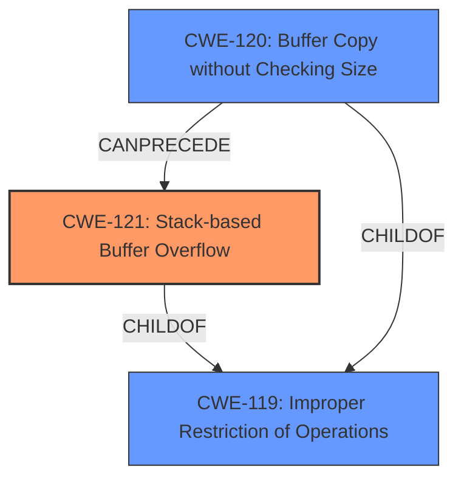

# Analysis Report for CVE-2024-48150

# Vulnerability Analysis Report: CVE-2024-48150

## Description

D-Link DIR-820L 1.05B03 has a **stack overflow** vulnerability in the sub_451208 function.

## Vulnerability Description Key Phrases

- **Weakness:** stack overflow
- **Product:** D-Link DIR-820L
- **Version:** 1.05B03
- **Component:** sub_451208 function

## Analysis (with Relationship Data)

# Summary

| CWE ID | CWE Name | Confidence | CWE Abstraction Level | CWE Vulnerability Mapping Label | CWE-Vulnerability Mapping Notes |
|---|---|---|---|---|---|
| CWE-121 | Stack-based Buffer Overflow | 1.0 | Variant |  Primary CWE | Allowed |

## Evidence and Confidence

*   **Confidence Score:** 1.0
*   **Evidence Strength:** HIGH

## Relationship Analysis
The primary relationship that influenced the decision was the hierarchical relationship. CWE-121 "Stack-based Buffer Overflow" is a variant of the more general buffer overflow weaknesses. The selection of the variant provides a more specific classification of the vulnerability.



## Vulnerability Chain
The vulnerability chain is straightforward: a **stack overflow** occurs in the `sub_451208` function. This leads to potential code execution or denial of service.

## Summary of Analysis
The vulnerability description clearly indicates a **stack overflow** vulnerability in the `sub_451208` function of the D-Link DIR-820L device. The primary evidence is the phrase "**stack overflow**" in the vulnerability description, as well as the CWE for similar CVE Descriptions.
Given the information, CWE-121 "Stack-based Buffer Overflow" is the most appropriate CWE. It is a variant-level CWE, providing a specific classification for the **stack overflow**. The other CWEs were not selected because they didn't match the **stack overflow** root cause.

Relevant CWE Information:

# Enhanced Context (25 CWEs)
The following CWEs were identified as potentially relevant to this vulnerability:

## CWE-121: Stack-based Buffer Overflow
**Abstraction Level**: Variant
**Similarity Score**: 0.69
**Source**: dense

**Description**:
A stack-based buffer overflow condition is a condition where the buffer being overwritten is allocated on the stack (i.e., is a local variable or, rarely, a parameter to a function).

**Mapping Guidance**:
- Usage: Allowed
- Rationale: This CWE entry is at the Variant level of abstraction, which is a preferred level of abstraction for mapping to the root causes of vulnerabilities.


## CWE Relationship Analysis

Current CWEs represent these abstraction levels: .


### Vulnerability Chain Analysis

**Chain starting from CWE-119:**
- 119 (Improper Restriction of Operations within the Bounds of a Memory Buffer) - ROOT


**Chain starting from CWE-121:**
- 121 (Stack-based Buffer Overflow) - ROOT


### CWE Relationship Diagram

```mermaid
graph TD
    classDef primary fill:#f96,stroke:#333,stroke-width:2px
    classDef secondary fill:#69f,stroke:#333
    classDef tertiary fill:#9e9,stroke:#333
```


*Report generated on 2025-07-13 18:45:01*
