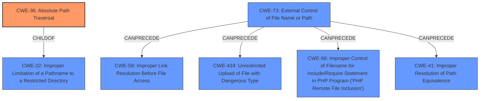

# Raw Analyzer Response for CVE-2024-48248

# Summary

| CWE ID | CWE Name | Confidence | CWE Abstraction Level | CWE Vulnerability Mapping Label | CWE-Vulnerability Mapping Notes |
|---|---|---|---|---|---|
| CWE-36 | Absolute Path Traversal | 1.0 | Base | Allowed | Primary CWE |
| CWE-73 | External Control of File Name or Path | 0.7 | Base | Allowed | Secondary Candidate |

## Evidence and Confidence

*   **Confidence Score:** 0.9
*   **Evidence Strength:** HIGH

## Relationship Analysis

The primary CWE is CWE-36, Absolute Path Traversal, which is a specific type of path traversal vulnerability. CWE-73, External Control of File Name or Path, is a broader category encompassing path traversal, but CWE-36 is more precise given the vulnerability description explicitly mentions absolute path traversal. There is a parent-child relationship between CWE-22 (Improper Limitation of a Pathname to a Restricted Directory) and CWE-36 as CWE-36 is a type of CWE-22. CWE-73 can precede CWE-59, CWE-434, CWE-98, and CWE-41.

## Vulnerability Chain

The vulnerability chain begins with the **improper handling of user-supplied input** for the file path. This leads directly to **CWE-36, Absolute Path Traversal**, allowing an attacker to read arbitrary files. The impact of this is potential remote code execution due to exposure of cleartext credentials.

## Summary of Analysis

The primary classification is CWE-36, Absolute Path Traversal. This is based on the vulnerability description explicitly stating "**absolute path traversal**" and the CVE Reference Links Content Summary confirming that the `getImageByPath` method takes a user-supplied path and directly uses it to read a file, without proper input validation.

CWE-73, External Control of File Name or Path, was also considered because the vulnerability involves external control of the file path. However, since the description specifically mentions "absolute path traversal", CWE-36 is a more specific and accurate representation of the weakness and the first in the vulnerability chain.

The retriever results also listed CWE-22, Improper Limitation of a Pathname to a Restricted Directory ('Path Traversal') and CWE-23, Relative Path Traversal. While these are related to path traversal, the explicit mention of "absolute path" in the vulnerability description makes CWE-36 the most accurate choice.

The final selection of CWE-36 is at the optimal level of specificity, representing the root cause of the vulnerability.

Relevant CWE Information:

**CWE-36: Absolute Path Traversal**

*   **Technical Explanation:** The application directly uses an absolute file path provided by the user without proper validation, allowing access to files outside the intended directory.
*   **Security Implications:** This allows an attacker to read arbitrary files on the system, potentially including sensitive data such as configuration files, credentials, or other user data.
*   **Relationship:** ChildOf CWE-22 (Improper Limitation of a Pathname to a Restricted Directory).
*   **Primary Weakness:** Yes, this is the root cause of the vulnerability.
*   **Mapping Guidance:** Allowed.

**CWE-73: External Control of File Name or Path**

*   **Technical Explanation:** The application allows user input to control or influence paths or file names that are used in filesystem operations. In this case, the user-provided path is used to retrieve an image.
*   **Security Implications:** An attacker can manipulate the file path to access unintended files, potentially leading to information disclosure or other attacks.
*   **Relationship:** Parent of many path traversal related CWEs.
*   **Primary Weakness:** No, CWE-36 is more specific.
*   **Mapping Guidance:** Allowed.