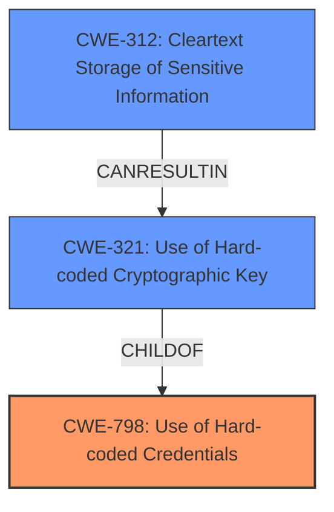

# Raw Analyzer Response for CVE-2024-48353

# Summary
| CWE ID | CWE Name | Confidence | CWE Abstraction Level | CWE Vulnerability Mapping Label | CWE-Vulnerability Mapping Notes |
|---|---|---|---|---|---|
| CWE-798 | Use of Hard-coded Credentials | 1.0 | Base | Allowed | Primary CWE. The server **uses hard-coded credentials** which can be extracted to decrypt passwords. |
| CWE-321 | Use of Hard-coded Cryptographic Key | 0.9 | Variant | Allowed | Secondary CWE. The hard-coded credential is specifically a **cryptographic key** used for decryption. |
| CWE-312 | Cleartext Storage of Sensitive Information | 0.7 | Base | Allowed | Secondary CWE. The passwords are, in effect, being **stored in cleartext** because the key is readily available. |

## Evidence and Confidence

*   **Confidence Score:** 0.9
*   **Evidence Strength:** HIGH

## Relationship Analysis
The primary weakness is the use of hard-coded credentials (CWE-798). This leads to the exposure of cryptographic keys (CWE-321) which in turn allows for the decryption of passwords that are effectively stored in cleartext (CWE-312). The relationship is hierarchical, with CWE-321 being a specific type of CWE-798.

## Vulnerability Chain
The vulnerability chain starts with the **hard-coded credentials** (CWE-798), specifically a **cryptographic key** (CWE-321), which allows attackers to decrypt passwords resulting in **cleartext storage of sensitive information** (CWE-312).

## Summary of Analysis
The primary weakness is the use of hard-coded credentials, which is a cryptographic key. This allows attackers to decrypt passwords, effectively storing them in cleartext.

The selection is based on the provided evidence: "attackers to obtain static key information from a front-end JS file and decrypt the plaintext passwords based on the obtained key information."

CWE-798 (Use of Hard-coded Credentials) is the most accurate root cause, as it describes the fundamental issue of embedding credentials directly in the code. CWE-321 (Use of Hard-coded Cryptographic Key) is included because the specific hard-coded credential is a cryptographic key. CWE-312 (Cleartext Storage of Sensitive Information) describes the final impact of the vulnerability, since the passwords are being decrypted.

Other CWEs Considered and Rejected:

*   CWE-256 (Plaintext Storage of a Password): While the passwords are ultimately decrypted, the root cause isn't simply storing them in plaintext. It's the **hard-coded key** that enables the decryption.
*   CWE-319 (Cleartext Transmission of Sensitive Information): This doesn't apply as the issue is related to storage and decryption, not transmission.