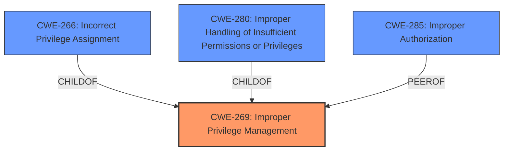

# Enhanced Analysis for CVE-2024-48828

# Summary
| CWE ID | CWE Name | Confidence | CWE Abstraction Level | CWE Vulnerability Mapping Label | CWE-Vulnerability Mapping Notes |
|---|---|---|---|---|---|
| CWE-269 | Improper Privilege Management | 0.75 | Class | Primary CWE | Discouraged |

## Evidence and Confidence

*   **Confidence Score:** 0.75
*   **Evidence Strength:** MEDIUM

## Relationship Analysis
The primary identified CWE is CWE-269 (Improper Privilege Management), which is a class-level CWE. Several other CWEs were considered, including more specific Base-level CWEs like CWE-266 (Incorrect Privilege Assignment) and CWE-280 (Improper Handling of Insufficient Permissions or Privileges). However, based on the provided description, the root cause of the vulnerability is generally described as an "Improper Privilege Management" issue, without specifying the exact mechanism. Therefore, while less specific, CWE-269 is chosen as the best fit. The retriever results show CWE-269 at the top.



## Vulnerability Chain
The vulnerability chain consists of:
1.  **Root Cause:** **Improper Privilege Management** (CWE-269)
2.  **Impact:** Unauthorized access.

The provided information is limited in detail; therefore, a more specific chain cannot be constructed.

## Summary of Analysis
The initial assessment identified CWE-269 (Improper Privilege Management) as the primary weakness based on the vulnerability description and the CVE reference links. The vulnerability description clearly states "***Improper Privilege Management*** vulnerability".

The analysis considered the MITRE mapping guidance and the retriever results. While CWE-269 is a class-level CWE and is generally discouraged, the lack of specific information about the underlying cause makes it difficult to assign a more specific base-level CWE. The evidence points to a general failure in managing privileges, leading to unauthorized access.

The confidence level is 0.75 because while the high-level root cause is clear, the specific implementation details are not available, preventing a more precise mapping to a base-level CWE.
Relevant CWE Information:

# Enhanced Context (25 CWEs)
The following CWEs were identified as potentially relevant to this vulnerability:

## CWE-266: Incorrect Privilege Assignment
**Abstraction Level**: Base
**Similarity Score**: 0.80
**Source**: dense

**Description**:
A product incorrectly assigns a privilege to a particular actor, creating an unintended sphere of control for that actor.

**Mapping Guidance**:
- Usage: Allowed
- Rationale: This CWE entry is at the Base level of abstraction, which is a preferred level of abstraction for mapping to the root causes of vulnerabilities.

*This CWE was considered but not selected because the description doesn't specify an incorrect assignment, but rather a general improper management.*

## CWE-280: Improper Handling of Insufficient Permissions or Privileges 
**Abstraction Level**: Base
**Similarity Score**: 0.80
**Source**: dense

**Description**:
The product does not handle or incorrectly handles when it has insufficient privileges to access resources or functionality as specified by their permissions. This may cause it to follow unexpected code paths that may leave the product in an invalid state.

**Mapping Guidance**:
- Usage: Allowed
- Rationale: This CWE entry is at the Base level of abstraction, which is a preferred level of abstraction for mapping to the root causes of vulnerabilities.

*This CWE was considered but not selected because the description doesn't specify an incorrect handling of insufficient privileges, but rather a general improper management.*

## CWE-285: Improper Authorization
**Abstraction Level**: Class
**Similarity Score**: 1738.50
**Source**: sparse

**Description**:
The product does not perform or incorrectly performs an authorization check when an actor attempts to access a resource or perform an action.

**Mapping Guidance**:
- Usage: Discouraged
- Rationale: CWE-285 is high-level and lower-level CWEs can frequently be used instead. It is a level-1 Class (i.e., a child of a Pillar).

*This CWE was considered but not selected because the description doesn't specify an authorization bypass, but rather a general improper management.*


## CWE Relationship Analysis

Current CWEs represent these abstraction levels: .


### Vulnerability Chain Analysis

**Chain starting from CWE-266:**
- 266 (Incorrect Privilege Assignment) - ROOT


**Chain starting from CWE-280:**
- 280 (Improper Handling of Insufficient Permissions or Privileges ) - ROOT


### CWE Relationship Diagram

```mermaid
graph TD
    classDef primary fill:#f96,stroke:#333,stroke-width:2px
    classDef secondary fill:#69f,stroke:#333
    classDef tertiary fill:#9e9,stroke:#333
```