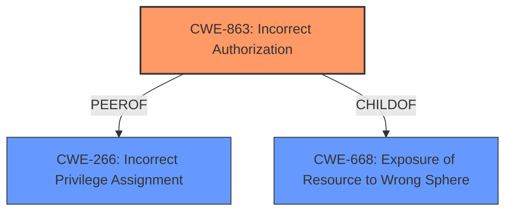

# Analysis Report for CVE-2024-48921

# Vulnerability Analysis Report: CVE-2024-48921

## Description

Kyverno is a policy engine designed for Kubernetes. A kyverno ClusterPolicy, ie. disallow-privileged-containers, can be overridden by the creation of a PolicyException in a random namespace. By design, **PolicyExceptions are consumed from any namespace**. Administrators may not recognize that this allows users with privileges to non-kyverno namespaces to create exceptions. This vulnerability is fixed in 1.13.0.

## Vulnerability Description Key Phrases

- **Rootcause:** PolicyExceptions are consumed from any namespace
- **Impact:** override Kyverno ClusterPolicy
- **Attacker:** users with privileges to non-kyverno namespaces
- **Product:** Kyverno
- **Version:** before 1.13.0

## Analysis (with Relationship Data)

# Summary
| CWE ID   | CWE Name                                                                                    | Confidence | CWE Abstraction Level | CWE Vulnerability Mapping Label | CWE-Vulnerability Mapping Notes |
| -------- | ------------------------------------------------------------------------------------------- | ---------- | --------------------- | ------------------------------- | ------------------------------- |
| CWE-863  | Incorrect Authorization                                                                     | 0.9        | Class                 | Primary CWE                     | Allowed-with-Review           |
| CWE-266  | Incorrect Privilege Assignment                                                              | 0.7        | Base                  | Secondary Candidate              | Allowed                       |
| CWE-668  | Exposure of Resource to Wrong Sphere                                                        | 0.6        | Class                 | Secondary Candidate              | Discouraged                    |

## Evidence and Confidence

*   **Confidence Score:** 0.8
*   **Evidence Strength:** HIGH

## Relationship Analysis
The primary relationship influencing my decision is the hierarchical one, specifically focusing on finding the most specific CWE to describe the authorization flaw. While several CWEs relate to privilege and permission issues, CWE-863's description of an incorrect authorization check aligns best with the vulnerability. CWE-266 is a possible, more specific Base level CWE, however the evidence doesn't strongly suggest a privilege *assignment* problem, as much as an authorization *check* problem. CWE-668 is a higher level Class which is less specific.



## Vulnerability Chain
The vulnerability chain starts with the **rootcause**: Kyverno **PolicyExceptions are consumed from any namespace**. This leads to **Incorrect Authorization** (CWE-863), where users in non-kyverno namespaces can create exceptions, overriding intended policies. The impact is the ability to bypass security policies.

## Summary of Analysis
The primary CWE is CWE-863 (Incorrect Authorization) because the **PolicyExceptions are consumed from any namespace**, which allows users to bypass intended security policies. This indicates an authorization issue, where the check to determine if a user can create a `PolicyException` is flawed. The evidence for this is the vulnerability description itself: "**PolicyExceptions are consumed from any namespace**". This means that the authorization logic is not correctly restricting the creation of these exceptions to only authorized users or namespaces.

CWE-266 (Incorrect Privilege Assignment) was considered because the vulnerability involves users in non-kyverno namespaces being able to create exceptions. However, the core issue is not that the users are assigned the wrong privileges, but rather that the authorization check for creating `PolicyException` objects is flawed. Therefore, CWE-863 is a more accurate fit.

CWE-668 (Exposure of Resource to Wrong Sphere) was also considered because the vulnerability involves `PolicyException` objects being accessible from any namespace, but it is a high-level Class CWE and is less specific than CWE-863.

My assessment is based on the provided evidence, and the graph relationships influenced my selection by highlighting the hierarchical relationships between the candidate CWEs. CWE-863 is at the optimal level of specificity because it accurately describes the authorization flaw, where the check to determine if a user can create a `PolicyException` is flawed.


## CWE Relationship Analysis

Current CWEs represent these abstraction levels: .


### Vulnerability Chain Analysis

**Chain starting from CWE-863:**
- 863 (Incorrect Authorization) - ROOT


**Chain starting from CWE-668:**
- 668 (Exposure of Resource to Wrong Sphere) - ROOT


### CWE Relationship Diagram

```mermaid
graph TD
    classDef primary fill:#f96,stroke:#333,stroke-width:2px
    classDef secondary fill:#69f,stroke:#333
    classDef tertiary fill:#9e9,stroke:#333
```


*Report generated on 2025-07-13 19:04:07*
