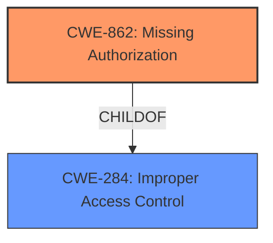

# Analysis Report for CVE-2024-48955

# Vulnerability Analysis Report: CVE-2024-48955

## Description

Broken access control in NetAdmin 4.030319 returns data with functionalities on the endpoint that assembles the functionalities menus, the return of this call is not encrypted and as the system **does not validate the session authorization**, an attacker can copy the content of the browser of a user with greater privileges having access to the functionalities of the user that the code was copied.

## Vulnerability Description Key Phrases

- **Rootcause:** ['broken access control', 'does not validate the session authorization']
- **Impact:** obtain data and functionalities of a user with greater privileges
- **Attacker:** attacker
- **Product:** NetAdmin
- **Version:** 4.030319

## Analysis (with Relationship Data)

# Summary
| CWE ID  | CWE Name | Confidence | CWE Abstraction Level | CWE Vulnerability Mapping Label | CWE-Vulnerability Mapping Notes |
| ------------- | ------------- | ------------- | ------------- | ------------- | ------------- |
| CWE-862 | Missing Authorization | 1.0 | Base | Primary | Allowed |
| CWE-284 | Improper Access Control | 0.8 | Class | Secondary | Allowed |

## Evidence and Confidence

*   **Confidence Score:** 0.9
*   **Evidence Strength:** HIGH

## Relationship Analysis
The primary weakness is **CWE-862 [Missing Authorization]**, which is a Base level CWE. It directly reflects the **root cause** as the system **does not validate the session authorization**. **CWE-284 [Improper Access Control]** is a Class-level CWE and a parent of CWE-862, representing a broader category of access control issues. The relationship is that the **missing authorization** leads to **improper access control**.



## Vulnerability Chain
The vulnerability chain starts with the **lack of session validation**, leading to **missing authorization checks**, which ultimately results in an **attacker obtaining data and functionalities of a user with greater privileges**.

CWE-862 (Missing Authorization) -> CWE-284 (Improper Access Control) -> Information Disclosure/Privilege Escalation

## Summary of Analysis
The primary **root cause** of this vulnerability is the **lack of session authorization validation**, as explicitly stated in the vulnerability description: "the system **does not validate the session authorization**". This maps directly to **CWE-862 [Missing Authorization]**, which describes a situation where the product does not perform an authorization check when an actor attempts to access a resource or perform an action. This missing check allows an attacker to bypass security measures and gain unauthorized access.
The impact of this **missing authorization** is that an attacker can "obtain data and functionalities of a user with greater privileges." This is a direct consequence of the **missing authorization** check, as the system **does not validate** whether the user is authorized to access the requested resources. **CWE-284 [Improper Access Control]** is considered a secondary CWE because it describes the general class of the vulnerability, while the **root cause** is specifically **CWE-862 [Missing Authorization]**.

The retriever results consistently highlight authorization-related CWEs, especially **CWE-863 [Incorrect Authorization]**, **CWE-285 [Improper Authorization]**, and **CWE-862 [Missing Authorization]**. However, **CWE-862 [Missing Authorization]** is a more accurate representation of the **root cause** because the description explicitly states that the system **does not validate session authorization**, which means that there is no authorization check performed at all, rather than an incorrect one.

The relationship between **CWE-862 [Missing Authorization]** and **CWE-284 [Improper Access Control]** is that **CWE-862 [Missing Authorization]** is a specific type of **improper access control**. Since the vulnerability description clearly points to a **missing authorization** check as the **root cause**, **CWE-862 [Missing Authorization]** is the more appropriate primary CWE.

**CWE-863 [Incorrect Authorization]**, **CWE-295 [Improper Certificate Validation]**, **CWE-1390 [Weak Authentication]**, **CWE-285 [Improper Authorization]**, **CWE-327 [Use of a Broken or Risky Cryptographic Algorithm]**, **CWE-284 [Improper Access Control]**, **CWE-639 [Authorization Bypass Through User-Controlled Key]**, and **CWE-497 [Exposure of Sensitive System Information to an Unauthorized Control Sphere]** were considered but not used as the primary CWE. They either represent a higher-level abstraction, are not as directly related to the **root cause**, or are related to different types of vulnerabilities.


## CWE Relationship Analysis

Current CWEs represent these abstraction levels: .


### Vulnerability Chain Analysis

**Chain starting from CWE-1390:**
- 1390 (Weak Authentication) - ROOT


**Chain starting from CWE-863:**
- 863 (Incorrect Authorization) - ROOT


### CWE Relationship Diagram

```mermaid
graph TD
    classDef primary fill:#f96,stroke:#333,stroke-width:2px
    classDef secondary fill:#69f,stroke:#333
    classDef tertiary fill:#9e9,stroke:#333
```


*Report generated on 2025-07-13 19:07:14*
