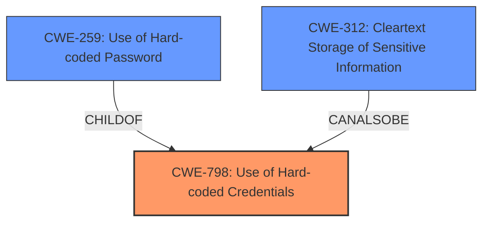

# Analysis Report for CVE-2024-48971

# Vulnerability Analysis Report: CVE-2024-48971

## Description

The Clinician Password and Serial Number Clinician Password are hard-coded into the ventilator in plaintext form. This could allow an attacker to obtain the password off the ventilator and use it to gain unauthorized access to the device, with clinician privileges.

## Vulnerability Description Key Phrases

- **Rootcause:** hardcoded password
- **Impact:** ['gain unauthorized access', 'unauthorized access to device with clinician privileges']
- **Attacker:** attacker
- **Product:** ventilator

## Analysis (with Relationship Data)

# Summary
| CWE ID  | CWE Name                                                  | Confidence | CWE Abstraction Level | CWE Vulnerability Mapping Label | CWE-Vulnerability Mapping Notes |
| :-------- | :-------------------------------------------------------- | :--------- | :-------------------- | :------------------------------ | :------------------------------ |
| CWE-798 | Use of Hard-coded Credentials                             | 1          | Base                  | Primary CWE                     | Allowed                       |
| CWE-259 | Use of Hard-coded Password                                | 0.9        | Variant               | Secondary Candidate             | Allowed                       |
| CWE-312 | Cleartext Storage of Sensitive Information                | 0.7        | Base                  | Secondary Candidate             | Allowed                       |

## Evidence and Confidence

*   **Confidence Score:** 0.9
*   **Evidence Strength:** HIGH

## Relationship Analysis
The primary relationship influencing the CWE selection is the hierarchical relationship between CWE-798 (Base) and CWE-259 (Variant). CWE-259 is a more specific case of CWE-798, but the description explicitly mentions "credentials" including the serial number, so the broader CWE-798 is most accurate. The relationship between CWE-312 and CWE-798 was also considered, as the hardcoded credentials are in plaintext, but CWE-798 is a more direct fit for the **root cause** of the vulnerability.



## Vulnerability Chain
The vulnerability chain starts with the **hardcoded credentials** (CWE-798), which allows an attacker to gain unauthorized access to the device with clinician privileges. This could lead to information disclosure and/or disruption of the device's function.

## Summary of Analysis
The primary CWE identified is CWE-798, "Use of Hard-coded Credentials". This is based on the explicit statement in the vulnerability description that "The Clinician Password and Serial Number Clinician Password are **hard-coded** into the ventilator in plaintext form." This aligns directly with the CWE description: "The product contains **hard-coded credentials**, such as a password or cryptographic key." The "CVE Reference Links Content Summary" section also confirms this by stating, "The Clinician Password and Serial Number Clinician Password are **hard-coded** into the ventilator in plaintext form." and listing "Use of Hard-Coded Credentials (CWE-798)" as a weakness.

CWE-259, "Use of Hard-coded Password," was considered as a more specific variant of CWE-798. However, since the description mentions both a password *and* a serial number being hardcoded, CWE-798 is a more accurate representation of the vulnerability.

CWE-312, "Cleartext Storage of Sensitive Information," was also considered because the hardcoded credentials are in plaintext form. While this is a related concern, the root cause is the use of hardcoded credentials, not the storage method. Therefore, CWE-798 is the primary weakness, and CWE-312 is a secondary concern.

The selection of CWE-798 is at the optimal level of specificity (Base) as it directly addresses the root cause of the vulnerability without being overly broad or narrow. The evidence directly supports this classification, and the retriever results also suggest CWE-798 as a relevant candidate.

Relevant CWE Information:


## CWE Relationship Analysis

Current CWEs represent these abstraction levels: .


### Vulnerability Chain Analysis

**Chain starting from CWE-259:**
- 259 (Use of Hard-coded Password) - ROOT


**Chain starting from CWE-312:**
- 312 (Cleartext Storage of Sensitive Information) - ROOT


### CWE Relationship Diagram

```mermaid
graph TD
    classDef primary fill:#f96,stroke:#333,stroke-width:2px
    classDef secondary fill:#69f,stroke:#333
    classDef tertiary fill:#9e9,stroke:#333
```


*Report generated on 2025-07-13 19:07:49*
