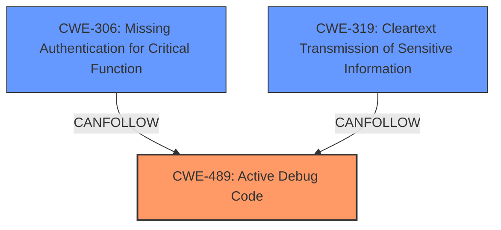

# Raw Analyzer Response for CVE-2024-48973

# Summary
| CWE ID | CWE Name | Confidence | CWE Abstraction Level | CWE Vulnerability Mapping Label | CWE-Vulnerability Mapping Notes |
|---|---|---|---|---|---|
| **CWE-489** | **Active Debug Code** | 0.9 | Base | Allowed | Primary CWE. The **debug port enabled by default** is the root cause. |
| CWE-306 | Missing Authentication for Critical Function | 0.7 | Base | Allowed | Secondary candidate, since the debug port lacks authentication. |
| CWE-319 | Cleartext Transmission of Sensitive Information | 0.6 | Base | Allowed | Secondary candidate, as the debug port transmits unencrypted messages. |

## Evidence and Confidence

*   **Confidence Score:** 0.8
*   **Evidence Strength:** HIGH

## Relationship Analysis
The primary CWE is CWE-489 (Active Debug Code), representing the root cause of the vulnerability.
CWE-306 (Missing Authentication for Critical Function) is a potential related weakness, as the debug port lacks authentication for critical functions.
CWE-319 (Cleartext Transmission of Sensitive Information) is another related weakness, as the debug port transmits unencrypted messages.
CWE-489 is a base-level CWE, which is appropriate for mapping the root cause.
CWE-306 and CWE-319 are also base-level CWEs, providing a suitable level of detail.

## Vulnerability Chain
The vulnerability chain starts with the **debug port enabled by default** (CWE-489). This leads to a missing authentication for critical functions (CWE-306), and cleartext transmission of sensitive information (CWE-319). The ultimate impact is unauthorized disclosure of information and/or unintended impacts on device settings and performance.

## Summary of Analysis
The primary weakness is the **debug port enabled by default** (CWE-489). This allows an attacker to send and receive messages over the debug port. The lack of authentication (CWE-306) and the cleartext transmission (CWE-319) exacerbate the issue.

The evidence for CWE-489 is that "The debug port on the ventilators serial interface is **enabled by default**".
The evidence for CWE-306 is that the debug port allows sending and receiving messages without authentication, impacting device settings and performance.
The evidence for CWE-319 is that messages sent over the debug port are unencrypted.

The retriever results suggested CWE-1299 (Missing Protection Mechanism for Alternate Hardware Interface), but this is not as accurate as CWE-489, as the core issue is the active debug code rather than a missing protection mechanism.

CWE-923 (Improper Restriction of Communication Channel to Intended Endpoints) was considered, but the problem isn't necessarily that the channel is open to unintended endpoints, but that the debug functionality is enabled in the first place without proper controls.

CWE-1295 (Debug Messages Revealing Unnecessary Information) was considered but deemed less relevant than CWE-489, because the vulnerability allows full control via the debug port, not just information leakage via debug messages.

Based on the evidence and the relationships between the CWEs, CWE-489, CWE-306, and CWE-319 are the most appropriate classifications.

Relevant CWE Information:

# Enhanced Context (25 CWEs)
The following CWEs were identified as potentially relevant to this vulnerability:

## CWE-1295: Debug Messages Revealing Unnecessary Information
**Abstraction Level**: Base
**Similarity Score**: 0.74
**Source**: dense

**Description**:
The product fails to adequately prevent the revealing of unnecessary and potentially sensitive system information within debugging messages.

**Mapping Guidance**:
- Usage: Allowed
- Rationale: This CWE entry is at the Base level of abstraction, which is a preferred level of abstraction for mapping to the root causes of vulnerabilities.

## CWE-912: Hidden Functionality
**Abstraction Level**: Class
**Similarity Score**: 0.73
**Source**: dense

**Description**:
The product contains functionality that is not documented, not part of the specification, and not accessible through an interface or command sequence that is obvious to the product's users or administrators.

**Mapping Guidance**:
- Usage: Allowed-with-Review
- Rationale: This CWE entry is a Class and might have Base-level children that would be more appropriate

## CWE-1188: Initialization of a Resource with an Insecure Default
**Abstraction Level**: Base
**Similarity Score**: 0.72
**Source**: dense

**Description**:
The product initializes or sets a resource with a default that is intended to be changed by the administrator, but the default is not secure.

**Mapping Guidance**:
- Usage: Allowed
- Rationale: This CWE entry is at the Base level of abstraction, which is a preferred level of abstraction for mapping to the root causes of vulnerabilities.

## CWE-319: Cleartext Transmission of Sensitive Information
**Abstraction Level**: Base
**Similarity Score**: 0.72
**Source**: dense

**Description**:
The product transmits sensitive or security-critical data in cleartext in a communication channel that can be sniffed by unauthorized actors.

**Mapping Guidance**:
- Usage: Allowed
- Rationale: This CWE entry is at the Base level of abstraction, which is a preferred level of abstraction for mapping to the root causes of vulnerabilities.

## CWE-798: Use of Hard-coded Credentials
**Abstraction Level**: Base
**Similarity Score**: 0.72
**Source**: dense

**Description**:
The product contains hard-coded credentials, such as a password or cryptographic key.

**Mapping Guidance**:
- Usage: Allowed
- Rationale: This CWE entry is at the Base level of abstraction, which is a preferred level of abstraction for mapping to the root causes of vulnerabilities.

## CWE-497: Exposure of Sensitive System Information to an Unauthorized Control Sphere
**Abstraction Level**: Base
**Similarity Score**: 0.72
**Source**: dense

**Description**:
The product does not properly prevent sensitive system-level information from being accessed by unauthorized actors who do not have the same level of access to the underlying system as the product does.

**Mapping Guidance**:
- Usage: Allowed
- Rationale: This CWE entry is at the Base level of abstraction, which is a preferred level of abstraction for mapping to the root causes of vulnerabilities.

## CWE-294: Authentication Bypass by Capture-replay
**Abstraction Level**: Base
**Similarity Score**: 0.72
**Source**: dense

**Description**:
A capture-replay flaw exists when the design of the product makes it possible for a malicious user to sniff network traffic and bypass authentication by replaying it to the server in question to the same effect as the original message (or with minor changes).

**Mapping Guidance**:
- Usage: Allowed
- Rationale: This CWE entry is at the Base level of abstraction, which is a preferred level of abstraction for mapping to the root causes of vulnerabilities.

## CWE-1391: Use of Weak Credentials
**Abstraction Level**: Class
**Similarity Score**: 0.71
**Source**: dense

**Description**:
The product uses weak credentials (such as a default key or hard-coded password) that can be calculated, derived, reused, or guessed by an attacker.

**Mapping Guidance**:
- Usage: Allowed-with-Review
- Rationale: This CWE entry is a Class and might have Base-level children that would be more appropriate

## CWE-755: Improper Handling of Exceptional Conditions
**Abstraction Level**: Class
**Similarity Score**: 0.71
**Source**: dense

**Description**:
The product does not handle or incorrectly handles an exceptional condition.

**Mapping Guidance**:
- Usage: Discouraged
- Rationale: This CWE entry is a level-1 Class (i.e., a child of a Pillar). It might have lower-level children that would be more appropriate

## CWE-489: Active Debug Code
**Abstraction Level**: Base
**Similarity Score**: 0.71
**Source**: dense

**Description**:
The product is deployed to unauthorized actors with debugging code still enabled or active, which can create unintended entry points or expose sensitive information.

**Mapping Guidance**:
- Usage: Allowed
- Rationale: This CWE entry is at the Base level of abstraction, which is a preferred level of abstraction for mapping to the root causes of vulnerabilities.

## CWE-1299: Missing Protection