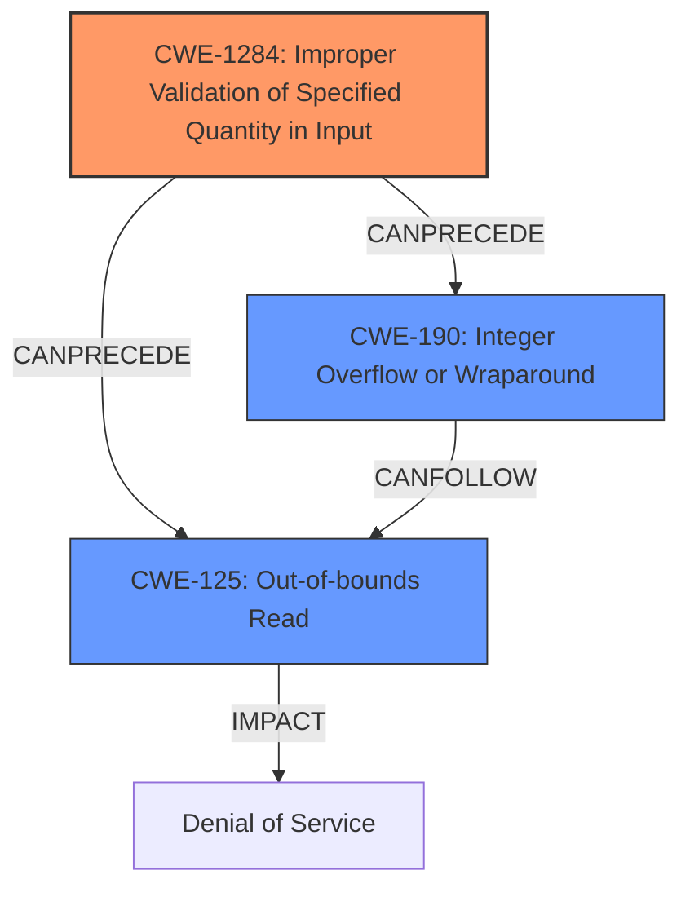

# Analysis Report for CVE-2024-48982

# Vulnerability Analysis Report: CVE-2024-48982

## Description

An issue was discovered in MBed OS 6.16.0. Its hci parsing software dynamically determines the length of certain hci packets by reading a byte from its header. This value is assumed to be greater than or equal to 3, but the software doesnt ensure that this is the case. Supplying a length less than 3 leads to a **buffer overflow** in a buffer that is allocated later. It is simultaneously possible to cause another **integer overflow** by supplying large length values because the provided length value is increased by a few bytes to account for additional information that is supposed to be stored there. This bug is trivial to exploit for a denial of service but is not certain to suffice to bring the system down and can generally not be exploited further because the exploitable buffer is dynamically allocated.

## Vulnerability Description Key Phrases

- **Rootcause:** doesnt ensure the length of certain hci packets is greater than or equal to 3
- **Weakness:** ['buffer overflow', 'integer overflow']
- **Impact:** denial of service
- **Vector:** supplying a length less than 3
- **Product:** MBed OS
- **Version:** 6.16.0
- **Component:** hci parsing software

## Analysis (with Relationship Data)

# Summary
| CWE ID  | CWE Name                                               | Confidence | CWE Abstraction Level | CWE Vulnerability Mapping Label | CWE-Vulnerability Mapping Notes |
| :-------- | :----------------------------------------------------- | :--------- | :---------------------- | :------------------------------ | :------------------------------ |
| CWE-1284 | Improper Validation of Specified Quantity in Input   | 0.9        | Base                    | Primary CWE                    | Allowed                       |
| CWE-190 | Integer Overflow or Wraparound                       | 0.8        | Base                    | Secondary Candidate             | Allowed                       |
| CWE-125 | Out-of-bounds Read                                   | 0.7        | Base                    | Secondary Candidate             | Allowed                       |

## Evidence and Confidence

*   **Confidence Score:** 0.8
*   **Evidence Strength:** HIGH

## Relationship Analysis
The primary weakness is **Improper Validation of Specified Quantity in Input (CWE-1284)**, because the **root cause** is that the software **doesn't ensure the length of certain hci packets is greater than or equal to 3.** This can lead to an **Integer Overflow (CWE-190)** if the length is too large, or an **Out-of-bounds Read (CWE-125)** if the length is too small. All three are Base level CWEs which provides sufficient specificity. **CWE-1284** can precede **CWE-190** and **CWE-125** in a vulnerability chain.



## Vulnerability Chain
The vulnerability chain starts with **Improper Validation of Specified Quantity in Input (CWE-1284)**, because the software **doesn't ensure the length of certain hci packets is greater than or equal to 3**. If the supplied length is too large, this leads to **Integer Overflow or Wraparound (CWE-190)**. If the supplied length is too small, this leads to an **Out-of-bounds Read (CWE-125)**, which can both lead to a **denial of service**.

## Summary of Analysis
The vulnerability description states that the software **doesn't ensure that the length of certain hci packets is greater than or equal to 3**, leading to a **buffer overflow** or **integer overflow**.
Based on the **ROOTCAUSE** analysis, the most appropriate CWE is **CWE-1284 (Improper Validation of Specified Quantity in Input)**.

The description states, "This value is assumed to be greater than or equal to 3, but the software **doesnt ensure that this is the case.** Supplying a length less than 3 leads to a **buffer overflow** in a buffer that is allocated later. It is simultaneously possible to cause another **integer overflow** by supplying large length values because the provided length value is increased by a few bytes to account for additional information that is supposed to be stored there."

**CWE-190 (Integer Overflow or Wraparound)** is included because the supplied length value is increased, which could lead to an integer overflow.
**CWE-125 (Out-of-bounds Read)** is included because supplying a length less than 3 leads to a **buffer overflow**.

Other CWEs like **CWE-130 (Improper Handling of Length Parameter Inconsistency)**, **CWE-789 (Memory Allocation with Excessive Size Value)**, and **CWE-191 (Integer Underflow (Wrap or Wraparound))** were considered but deemed less relevant because they don't precisely capture the **root cause** of **improper validation**.

Relevant CWE Information:


## CWE Relationship Analysis

Current CWEs represent these abstraction levels: .


### Vulnerability Chain Analysis

**Chain starting from CWE-1284:**
- 1284 (Improper Validation of Specified Quantity in Input) - ROOT


**Chain starting from CWE-130:**
- 130 (Improper Handling of Length Parameter Inconsistency) - ROOT


### CWE Relationship Diagram

```mermaid
graph TD
    classDef primary fill:#f96,stroke:#333,stroke-width:2px
    classDef secondary fill:#69f,stroke:#333
    classDef tertiary fill:#9e9,stroke:#333
```


*Report generated on 2025-07-13 19:08:20*
