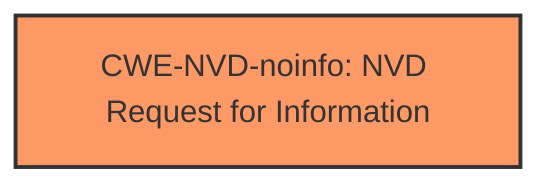

# Analysis Report for CVE-2024-49033

# Vulnerability Analysis Report: CVE-2024-49033

## Description

Microsoft Word Security Feature Bypass Vulnerability

## Vulnerability Description Key Phrases

- **Impact:** Security Feature Bypass
- **Product:** Microsoft Word
- **Component:** Security Feature Bypass Vulnerability

## Analysis (with Relationship Data)

# Summary

| CWE ID        | CWE Name                                                                     | Confidence | CWE Abstraction Level | CWE Vulnerability Mapping Label | CWE-Vulnerability Mapping Notes |
| ------------- | ---------------------------------------------------------------------------- | ---------- | --------------------- | ------------------------------- | ----------------------------- |
| CWE-NVD-noinfo | NVD Request for Information                                                | 0.7        | N/A                   | Primary                         | Allowed                       |

## Evidence and Confidence

*   **Confidence Score:** 0.7
*   **Evidence Strength:** LOW

## Relationship Analysis

Since **CWE-NVD-noinfo** is a placeholder, there are no meaningful relationships to analyze. This CWE is used when there's insufficient information to determine the actual weakness.



## Vulnerability Chain

Because the vulnerability description lacks specific details, it is impossible to create a meaningful vulnerability chain. The initial flaw and its impact are unknown.

## Summary of Analysis

The vulnerability description provides minimal information, only stating it's a "Microsoft Word Security Feature Bypass Vulnerability". The key phrase emphasizes "Security Feature Bypass," but without further details, assigning a specific CWE is impossible.

The primary CWE match from similar CVE descriptions is **CWE-NVD-noinfo**, which indicates a lack of sufficient information. Given the very limited information, I am assigning **CWE-NVD-noinfo** as the primary CWE.

The retriever results offer several potential CWEs, but none directly align with the vague description. For instance:

*   **CWE-288: Authentication Bypass Using an Alternate Path or Channel** might seem relevant to "Bypass" but it is authentication related and there is no evidence of that.
*   **CWE-120: Buffer Copy without Checking Size of Input ('Classic Buffer Overflow')** and **CWE-123: Write-what-where Condition** are memory corruption issues and there is no evidence of that.
*   **CWE-798: Use of Hard-coded Credentials** is not related to the description.
*   **CWE-1007: Insufficient Visual Distinction of Homoglyphs Presented to User** is not related to the description.
*   **CWE-610: Externally Controlled Reference to a Resource in Another Sphere** is not related to the description.

Given the lack of evidence, it's best to stick with **CWE-NVD-noinfo**, and look for more information.


## CWE Relationship Analysis

Current CWEs represent these abstraction levels: .


### Vulnerability Chain Analysis

**Chain starting from CWE-288:**
- 288 (Authentication Bypass Using an Alternate Path or Channel) - ROOT


**Chain starting from CWE-123:**
- 123 (Write-what-where Condition) - ROOT


### CWE Relationship Diagram

```mermaid
graph TD
    classDef primary fill:#f96,stroke:#333,stroke-width:2px
    classDef secondary fill:#69f,stroke:#333
    classDef tertiary fill:#9e9,stroke:#333
```


*Report generated on 2025-07-13 19:09:45*
