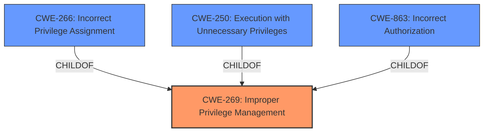

# Enhanced Analysis for CVE-2024-49039

# Summary
| CWE ID    | CWE Name                                                                 | Confidence | CWE Abstraction Level | CWE Vulnerability Mapping Label | CWE-Vulnerability Mapping Notes |
| :---------- | :----------------------------------------------------------------------- | :--------- | :-------------------- | :------------------------------ | :------------------------------ |
| CWE-269     | Improper Privilege Management                                            | 0.5        | Class                 | Primary CWE                     | Discouraged                     |
| CWE-NVD-noinfo | No Information Available                                                     | 0.4        | N/A                   | Secondary Candidate             | N/A                           |

## Evidence and Confidence

*   **Confidence Score:** 0.5
*   **Evidence Strength:** LOW

## Relationship Analysis
The primary relationship that influenced the selection was the parent-child relationship between CWE-269 and its children. The vulnerability description mentions "elevation of privilege," which is a key indicator for privilege management issues. While more specific child CWEs exist (like CWE-266, CWE-250), there's insufficient information to pinpoint the exact root cause beyond a general privilege management problem.



## Vulnerability Chain
The vulnerability chain is incomplete due to lack of information. The description indicates an "elevation of privilege" in Windows Task Scheduler, but the specific flaw enabling this is unknown.

Improper Privilege Management (CWE-269) -> Impact: Elevation of Privilege

## Summary of Analysis
The initial analysis focused on identifying CWEs related to privilege management, given the "elevation of privilege" impact statement. The retriever results and CWE guidance pointed towards CWE-269, CWE-266, CWE-250, and CWE-863. However, the limited information prevents a more precise mapping.

The decision to use CWE-269 is based on the high-level description aligning with general privilege management issues. The evidence is weak, hence the low confidence score. The selection of CWE-269 is a compromise due to the lack of specifics, acknowledging that a more detailed analysis could reveal a more accurate root cause.

The retriever results also listed CWE-NVD-noinfo and while this is the Primary CWE Match, it is not a real CWE. It only means that there was not enough information to map to a CWE.

Relevant CWE Information:

# Enhanced Context (25 CWEs)
The following CWEs were identified as potentially relevant to this vulnerability:

## CWE-269: Improper Privilege Management
**Abstraction Level**: Class
**Similarity Score**: 1198.91
**Source**: sparse

**Description**:
The product does not properly assign, modify, track, or check privileges for an actor, creating an unintended sphere of control for that actor.

**Mapping Guidance**:
- Usage: Discouraged
- Rationale: CWE-269 is commonly misused. It can be conflated with "privilege escalation," which is a technical impact that is listed in many low-information vulnerability reports [REF-1287]. It is not useful for trend analysis.

## CWE-NVD-noinfo

### Detailed Explanation for Selected CWEs:

*   **CWE-269: Improper Privilege Management**
    *   **Technical Explanation:** The vulnerability description indicates an "elevation of privilege" in the Windows Task Scheduler. This suggests a flaw in how the system manages user privileges, allowing an attacker to gain higher-level access than intended.
    *   **Security Implications:** Successful exploitation could allow an attacker to perform actions with elevated privileges, potentially compromising the entire system.
    *   **Relationships:** CWE-269 is a Class-level CWE with several more specific children, such as CWE-266 (Incorrect Privilege Assignment) and CWE-250 (Execution with Unnecessary Privileges).
    *   **Mapping Guidance:** While CWE-269 is discouraged due to its generality, it's chosen here as the best available option given the limited information. More information would be needed to determine the precise nature of the privilege management issue and select a more specific CWE.
    *   **Confidence:** 0.5
    *   **Justification:** The "elevation of privilege" impact directly aligns with the general concept of improper privilege management.

*   **CWE-NVD-noinfo: No Information Available**
    *   **Technical Explanation:** This is a placeholder CWE that means there was not enough information to map to a CWE.
    *   **Security Implications:** N/A
    *   **Relationships:** N/A
    *   **Mapping Guidance:** N/A
    *   **Confidence:** 0.4
    *   **Justification:** The lack of specific information about the vulnerability means that this is also a valid mapping to use.

### Explanation for Other Considered CWEs:

*   **CWE-266, CWE-250, CWE-863:** These CWEs were considered as more specific alternatives to CWE-269. However, the vulnerability description lacks the details needed to confirm whether the issue is due to incorrect privilege assignment (CWE-266), execution with unnecessary privileges (CWE-250), or incorrect authorization (CWE-863). Without more information, these cannot be confidently assigned.

*   **CWE-59, CWE-1386, CWE-123, CWE-40, CWE-454, CWE-127, CWE-825, CWE-416:** These were in the retriever results but were discarded as they were file related or memory corruption related and the vulnerability description makes no mention of these.


## CWE Relationship Analysis

Current CWEs represent these abstraction levels: .


### Vulnerability Chain Analysis

**Chain starting from CWE-863:**
- 863 (Incorrect Authorization) - ROOT


**Chain starting from CWE-123:**
- 123 (Write-what-where Condition) - ROOT


### CWE Relationship Diagram

```mermaid
graph TD
    classDef primary fill:#f96,stroke:#333,stroke-width:2px
    classDef secondary fill:#69f,stroke:#333
    classDef tertiary fill:#9e9,stroke:#333
```