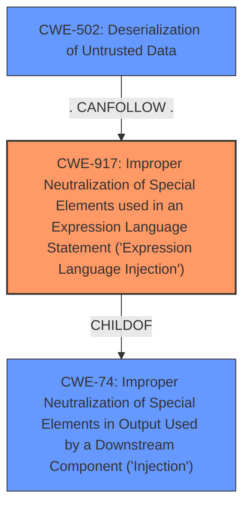

# Analysis Report for CVE-2024-49194

# Vulnerability Analysis Report: CVE-2024-49194

## Description

Databricks JDBC Driver before 2.6.40 could potentially allow remote code execution (RCE) by triggering a JNDI injection via a JDBC URL parameter. The vulnerability is rooted in the **improper handling of the krbJAASFile parameter**. An attacker could potentially exploit this vulnerability to achieve Remote Code Execution in the context of the driver by tricking a victim into using a crafted connection URL that uses the property krbJAASFile.

## Vulnerability Description Key Phrases

- **Rootcause:** improper handling of the krbJAASFile parameter
- **Impact:** remote code execution (RCE)
- **Vector:** crafted connection URL with krbJAASFile property
- **Product:** Databricks JDBC Driver
- **Version:** before 2.6.40

## Analysis (with Relationship Data)

# Summary
| CWE ID | CWE Name | Confidence | CWE Abstraction Level | CWE Vulnerability Mapping Label | CWE-Vulnerability Mapping Notes |
|---|---|---|---|---|---|
| CWE-917 | Improper Neutralization of Special Elements used in an Expression Language Statement ('Expression Language Injection') | 0.9 | Base | Allowed | Primary CWE - This is the most accurate CWE because the vulnerability is a JNDI injection via a JDBC URL parameter. |
| CWE-74 | Improper Neutralization of Special Elements in Output Used by a Downstream Component ('Injection') | 0.6 | Class | Discouraged | Secondary Candidate - CWE-74 is a high-level injection class, but CWE-917 is more specific. |
| CWE-502 | Deserialization of Untrusted Data | 0.5 | Base | Allowed | Secondary Candidate - JNDI injection often leads to deserialization issues, but the root cause is the injection itself. |

## Evidence and Confidence

*   **Confidence Score:** 0.8
*   **Evidence Strength:** HIGH

## Relationship Analysis
The primary relationship that influenced the decision was the hierarchical relationship between CWE-74 (Injection) and CWE-917 (Expression Language Injection). CWE-917 is a more specific type of injection, making it a better fit for the vulnerability description. CWE-502 is included since the JNDI injection could lead to deserialization of untrusted data.



## Vulnerability Chain
The vulnerability chain starts with the **improper handling of the krbJAASFile parameter** in the JDBC driver. This leads to a JNDI injection vulnerability, which can then be exploited to achieve remote code execution (RCE).
  - **Root Cause:** **Improper handling of the krbJAASFile parameter** (CWE-917).
  - **Vulnerability:** JNDI Injection
  - **Impact:** Remote Code Execution (RCE)

## Summary of Analysis
The primary CWE selected is CWE-917 (Improper Neutralization of Special Elements used in an Expression Language Statement ('Expression Language Injection')), with a confidence score of 0.9. This is based on the vulnerability description, which explicitly mentions a JNDI injection via a JDBC URL parameter, due to the **improper handling of the krbJAASFile parameter**. The "CVE Reference Links Content Summary" section confirms that the root cause is the **improper handling of the `krbJAASFile` parameter**, allowing for JNDI injection.

CWE-74 (Improper Neutralization of Special Elements in Output Used by a Downstream Component ('Injection')) was considered but is too general. While the vulnerability is an injection, CWE-917 is more specific to expression language injection, which is the nature of the vulnerability.

CWE-502 (Deserialization of Untrusted Data) was also considered because JNDI injection often leads to deserialization issues. However, the primary issue is the injection itself, making CWE-917 the more accurate root cause.

The selection of CWE-917 is at the optimal level of specificity because it accurately describes the **root cause** of the vulnerability (JNDI injection via a crafted connection URL), while remaining at the Base level of abstraction.
Relevant CWE Information:

# Enhanced Context (25 CWEs)
The following CWEs were identified as potentially relevant to this vulnerability:

## CWE-116: Improper Encoding or Escaping of Output
**Abstraction Level**: Class
**Similarity Score**: 0.70
**Source**: dense

**Description**:
The product prepares a structured message for communication with another component, but encoding or escaping of the data is either missing or done incorrectly. As a result, the intended structure of the message is not preserved.

**Mapping Guidance**:
- Usage: Allowed-with-Review
- Rationale: This CWE entry is a Class and might have Base-level children that would be more appropriate

## CWE-74: Improper Neutralization of Special Elements in Output Used by a Downstream Component ('Injection')
**Abstraction Level**: Class
**Similarity Score**: 0.69
**Source**: dense

**Description**:
The product constructs all or part of a command, data structure, or record using externally-influenced input from an upstream component, but it does not neutralize or incorrectly neutralizes special elements that could modify how it is parsed or interpreted when it is sent to a downstream component.

**Mapping Guidance**:
- Usage: Discouraged
- Rationale: CWE-74 is high-level and often misused when lower-level weaknesses are more appropriate.

## CWE-917: Improper Neutralization of Special Elements used in an Expression Language Statement ('Expression Language Injection')
**Abstraction Level**: Base
**Similarity Score**: 0.69
**Source**: dense

**Description**:
The product constructs all or part of an expression language (EL) statement in a framework such as a Java Server Page (JSP) using externally-influenced input from an upstream component, but it does not neutralize or incorrectly neutralizes special elements that could modify the intended EL statement before it is executed.

**Mapping Guidance**:
- Usage: Allowed
- Rationale: This CWE entry is at the Base level of abstraction, which is a preferred level of abstraction for mapping to the root causes of vulnerabilities.

## CWE-502: Deserialization of Untrusted Data
**Abstraction Level**: Base
**Similarity Score**: 0.69
**Source**: dense

**Description**:
The product deserializes untrusted data without sufficiently ensuring that the resulting data will be valid.

**Mapping Guidance**:
- Usage: Allowed
- Rationale: This CWE entry is at the Base level of abstraction, which is a preferred level of abstraction for mapping to the root causes of vulnerabilities.

## CWE-755: Improper Handling of Exceptional Conditions
**Abstraction Level**: Class
**Similarity Score**: 0.68
**Source**: dense

**Description**:
The product does not handle or incorrectly handles an exceptional condition.

**Mapping Guidance**:
- Usage: Discouraged
- Rationale: This CWE entry is a level-1 Class (i.e., a child of a Pillar). It might have lower-level children that would be more appropriate

## CWE-923: Improper Restriction of Communication Channel to Intended Endpoints
**Abstraction Level**: Class
**Similarity Score**: 0.68
**Source**: dense

**Description**:
The product establishes a communication channel to (or from) an endpoint for privileged or protected operations, but it does not properly ensure that it is communicating with the correct endpoint.

**Mapping Guidance**:
- Usage: Allowed-with-Review
- Rationale: This CWE entry is a Class and might have Base-level children that would be more appropriate

## CWE-918: Server-Side Request Forgery (SSRF)
**Abstraction Level**: Base
**Similarity Score**: 0.68
**Source**: dense

**Description**:
The web server receives a URL or similar request from an upstream component and retrieves the contents of this URL, but it does not sufficiently ensure that the request is being sent to the expected destination.

**Mapping Guidance**:
- Usage: Allowed
- Rationale: This CWE entry is at the Base level of abstraction, which is a preferred level of abstraction for mapping to the root causes of vulnerabilities.

## CWE-93: Improper Neutralization of CRLF Sequences ('CRLF Injection')
**Abstraction Level**: Base
**Similarity Score**: 0.68
**Source**: dense

**Description**:
The product uses CRLF (carriage return line feeds) as a special element, e.g. to separate lines or records, but it does not neutralize or incorrectly neutralizes CRLF sequences from inputs.

**Mapping Guidance**:
- Usage: Allowed
- Rationale: This CWE entry is at the Base level of abstraction, which is a preferred level of abstraction for mapping to the root causes of vulnerabilities.

## CWE-522: Insufficiently Protected Credentials
**Abstraction Level**: Class
**Similarity Score**: 0.68
**Source**: dense

**Description**:
The product transmits or stores authentication credentials, but it uses an insecure method that is susceptible to unauthorized interception and/or retrieval.

**Mapping Guidance**:
- Usage: Allowed-with-Review
- Rationale: This CWE entry is a Class and might have Base-level children that would be more appropriate

## CWE-200: Exposure of Sensitive Information to an Unauthorized Actor
**Abstraction Level**: Class
**Similarity Score


## CWE Relationship Analysis

Current CWEs represent these abstraction levels: .


### Vulnerability Chain Analysis

**Chain starting from CWE-502:**
- 502 (Deserialization of Untrusted Data) - ROOT


**Chain starting from CWE-116:**
- 116 (Improper Encoding or Escaping of Output) - ROOT


### CWE Relationship Diagram

```mermaid
graph TD
    classDef primary fill:#f96,stroke:#333,stroke-width:2px
    classDef secondary fill:#69f,stroke:#333
    classDef tertiary fill:#9e9,stroke:#333
```


*Report generated on 2025-07-13 19:15:23*
