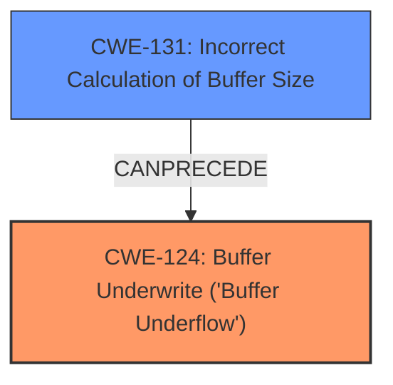

# Analysis Report for CVE-2024-49195

# Vulnerability Analysis Report: CVE-2024-49195

## Description

Mbed TLS 3.5.x through 3.6.x before 3.6.2 has a **buffer underrun** in pkwrite when writing an opaque key pair

## Vulnerability Description Key Phrases

- **Weakness:** buffer underrun
- **Product:** Mbed TLS
- **Version:** 3.5.x through 3.6.x before 3.6.2
- **Component:** pkwrite

## Analysis (with Relationship Data)

# Summary
| CWE ID | CWE Name | Confidence | CWE Abstraction Level | CWE Vulnerability Mapping Label | CWE-Vulnerability Mapping Notes |
|---|---|---|---|---|---|
| CWE-124 | Buffer Underwrite ('Buffer Underflow') | 1.0 | Base | Allowed | Primary CWE |
| CWE-131 | Incorrect Calculation of Buffer Size | 0.7 | Base | Allowed | Secondary Candidate |

## Evidence and Confidence

*   **Confidence Score:** 0.9
*   **Evidence Strength:** HIGH

## Relationship Analysis
The primary relationship that influenced the decision was the direct match of the vulnerability description to the definition of CWE-124 **Buffer Underwrite ('Buffer Underflow')**. CWE-131 **Incorrect Calculation of Buffer Size** was considered as a potential cause, leading to a chain where the incorrect calculation could precede the buffer underwrite. The abstraction levels were considered to choose the most specific and relevant CWE.



## Vulnerability Chain
The vulnerability chain starts with a potential **incorrect calculation of the buffer size** (CWE-131), which then leads to the **buffer underwrite** (CWE-124).

## Summary of Analysis
The initial analysis focused on identifying the root cause of the vulnerability. The description clearly states that there is a **buffer underrun** in pkwrite when writing an opaque key pair. The CVE Reference Links Content Summary confirms that the functions `mbedtls_pk_write_key_der()` and `mbedtls_pk_write_key_pem()` can cause a **buffer underrun** when the output buffer is too small in certain cases.

The primary CWE, CWE-124 **Buffer Underwrite ('Buffer Underflow')**, directly matches the vulnerability description.

CWE-131 **Incorrect Calculation of Buffer Size** was considered because the buffer underrun could be a consequence of an incorrect size calculation, as suggested in the CVE Reference Links Content Summary. However, the description doesn't explicitly state that the buffer size calculation is incorrect, only that the output buffer is too small.

The selected CWEs are at the optimal level of specificity. CWE-124 is a Base CWE and directly reflects the **buffer underrun**.

Relevant CWE Information:

# Enhanced Context (25 CWEs)
The following CWEs were identified as potentially relevant to this vulnerability:

## CWE-131: Incorrect Calculation of Buffer Size
**Abstraction Level**: Base
**Similarity Score**: 0.74
**Source**: dense

**Description**:
The product does not correctly calculate the size to be used when allocating a buffer, which could lead to a buffer overflow.

**Mapping Guidance**:
- Usage: Allowed
- Rationale: This CWE entry is at the Base level of abstraction, which is a preferred level of abstraction for mapping to the root causes of vulnerabilities.

## CWE-124: Buffer Underwrite ('Buffer Underflow')
**Abstraction Level**: Base
**Similarity Score**: 739.14
**Source**: sparse

**Description**:
The product writes to a buffer using an index or pointer that references a memory location prior to the beginning of the buffer.

**Mapping Guidance**:
- Usage: Allowed
- Rationale: This CWE entry is at the Base level of abstraction, which is a preferred level of abstraction for mapping to the root causes of vulnerabilities.

**Supporting evidence:**
- Vulnerability Description: "... has a **buffer underrun** in pkwrite when writing an opaque key pair"
- CVE Reference Links Content Summary: "**Root cause of vulnerability:** The functions `mbedtls_pk_write_key_der()` and `mbedtls_pk_write_key_pem()` can cause a **buffer underrun** when the output buffer is too small in certain cases."

CWE-124 is the primary weakness.
CWE-131 is a secondary weakness that could be the root cause of CWE-124.


## CWE Relationship Analysis

Current CWEs represent these abstraction levels: .


### Vulnerability Chain Analysis

**Chain starting from CWE-124:**
- 124 (Buffer Underwrite ('Buffer Underflow')) - ROOT


**Chain starting from CWE-131:**
- 131 (Incorrect Calculation of Buffer Size) - ROOT


### CWE Relationship Diagram

```mermaid
graph TD
    classDef primary fill:#f96,stroke:#333,stroke-width:2px
    classDef secondary fill:#69f,stroke:#333
    classDef tertiary fill:#9e9,stroke:#333
```


*Report generated on 2025-07-13 19:15:37*
