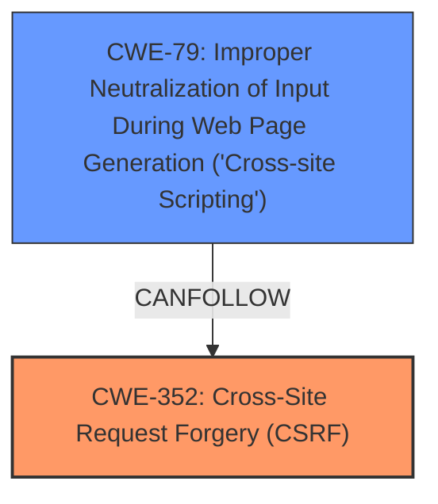

# Raw Analyzer Response for CVE-2024-49229

# Summary
| CWE ID | CWE Name | Confidence | CWE Abstraction Level | CWE Vulnerability Mapping Label | CWE-Vulnerability Mapping Notes |
|---|---|---|---|---|---|
| CWE-352 | Cross-Site Request Forgery (CSRF) | 1.0 | Compound | Primary | Allowed |
| CWE-79 | Improper Neutralization of Input During Web Page Generation ('Cross-site Scripting') | 1.0 | Base | Secondary | Allowed |

## Evidence and Confidence

*   **Confidence Score:** 1.0
*   **Evidence Strength:** HIGH

## Relationship Analysis
The primary weakness is the **lack of CSRF protection** which allows for other vulnerabilities to be exploited. In this case, it enables Cross-Site Scripting (XSS). CWE-352 is a compound weakness that represents the **lack of CSRF protection**. CWE-79 represents the **cross-site scripting** that is a result of the lack of CSRF protection.

## Vulnerability Chain
The vulnerability chain starts with the **lack of CSRF protection (CWE-352)**, which allows an attacker to forge requests on behalf of a user. This **leads to cross-site scripting (CWE-79)** because the forged requests can inject malicious scripts into the web page.

## Summary of Analysis
The analysis is based on the vulnerability description, which clearly states that the root cause is the **lack of CSRF protection** and that the weakness leads to cross-site scripting.

The vulnerability description includes these key phrases:
- **rootcause:** **lack of CSRF protection**
- **weakness:** **cross-site scripting**

The CVE Reference Links Content Summary includes the following:

*   **Root cause of vulnerability:** The Better Author Bio WordPress plugin (versions <= 2.7.10.11) is vulnerable to Cross-Site Request Forgery (CSRF).
*   **Weaknesses/vulnerabilities present:**  The plugin lacks proper CSRF protection, allowing attackers to forge requests.

CWE-352 is a compound weakness, but it accurately represents the **lack of CSRF protection**, which is the root cause. CWE-79 is a base weakness and represents the cross-site scripting that is a result of the lack of CSRF protection. The selected CWEs are at the optimal level of specificity because they directly correspond to the root cause and the resulting weakness.

CWE-73, CWE-89, CWE-94, CWE-116, CWE-184, CWE-425, CWE-434, CWE-471, CWE-494, CWE-918 were considered but not used. These CWEs did not accurately represent the specific vulnerability described in the vulnerability description.