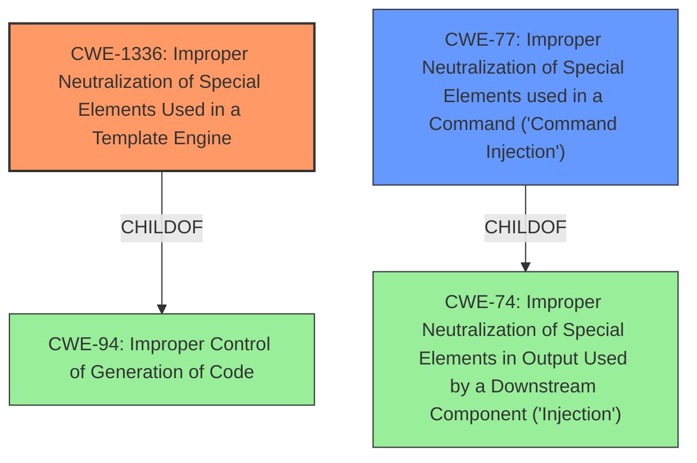

# Enhanced Analysis for CVE-2024-49271

# Summary
| CWE ID | CWE Name | Confidence | CWE Abstraction Level | CWE Vulnerability Mapping Label | CWE-Vulnerability Mapping Notes |
|---|---|---|---|---|---|
| CWE-1336 | Improper Neutralization of Special Elements Used in a Template Engine | 0.9 | Base | Allowed | Primary CWE. The vulnerability description explicitly states this weakness as the root cause. |
| CWE-77 | Improper Neutralization of Special Elements used in a Command ('Command Injection') | 0.7 | Class | Allowed-with-Review | Secondary. The vulnerability leads to command injection, but the root cause is the improper neutralization in the template engine. |

## Evidence and Confidence

*   **Confidence Score:** 0.8
*   **Evidence Strength:** HIGH

## Relationship Analysis
The primary relationship impacting the decision is the parent-child relationship between CWE-77 and CWE-74 (Improper Neutralization of Special Elements in Output Used by a Downstream Component ('Injection')), and CWE-1336 being a child of CWE-94 (Improper Control of Generation of Code ('Code Injection')). CWE-1336 is selected as the primary because the description explicitly mentions "Improper Neutralization of Special Elements Used in a Template Engine". CWE-77 is chosen as a secondary CWE because the **weakness** leads to **command injection**. The abstraction levels were considered, and the Base level for CWE-1336 was deemed appropriate due to the specific context of template engine usage.



## Vulnerability Chain
The vulnerability chain starts with the **improper neutralization of special elements** in the template engine (CWE-1336), which leads to the ability to inject commands (CWE-77), ultimately resulting in remote code execution.

## Summary of Analysis
The initial analysis strongly pointed to CWE-1336 as the primary weakness due to the explicit mention in the vulnerability description. The retriever results also list CWE-1336 as a potential match and also list CWE-77 which is confirmed by the CVE Reference Links Content Summary section that states that this vulnerability leads to Remote Code Execution (RCE). The graph relationships confirm the connection between neutralization issues and command injection.

The evidence from the vulnerability description is: "**Improper Neutralization of Special Elements Used in a Template Engine** vulnerability in Unlimited Elements Unlimited Elements For Elementor (Free Widgets, Addons, Templates) allows **Command Injection**."

CWE-1336 is selected because it is the **rootcause** weakness described in the vulnerability description.

Other CWEs Considered But Not Used:

*   CWE-78: Improper Neutralization of Special Elements used in an OS Command ('OS Command Injection') - While related to command injection, CWE-77 is more general and appropriate as the template engine might not be directly executing OS commands.
*   CWE-89, CWE-90, CWE-1236: These relate to specific injection types (SQL, LDAP, CSV) and are not applicable here as the vulnerability is in a template engine.
*   CWE-138: Improper Neutralization of Special Elements - This is a class-level CWE and is too general. CWE-1336 provides a more specific context of template engines.
*   CWE-150: Improper Neutralization of Escape, Meta, or Control Sequences - While relevant, CWE-1336 encompasses this within the context of template engines.
*   CWE-184: Incomplete List of Disallowed Inputs - This is not the primary issue; the core problem is improper neutralization, not an incomplete list.


## CWE Relationship Analysis

Current CWEs represent these abstraction levels: .


### Vulnerability Chain Analysis

**Chain starting from CWE-90:**
- 90 (Improper Neutralization of Special Elements used in an LDAP Query ('LDAP Injection')) - ROOT


**Chain starting from CWE-89:**
- 89 (Improper Neutralization of Special Elements used in an SQL Command ('SQL Injection')) - ROOT


### CWE Relationship Diagram

```mermaid
graph TD
    classDef primary fill:#f96,stroke:#333,stroke-width:2px
    classDef secondary fill:#69f,stroke:#333
    classDef tertiary fill:#9e9,stroke:#333
```