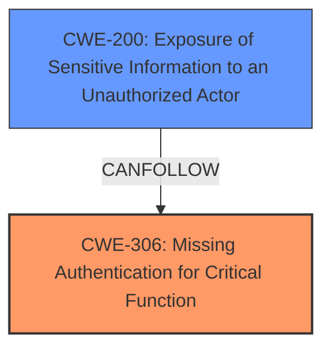

# Raw Analyzer Response for CVE-2024-49357

# Summary
| CWE ID   | CWE Name                                                              | Confidence | CWE Abstraction Level | CWE Vulnerability Mapping Label | CWE-Vulnerability Mapping Notes |
| :-------- | :--------------------------------------------------------------------- | :--------- | :-------------------- | :------------------------------ | :-------------------------------- |
| CWE-306 | Missing Authentication for Critical Function                           | 1.0        | Base                  | Primary                         | Allowed                           |
| CWE-200 | Exposure of Sensitive Information to an Unauthorized Actor | 0.7        | Class                  | Secondary                         | Discouraged                           |

## Evidence and Confidence

*   **Confidence Score:** 0.9
*   **Evidence Strength:** HIGH

## Relationship Analysis
The primary weakness is the **missing authentication** which directly leads to **exposure of sensitive information**. CWE-306 (Missing Authentication for Critical Function) is the root cause, allowing unauthorized access. CWE-200 (Exposure of Sensitive Information to an Unauthorized Actor) is a consequence of the missing authentication. CWE-306 is a base level CWE, and CWE-200 is a class level CWE. More specific child CWEs of CWE-200 could exist, but the description does not provide enough information to narrow it down further.

## Vulnerability Chain
The vulnerability chain starts with the **missing authentication (CWE-306)**, which then directly leads to the **exposure of sensitive information (CWE-200)**.

`Missing Authentication` -> `Information Exposure`

## Summary of Analysis
The primary issue is the **lack of authentication** on API endpoints, allowing unauthorized access to sensitive information. This is a clear case of **CWE-306 (Missing Authentication for Critical Function)**. The impact of this **weakness** is the **exposure of sensitive information**, which is represented by **CWE-200 (Exposure of Sensitive Information to an Unauthorized Actor)**.

The vulnerability description clearly states: "API endpoints in ZimaOS, such as `http///v1/users/image?path=/var/lib/casaos/1/app_order.json` and `http///v1/users/image?path=/var/lib/casaos/1/system.json`, expose sensitive data like installed applications and system information **without requiring any authentication or authorization**." This directly supports the selection of CWE-306 as the root cause.

The "CVE Reference Links Content Summary" further confirms this: "The root cause is the **lack of authentication** and authorization checks on API endpoints that expose sensitive system information and installed application data."

The guidance provided reinforces this decision: "CWE-306: Missing Authentication for Critical Function – used when no identity validation is enforced for sensitive functionality".

I considered other CWEs, such as CWE-284 (Improper Access Control), CWE-862 (Missing Authorization), and CWE-668 (Exposure of Resource to Wrong Sphere). However, CWE-306 is the most accurate because the vulnerability description explicitly mentions the **absence of authentication**. CWE-862 is not applicable because it deals with authorization issues after authentication, which is not the case here. CWE-284 is too general, and CWE-668 is a class-level CWE and less specific than CWE-200.

CWE-200 is a relevant secondary weakness, since there is a direct exposure of sensitive information, and no authentication is required.
The selected CWEs are at the optimal level of specificity because they directly address the root cause (**missing authentication**) and the resulting impact (**information exposure**).