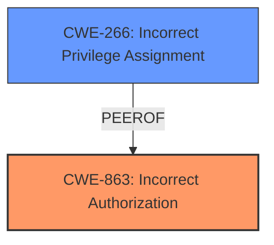

# Analysis Report for CVE-2024-49376

# Vulnerability Analysis Report: CVE-2024-49376

## Description

Autolab, a course management service that enables auto-graded programming assignments, has **misconfigured reset password permissions** in version 3.0.0. For email-based accounts, users with insufficient privileges could reset and theoretically access privileged users accounts by resetting their passwords. This issue is fixed in version 3.0.1. No known workarounds exist.

## Vulnerability Description Key Phrases

- **Rootcause:** misconfigured reset password permissions
- **Impact:** access privileged users accounts
- **Attacker:** users with insufficient privileges
- **Product:** Autolab
- **Version:** 3.0.0

## Analysis (with Relationship Data)

# Summary
| CWE ID | CWE Name | Confidence | CWE Abstraction Level | CWE Vulnerability Mapping Label | CWE-Vulnerability Mapping Notes |
|---|---|---|---|---|---|
| CWE-863 | Incorrect Authorization | 1.0 | Class | Primary CWE | Allowed-with-Review |
| CWE-266 | Incorrect Privilege Assignment | 0.7 | Base | Secondary Candidate | Allowed |

## Evidence and Confidence

*   **Confidence Score:** 0.9
*   **Evidence Strength:** HIGH

## Relationship Analysis
The primary relationship that influenced my decision was the distinction between privileges and permissions, as highlighted in the provided guidance. While the vulnerability involves **misconfigured reset password permissions**, it ultimately boils down to an **incorrect authorization** check in the `update_password_for_user` action. The application failed to properly verify if the user had the necessary privileges to perform the password reset for another user, particularly privileged accounts. CWE-863, as a Class, represents the broad category of authorization failures. CWE-266 was considered because the problem stems from **misconfigured reset password permissions**, but the root cause lies in the authorization logic and privilege validation when attempting to change a password.



## Vulnerability Chain
The vulnerability chain starts with the **misconfigured reset password permissions**, leading to **insufficient privilege check** and ultimately results in the potential for **account takeover**.

**Root Cause:** **Misconfigured Reset Password Permissions** (CWE-863)
**Weakness:** **Insufficient Privilege Check** (Inadequate authorization in `update_password_for_user` action)
**Impact:** **Account Takeover** (Privileged user account accessible)

## Summary of Analysis
The initial analysis focused on identifying the root cause of the vulnerability. The **misconfigured reset password permissions** immediately suggested a privilege-related issue. However, the core weakness lies in the fact that the system **incorrectly authorized** password reset attempts for users lacking sufficient privileges.

The provided guidance on privileges vs. permissions helped to clarify the distinction. The vulnerability description and CVE Reference Links Content Summary highlight that the `update_password_for_user` action lacked proper authorization checks, allowing users with insufficient privileges to attempt password resets of other users, including privileged accounts. The code change, which added `action_auth_level :update_password_for_user, :administrator`, confirms that the fix involves enforcing an authorization check based on privilege level.

CWE-863 (Incorrect Authorization) accurately captures this weakness, as the authorization check was either missing or flawed. While CWE-266 (Incorrect Privilege Assignment) is related, it is less precise than CWE-863, which focuses on the flawed authorization logic.

CWE-863 is chosen as the primary CWE because the core issue is that the authorization check was not correctly performed. The system should have verified whether the user initiating the password reset had the necessary privileges to modify the target user's password. The absence or misconfiguration of this check is precisely what CWE-863 describes.

Relevant CWE Information:

# Enhanced Context (25 CWEs)
The following CWEs were identified as potentially relevant to this vulnerability:

## CWE-266: Incorrect Privilege Assignment
**Abstraction Level**: Base
**Similarity Score**: 1.80
**Source**: graph

**Description**:
A product incorrectly assigns a privilege to a particular actor, creating an unintended sphere of control for that actor.

**Mapping Guidance**:
- Usage: Allowed
- Rationale: This CWE entry is at the Base level of abstraction, which is a preferred level of abstraction for mapping to the root causes of vulnerabilities.

**Relationships**:
- PARENTOF -> CWE-9
- PARENTOF -> CWE-556
- PARENTOF -> CWE-520
- PARENTOF -> CWE-1022
- CANALSOBE -> CWE-286

## CWE-863: Incorrect Authorization
**Abstraction Level**: Class
**Similarity Score**: 1849.53
**Source**: sparse

**Description**:
The product performs an authorization check when an actor attempts to access a resource or perform an action, but it does not correctly perform the check.

**Mapping Guidance**:
- Usage: Allowed-with-Review
- Rationale: This CWE entry is a Class and might have Base-level children that would be more appropriate

Here is the decision:

| CWE ID | CWE Name | Confidence | CWE Abstraction Level | CWE Vulnerability Mapping Label | CWE-Vulnerability Mapping Notes |
|---|---|---|---|---|---|
| CWE-863 | Incorrect Authorization | 1.0 | Class | Primary CWE | Allowed-with-Review |
> The product performs an authorization check when an actor attempts to access a resource or perform an action, but it does not correctly perform the check.
*   **How the vulnerability's details match the CWE's characteristics:** The Autolab application had a flaw in the `update_password_for_user` action, where it failed to properly check if the user initiating the password reset had the appropriate privileges to modify another user's password. This aligns perfectly with the description of **incorrect authorization**, as the system did not correctly perform the authorization check.
*   **The security implications and potential impact:** This vulnerability could lead to account takeover, as attackers with low-level privileges could reset the passwords of privileged users and gain access to sensitive data or functionalities.
*   **Any parent-child relationships or chain patterns that influenced your mapping:** CWE-863 is a Class-level CWE. While more specific Base or Variant CWEs could exist, none of the other identified candidates are a better fit for describing the root cause.
*   **Whether the weakness is primary or secondary in the vulnerability:** This is the primary weakness, as it directly leads to the potential for unauthorized access.
*   **How the official MITRE mapping guidance influenced your decision:** The MITRE mapping guidance suggests that CWE-863 is appropriate when authorization logic is present but flawed. The vulnerability description confirms that there was a missing or flawed authorization check in the `update_password_for_user` action, aligning with this guidance.
*   **Supporting Evidence:** "The vulnerability stems from **misconfigured reset password permissions**. Specifically, the issue was in the `UsersController` of the Autolab application where the `update_password_for_user` action, responsible for handling the actual password change, did not have proper authorization checks."
*   **Confidence Score:** 1.0
*   **Abstraction Level:** Class
*   **Rationale:** The authorization check was present but flawed.
*   **Mapping Notes Usage:** Allowed-with-Review

| CWE ID | CWE Name | Confidence | CWE Abstraction Level | CWE Vulnerability Mapping Label | CWE-Vulnerability Mapping Notes |
|---|---|---|---|---|---|
| CWE-266 | Incorrect Privilege Assignment | 0.7 | Base | Secondary Candidate | Allowed |
> A product incorrectly assigns a privilege to a particular actor, creating an unintended sphere of control for that actor.
*   **How the vulnerability's details match the CWE's characteristics:** The **misconfiguration** of reset password **permissions** could be interpreted as an **incorrect privilege assignment**, where regular users were inadvertently granted the privilege to reset passwords for other users.
*   **The security implications and potential impact:** Similar to CWE-863, this could lead to account takeover and unauthorized access.
*   **Any parent-child relationships or chain patterns that influenced your mapping:** CWE-266 is at the Base level.
*   **Whether the weakness is primary or secondary in the vulnerability:** This can be seen as a contributing factor, but not the core issue.
*   **How the official MITRE mapping guidance influenced your decision:** The MITRE mapping guidance suggests that CWE-266 is appropriate when privileges are misassigned. While the **misconfigured permissions** indirectly led to a privilege issue, the more direct cause was the **incorrect authorization** check.
*   **Supporting Evidence:** "**misconfigured reset password permissions** in version 3.0.0. For email-based accounts, users with insufficient privileges could reset and theoretically access privileged users accounts by resetting their passwords."
*   **Confidence Score:** 0.7
*   **Abstraction Level:** Base
*   **Rationale:** Contributes to the vulnerability but is not the most direct cause.
*   **Mapping Notes Usage:** Allowed

**CWEs Considered but Not Used:**

*   CWE-285 (Improper Authorization): Similar to CWE-863, but CWE-863 is more specific.
*   CWE-732 (Incorrect Permission Assignment for Critical Resource): While the vulnerability involves password reset, which is a critical resource, the core issue is the flawed authorization check, not simply the assignment of permissions to the resource.
*   CWE-269 (Improper Privilege Management): This is a higher-level class and doesn't capture the specifics of the flawed authorization


## CWE Relationship Analysis

Current CWEs represent these abstraction levels: .


### Vulnerability Chain Analysis

**Chain starting from CWE-863:**
- 863 (Incorrect Authorization) - ROOT


**Chain starting from CWE-556:**
- 556 (ASP.NET Misconfiguration: Use of Identity Impersonation) - ROOT


### CWE Relationship Diagram

```mermaid
graph TD
    classDef primary fill:#f96,stroke:#333,stroke-width:2px
    classDef secondary fill:#69f,stroke:#333
    classDef tertiary fill:#9e9,stroke:#333
```


*Report generated on 2025-07-13 19:21:06*
