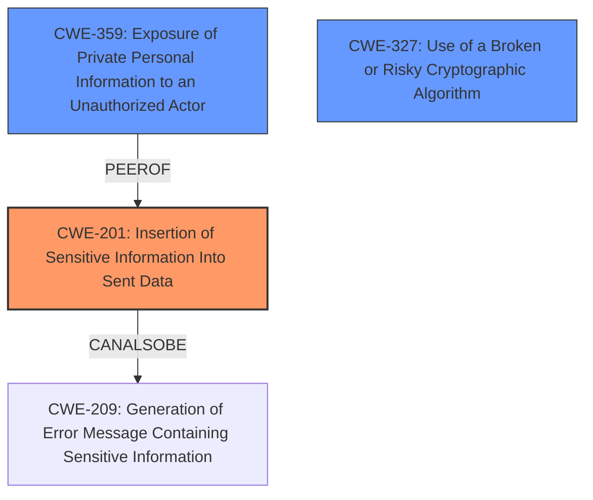

# Raw Analyzer Response for CVE-2024-49395

# Summary
| CWE ID | CWE Name | Confidence | CWE Abstraction Level | CWE Vulnerability Mapping Label | CWE-Vulnerability Mapping Notes |
|---|---|---|---|---|---|
| CWE-201 | Insertion of Sensitive Information Into Sent Data | 0.8 | Base | Primary | Allowed |
| CWE-359 | Exposure of Private Personal Information to an Unauthorized Actor | 0.6 | Base | Secondary Candidate | Allowed |
| CWE-327 | Use of a Broken or Risky Cryptographic Algorithm | 0.5 | Class | Secondary Candidate | Allowed-with-Review |

## Evidence and Confidence

*   **Confidence Score:** 0.7
*   **Evidence Strength:** MEDIUM

## Relationship Analysis
The primary CWE, CWE-201 [CWE-201: Insertion of Sensitive Information Into Sent Data], is a Base level CWE that directly addresses the core issue of sensitive data (Bcc) being included in the sent data due to the lack of `--hidden-recipient` usage. CWE-201 has peer relationships (CanAlsoBe) with CWE-202 and CWE-209, suggesting related information exposure issues. CWE-359 [CWE-359: Exposure of Private Personal Information to an Unauthorized Actor] is also relevant as it highlights the exposure of private information. CWE-327 [CWE-327: Use of a Broken or Risky Cryptographic Algorithm] is a Class-level CWE which is less specific than CWE-201.

## Vulnerability Chain
The vulnerability chain starts with the **weakness** that **PGP encryption does not use the --hidden-recipient mode** in mutt and neomutt. This leads to the Bcc email header field being potentially leaked, which means sensitive information is inserted into sent data (CWE-201 [CWE-201: Insertion of Sensitive Information Into Sent Data]). This results in the exposure of private personal information (Bcc recipients) to unauthorized actors (CWE-359 [CWE-359: Exposure of Private Personal Information to an Unauthorized Actor]).

## Summary of Analysis
The analysis is based on the provided vulnerability description, CVE reference content, and retriever results. The most relevant piece of evidence is: "In mutt and neomutt, **PGP encryption does not use the --hidden-recipient mode** which may leak the Bcc email header field by inferring from the recipients info." This directly indicates that sensitive information (Bcc) is being included in the sent data. The graph relationships helped to consider alternative classifications like CWE-209 [CWE-209: Generation of Error Message Containing Sensitive Information], but CWE-201 [CWE-201: Insertion of Sensitive Information Into Sent Data] is more accurate. The selected CWEs are at the optimal level of specificity, with CWE-201 [CWE-201: Insertion of Sensitive Information Into Sent Data] being a Base level CWE.

Relevant CWE Information:

# Enhanced Context (25 CWEs)
The following CWEs were identified as potentially relevant to this vulnerability:

## CWE-359: Exposure of Private Personal Information to an Unauthorized Actor
**Abstraction Level**: Base
**Similarity Score**: 0.71
**Source**: dense

**Description**:
The product does not properly prevent a person's private, personal information from being accessed by actors who either (1) are not explicitly authorized to access the information or (2) do not have the implicit consent of the person about whom the information is collected.

**Mapping Guidance**:
- Usage: Allowed
- Rationale: This CWE entry is at the Base level of abstraction, which is a preferred level of abstraction for mapping to the root causes of vulnerabilities.

## CWE-201: Insertion of Sensitive Information Into Sent Data
**Abstraction Level**: Base
**Similarity Score**: 734.58
**Source**: sparse

**Description**:
The code transmits data to another actor, but a portion of the data includes sensitive information that should not be accessible to that actor.

**Mapping Guidance**:
- Usage: Allowed
- Rationale: This CWE entry is at the Base level of abstraction, which is a preferred level of abstraction for mapping to the root causes of vulnerabilities.