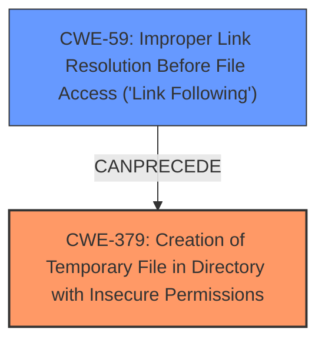

# Raw Analyzer Response for CVE-2024-49506

# Summary
| CWE ID | CWE Name | Confidence | CWE Abstraction Level | CWE Vulnerability Mapping Label | CWE-Vulnerability Mapping Notes |
|---|---|---|---|---|---|
| CWE-379 | Creation of Temporary File in Directory with Insecure Permissions | 0.9 | Base | Allowed | Primary CWE: The aeon-check script creates a temporary file in `/tmp`, which is a directory with insecure permissions, allowing unintended actors to determine the file's existence or access it. |
| CWE-59 | Improper Link Resolution Before File Access ('Link Following') | 0.7 | Base | Allowed | Secondary CWE: The script does not properly prevent the filename `/tmp/aeon-check-keyfile` from identifying a link that resolves to an unintended resource, allowing a symlink attack. |

## Evidence and Confidence

*   **Confidence Score:** 0.8
*   **Evidence Strength:** HIGH

## Relationship Analysis
The primary weakness is CWE-379, as the insecure directory permissions for temporary files allows for the exploitation. CWE-59 is a related weakness, as the insecure handling of symlinks allows an attacker to redirect file operations. CWE-59 is a prerequisite for CWE-379 because the symlink attack needs to resolve properly before the insecure permissions become exploitable. Both CWEs are at the Base level, providing the appropriate level of specificity.

## Vulnerability Chain
The vulnerability chain starts with the **insecure creation of a temporary file** in a directory with insecure permissions (CWE-379). This allows an attacker to create a symlink (CWE-59) that, when followed, leads to unintended file access and modification, potentially resulting in a denial of service or key compromise.
  - CWE-379: **Insecure creation of temporary files** in `/tmp`
  - CWE-59: Improper link resolution, allowing symlink attacks
  - Impact: Denial of service or compromise of encryption key

## Summary of Analysis
The analysis focuses on the root cause and contributing factors that allow exploitation. The primary issue is the **insecure creation of temporary files** (CWE-379), which is compounded by the **improper link resolution** (CWE-59) that enables symlink attacks.

The evidence supporting this assessment is strong, based on the following vulnerability description: "**Insecure creation of temporary files** allows local users on systems with non-default configurations to cause denial of service or set the encryption key for a filesystem".
Additionally, the CVE Reference Links Content Summary states: "The `aeon-check` script uses a fixed path `/tmp/aeon-check-keyfile` to create a temporary keyfile... Using a fixed path in `/tmp` makes the file susceptible to symlink attacks and pre-creation attacks."

The graph relationships highlight how CWE-59 can precede CWE-379 in an attack scenario. The selected CWEs are at the base level of abstraction, which is appropriate for identifying the specific weaknesses in the vulnerability.

Relevant CWE Information:

# Enhanced Context (25 CWEs)
The following CWEs were identified as potentially relevant to this vulnerability:

## CWE-378: Creation of Temporary File With Insecure Permissions
**Abstraction Level**: Base
**Similarity Score**: 0.76
**Source**: dense

**Description**:
Opening temporary files without appropriate measures or controls can leave the file, its contents and any function that it impacts vulnerable to attack.

**Mapping Guidance**:
- Usage: Allowed
- Rationale: This CWE entry is at the Base level of abstraction, which is a preferred level of abstraction for mapping to the root causes of vulnerabilities.

CWE-378 was considered but it's less specific than CWE-379, which highlights the issue with the directory permissions.

## CWE-379: Creation of Temporary File in Directory with Insecure Permissions
**Abstraction Level**: Base
**Similarity Score**: 0.74
**Source**: dense

**Description**:
The product creates a temporary file in a directory whose permissions allow unintended actors to determine the file's existence or otherwise access that file.

**Mapping Guidance**:
- Usage: Allowed
- Rationale: This CWE entry is at the Base level of abstraction, which is a preferred level of abstraction for mapping to the root causes of vulnerabilities.

## CWE-61: UNIX Symbolic Link (Symlink) Following
**Abstraction Level**: Compound
**Similarity Score**: 0.72
**Source**: dense

**Description**:
The product, when opening a file or directory, does not sufficiently account for when the file is a symbolic link that resolves to a target outside of the intended control sphere. This could allow an attacker to cause the product to operate on unauthorized files.

**Mapping Guidance**:
- Usage: Allowed
- Rationale: This is a well-known Composite of multiple weaknesses that must all occur simultaneously, although it is attack-oriented in nature.

CWE-61 was considered, but CWE-59 is more precise in describing the link following issue.

## CWE-377: Insecure Temporary File
**Abstraction Level**: Class
**Similarity Score**: 0.71
**Source**: dense

**Description**:
Creating and using insecure temporary files can leave application and system data vulnerable to attack.

**Mapping Guidance**:
- Usage: Allowed-with-Review
- Rationale: This CWE entry is a Class and might have Base-level children that would be more appropriate

CWE-377 is a class-level CWE and is less specific than CWE-379.

## CWE-59: Improper Link Resolution Before File Access ('Link Following')
**Abstraction Level**: Base
**Similarity Score**: 0.71
**Source**: dense

**Description**:
The product attempts to access a file based on the filename, but it does not properly prevent that filename from identifying a link or shortcut that resolves to an unintended resource.

**Mapping Guidance**:
- Usage: Allowed
- Rationale: This CWE entry is at the Base level of abstraction, which is a preferred level of abstraction for mapping to the root causes of vulnerabilities.

## CWE-367: Time-of-check Time-of-use (TOCTOU) Race Condition
**Abstraction Level**: Base
**Similarity Score**: 0.69
**Source**: dense

**Description**:
The product checks the state of a resource before using that resource, but the resource's state can change between the check and the use in a way that invalidates the results of the check. This can cause the product to perform invalid actions when the resource is in an unexpected state.

**Mapping Guidance**:
- Usage: Allowed
- Rationale: This CWE entry is at the Base level of abstraction, which is a preferred level of abstraction for mapping to the root causes of vulnerabilities.

CWE-367 was considered, but a TOCTOU race condition isn't the primary issue, although it could potentially contribute.

## CWE-330: Use of Insufficiently Random Values
**Abstraction Level**: Class
**Similarity Score**: 0.68
**Source**: dense

**Description**:
The product uses insufficiently random numbers or values in a security context that depends on unpredictable numbers.

**Mapping Guidance**:
- Usage: Discouraged
- Rationale: This CWE entry is a level-1 Class (i.e., a child of a Pillar). It might have lower-level children that would be more appropriate

CWE-330 is not relevant as the issue doesn't involve random number generation.

## CWE-277: Insecure Inherited Permissions
**Abstraction Level**: Variant
**Similarity Score**: 0.68
**Source**: dense

**Description**:
A product defines a set of insecure permissions that are inherited by objects that are created by the program.

**Mapping Guidance**:
- Usage: Allowed
- Rationale: This CWE entry is at the Variant level of abstraction, which is a preferred level of abstraction for mapping to the root causes of vulnerabilities.

CWE-277 is not relevant because it talks about inherited permissions which is not the case here.

## CWE-1391: Use of Weak Credentials
**Abstraction Level**: Class
**Similarity Score**: 0.67
**Source**: dense

**Description**:
The product uses weak credentials (such as a default key or hard-coded password) that can be calculated, derived, reused, or guessed by an attacker.

**Mapping Guidance**:
- Usage: Allowed-with-Review
- Rationale: This CWE entry is a Class and might have Base-level children that would be more appropriate

CWE-1391 is not relevant because it talks about weak credentials.

## CWE-73: External Control of File Name or Path
**Abstraction Level**: Base
**Similarity Score**: 0.67
**Source**: dense

**Description**:
The product allows user input to