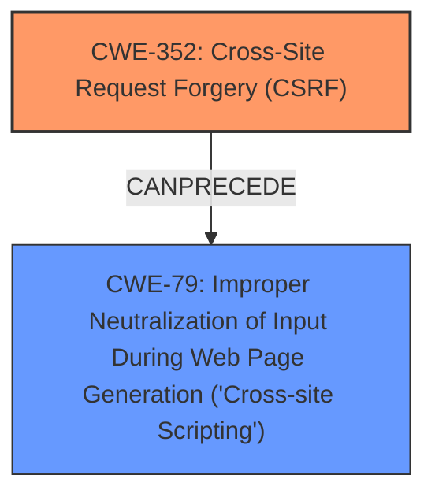

# Analysis for CVE-2024-49629

# Summary
| CWE ID | CWE Name | Confidence | CWE Abstraction Level | CWE Vulnerability Mapping Label | CWE-Vulnerability Mapping Notes |
|---|---|---|---|---|---|
| CWE-352 | Cross-Site Request Forgery (CSRF) | 1.0 | Compound | ROOTCAUSE | Allowed |
| CWE-79 | Improper Neutralization of Input During Web Page Generation ('Cross-site Scripting') | 1.0 | Base | WEAKNESS | Allowed |

## Evidence and Confidence

*   **Confidence Score:** 1.0
*   **Evidence Strength:** HIGH

## Relationship Analysis
The analysis identifies two distinct weaknesses: **lack of CSRF protection** and **XSS**. CWE-352 [CWE-352: Cross-Site Request Forgery (CSRF)] is mapped to the **lack of CSRF protection**, representing the root cause where the application fails to verify the legitimacy of user requests. CWE-79 [CWE-79: Improper Neutralization of Input During Web Page Generation ('Cross-site Scripting')] is mapped to the **XSS** vulnerability, which arises from the application's failure to neutralize user-controllable input properly. The primary relationship here is that the **lack of CSRF protection** (CWE-352 [CWE-352: Cross-Site Request Forgery (CSRF)]) can allow an attacker to inject malicious scripts, leading to XSS (CWE-79 [CWE-79: Improper Neutralization of Input During Web Page Generation ('Cross-site Scripting')]).

## Vulnerability Chain
The vulnerability chain begins with the **lack of CSRF protection** (CWE-352 [CWE-352: Cross-Site Request Forgery (CSRF)]), which enables an attacker to forge requests on behalf of a user. If the application also fails to properly neutralize user-controllable input, this can lead to stored XSS (CWE-79 [CWE-79: Improper Neutralization of Input During Web Page Generation ('Cross-site Scripting')]). Thus, the chain is:

1.  **Lack of CSRF protection** (CWE-352 [CWE-352: Cross-Site Request Forgery (CSRF)]) - Root Cause
2.  **Improper Neutralization of Input** (CWE-79 [CWE-79: Improper Neutralization of Input During Web Page Generation ('Cross-site Scripting')]) - Resulting Weakness

## Summary of Analysis
The initial analysis correctly identifies CWE-352 [CWE-352: Cross-Site Request Forgery (CSRF)] as the primary root cause due to the **lack of CSRF protection**, as explicitly stated in the description. The analysis also identifies CWE-79 [CWE-79: Improper Neutralization of Input During Web Page Generation ('Cross-site Scripting')] due to the presence of stored **XSS**, as the application fails to neutralize user-controllable input. The scores from the retriever results support these mappings, with CWE-352 [CWE-352: Cross-Site Request Forgery (CSRF)] and CWE-79 [CWE-79: Improper Neutralization of Input During Web Page Generation ('Cross-site Scripting')] having high relevance scores for the given keyphrases.

The evidence provided in the vulnerability description clearly supports the identification of these two weaknesses. The relationship between these weaknesses is that the **lack of CSRF protection** can allow an attacker to inject malicious scripts, leading to the **XSS** vulnerability.

The selected CWEs are at the optimal level of specificity because they directly address the root cause (**lack of CSRF protection**) and the resulting weakness (**XSS**).

CWEs considered but not used:

*   CWE-116 [CWE-116: Improper Encoding or Escaping of Output]: While encoding issues can contribute to XSS, the core issue is the **lack of neutralization**, making CWE-79 [CWE-79: Improper Neutralization of Input During Web Page Generation ('Cross-site Scripting')] a more precise fit.
*   CWE-434 [CWE-434: Unrestricted Upload of File with Dangerous Type]: This is not relevant because the description doesn't mention file uploads.
*   CWE-862 [CWE-862: Missing Authorization] and CWE-863 [CWE-863: Incorrect Authorization]: These are related to authorization issues, but the primary problem is the **lack of CSRF protection** that allows unauthorized actions, making CWE-352 [CWE-352: Cross-Site Request Forgery (CSRF)] more appropriate.
*   CWE-80 [CWE-80: Improper Neutralization of Script-Related HTML Tags in a Web Page (Basic XSS)]: Although related to **XSS**, CWE-79 [CWE-79: Improper Neutralization of Input During Web Page Generation ('Cross-site Scripting')] is a broader category that encompasses various types of **XSS**, including those beyond basic HTML tags.