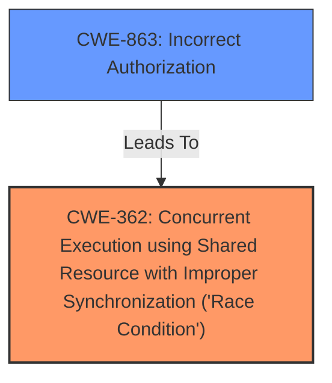

# Analysis for CVE-2024-49724

# Summary

| CWE ID  | CWE Name                                                                         | Confidence | CWE Abstraction Level | CWE Vulnerability Mapping Label | CWE-Vulnerability Mapping Notes |
| :-------- | :------------------------------------------------------------------------------- | :--------- | :-------------------- | :------------------------------ | :------------------------------ |
| CWE-362   | Concurrent Execution using Shared Resource with Improper Synchronization ('Race Condition') | 1          | Class                 | Primary                         | Allowed-with-Review           |
| CWE-863   | Incorrect Authorization                                                        | 0.7        | Class                 | Secondary                       | Allowed-with-Review           |

## Evidence and Confidence

*   **Confidence Score:** 0.8
*   **Evidence Strength:** HIGH

## Relationship Analysis

The primary CWE is CWE-362, which is a Class-level CWE. Several potential child CWEs exist for CWE-362, such as CWE-367 (Time-of-check Time-of-use (TOCTOU) Race Condition) and CWE-366 (Race Condition within a Thread). However, the description lacks specific details to determine which child CWE would be a more precise fit, so the Class-level CWE is more appropriate.

CWE-863, a Class-level CWE, is related to authorization issues. While authorization bypass is mentioned in the vulnerability description, the **race condition** is the root cause that leads to this bypass. The relationship is that the **race condition** allows for an incorrect authorization to occur.

## Vulnerability Chain

The vulnerability chain starts with a **race condition** (CWE-362) in AccountManagerService.java, which allows bypassing permissions and launching protected activities, leading to a local escalation of privilege.
  - The **race condition** (CWE-362) is the root cause.
  - The impact is bypassing permissions and launching protected activities (CWE-863).
  - This results in a local escalation of privilege.

## Summary of Analysis

The primary weakness is a **race condition** (CWE-362) in multiple functions of AccountManagerService.java. This **race condition** allows for bypassing permissions (CWE-863) and launching protected activities, ultimately leading to a local escalation of privilege.

The selection of CWE-362 is based on the vulnerability description, which explicitly mentions a **race condition**. The description also mentions bypassing permissions and launching protected activities. This aligns with CWE-863 (Incorrect Authorization), as the **race condition** enables the bypass of authorization checks.

The provided evidence supports the selection of CWE-362 as the primary weakness due to the explicit mention of a **race condition** as the root cause. The selection of CWE-863 is based on the impact of the **race condition**, which allows for bypassing permissions and launching protected activities.

The selected CWEs are at the appropriate level of specificity, with CWE-362 being a Class-level CWE and CWE-863 being a Class-level CWE.

Relevant CWE Information:
* CWE-362 Concurrent Execution using Shared Resource with Improper Synchronization ('Race Condition')
* CWE-863 Incorrect Authorization