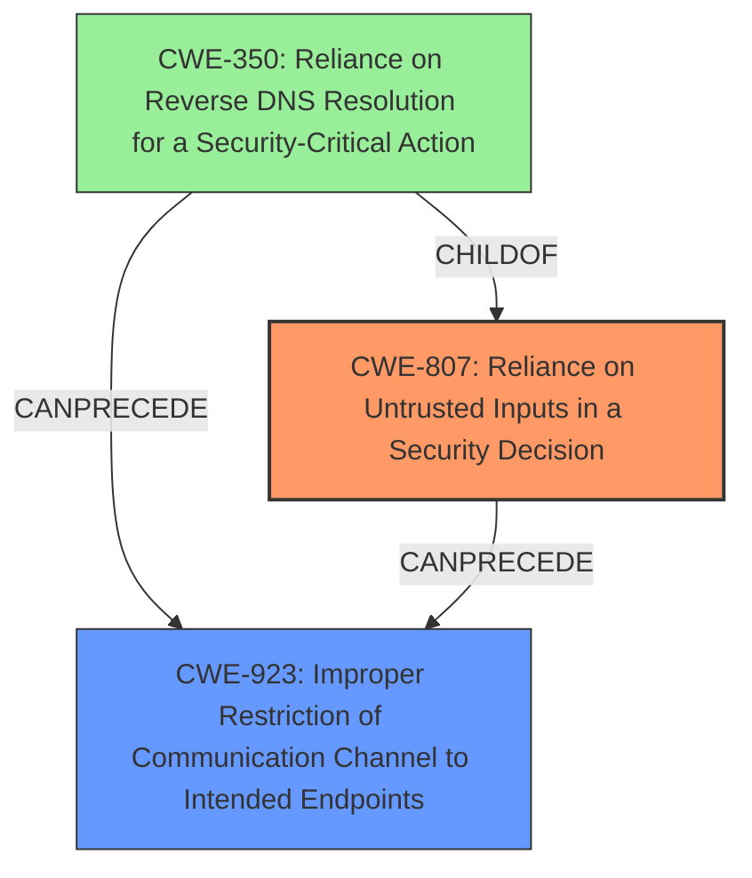

# Raw Analyzer Response for CVE-2024-49753

# Summary
| CWE ID | CWE Name | Confidence | CWE Abstraction Level | CWE Vulnerability Mapping Label | CWE-Vulnerability Mapping Notes |
|---|---|---|---|---|---|
| CWE-807 | Reliance on Untrusted Inputs in a Security Decision | 0.9 | Base | Allowed | Primary CWE: The **rootcause** is that the application relies on an input (DNS record) that can be modified by an untrusted actor to bypass security checks. |
| CWE-923 | Improper Restriction of Communication Channel to Intended Endpoints | 0.7 | Class | Allowed-with-Review | Secondary: Because the **flaw in the URL validation mechanism** allowed access to localhost, a restricted communication channel, this could be a secondary CWE. |

## Evidence and Confidence

*   **Confidence Score:** 0.8
*   **Evidence Strength:** HIGH

## Relationship Analysis
The primary relationship that influenced the decision was the parent-child relationship between CWE-807 and CWE-350 (Reliance on Reverse DNS Resolution for a Security-Critical Action). While CWE-350 is more specific, the description indicates a broader reliance on untrusted inputs rather than solely reverse DNS resolution, making CWE-807 a better fit. CWE-923, while relevant, is a class-level CWE, and the root cause is better captured by CWE-807.

## Vulnerability Chain
The vulnerability chain starts with the **improper URL validation** which leads to reliance on untrusted inputs (DNS record), which then allows bypassing the localhost restriction, ultimately leading to unauthorized access to internal endpoints.

1.  **Improper URL Validation** (Implicit)
2.  CWE-807 Reliance on Untrusted Inputs in a Security Decision (Root Cause)
3.  CWE-923 Improper Restriction of Communication Channel to Intended Endpoints (Bypass/Impact)
4.  Unauthorized Access to Internal Endpoints (Impact)

## Summary of Analysis
The initial assessment focused on identifying the root cause of the vulnerability. The description clearly indicates that the **flaw** lies in the application's **URL validation mechanism**, which allows bypassing restrictions by using a DNS record that resolves to 127.0.0.1.

The **Vulnerability Description Key Phrases** includes "**rootcause:** **flaw in URL validation mechanism**" and the **CVE Reference Links Content Summary** stated "The URL validation mechanism in Zitadel actions can be bypassed by creating a DNS record that resolves to 127.0.0.1. The isHostBlocked check, intended to block requests to localhost (127.0.0.1), is circumvented."

CWE-807, "Reliance on Untrusted Inputs in a Security Decision," best captures this **rootcause** because the application relies on the DNS record, an input modifiable by an attacker, to make a security decision (whether to block the request). This is a base-level CWE, providing sufficient specificity.

CWE-923, "Improper Restriction of Communication Channel to Intended Endpoints," is a secondary concern, as it represents the impact of bypassing the localhost restriction, but is not the primary **rootcause**.

The selected CWEs are at the optimal level of specificity because CWE-807 accurately describes the underlying weakness, and CWE-923 describes the impact of the weakness.

Relevant CWE Information:

# Enhanced Context (25 CWEs)
The following CWEs were identified as potentially relevant to this vulnerability:

## CWE-267: Privilege Defined With Unsafe Actions
**Abstraction Level**: Base
**Similarity Score**: 0.75
**Source**: dense

**Description**:
A particular privilege, role, capability, or right can be used to perform unsafe actions that were not intended, even when it is assigned to the correct entity.

**Mapping Guidance**:
- Usage: Allowed
- Rationale: This CWE entry is at the Base level of abstraction, which is a preferred level of abstraction for mapping to the root causes of vulnerabilities.

*Not Selected:* While the attacker needs high privileges to define and use actions, the core issue isn't about the privileges themselves being unsafe, but about how the URL validation is bypassed.

## CWE-288: Authentication Bypass Using an Alternate Path or Channel
**Abstraction Level**: Base
**Similarity Score**: 0.75
**Source**: dense

**Description**:
The product requires authentication, but the product has an alternate path or channel that does not require authentication.

**Mapping Guidance**:
- Usage: Allowed
- Rationale: This CWE entry is at the Base level of abstraction, which is a preferred level of abstraction for mapping to the root causes of vulnerabilities.

*Not Selected:* Authentication isn't bypassed here; the issue is with the URL validation.

## CWE-497: Exposure of Sensitive System Information to an Unauthorized Control Sphere
**Abstraction Level**: Base
**Similarity Score**: 0.74
**Source**: dense

**Description**:
The product does not properly prevent sensitive system-level information from being accessed by unauthorized actors who do not have the same level of access to the underlying system as the product does.

**Mapping Guidance**:
- Usage: Allowed
- Rationale: This CWE entry is at the Base level of abstraction, which is a preferred level of abstraction for mapping to the root causes of vulnerabilities.

*Not Selected:* While sensitive information *could* be exposed, the main problem is the bypassed validation.

## CWE-923: Improper Restriction of Communication Channel to Intended Endpoints
**Abstraction Level**: Class
**Similarity Score**: 0.74
**Source**: dense

**Description**:
The product establishes a communication channel to (or from) an endpoint for privileged or protected operations, but it does not properly ensure that it is communicating with the correct endpoint.

**Mapping Guidance**:
- Usage: Allowed-with-Review
- Rationale: This CWE entry is a Class and might have Base-level children that would be more appropriate

*Candidate, but Secondary:* As stated above, this is a secondary CWE.

## CWE-1391: Use of Weak Credentials
**Abstraction Level**: Class
**Similarity Score**: 0.74
**Source**: dense

**Description**:
The product uses weak credentials (such as a default key or hard-coded password) that can be calculated, derived, reused, or guessed by an attacker.

**Mapping Guidance**:
- Usage: Allowed-with-Review
- Rationale: This CWE entry is a Class and might have Base-level children that would be more appropriate

*Not Selected:* This vulnerability is not related to weak credentials.

## CWE-346: Origin Validation Error
**Abstraction Level**: Class
**Similarity Score**: 0.74
**Source**: dense

**Description**:
The product does not properly verify that the source of data or communication is valid.

**Mapping Guidance**:
- Usage: Allowed-with-Review
- Rationale: This CWE entry is a Class and might have Base-level children that would be more appropriate

*Not Selected:* The vulnerability is about validating the destination (localhost), not the origin of the request.

## CWE-303: Incorrect Implementation of Authentication Algorithm
**Abstraction Level**: Base
**Similarity Score**: 0.74
**Source**: dense

**Description**:
The requirements for the product dictate the use of an established authentication algorithm, but the implementation of the algorithm is incorrect.

**Mapping Guidance**:
- Usage: Allowed
- Rationale: This CWE entry is at the Base level of abstraction, which is a preferred level of abstraction for mapping to the root causes of vulnerabilities.

*Not Selected:* Not related to authentication.

## CWE-807: Reliance on Untrusted Inputs in a Security Decision
**Abstraction Level**: Base
**Similarity Score**: 0.73
**Source**: dense

**Description**:
The product uses a protection mechanism that relies on the existence or values of an input, but the input can be modified by an untrusted actor in a way that bypasses the protection mechanism.

**Mapping Guidance**:
- Usage: Allowed
- Rationale: This CWE entry is at the Base level of abstraction, which is a preferred level of abstraction for mapping to the root causes of vulnerabilities.

*Selected, Primary:* This is the best fit for the **rootcause**.

## CWE-639: Authorization Bypass Through User-Controlled Key
**Abstraction Level**: Base
**Similarity Score**: 0.7