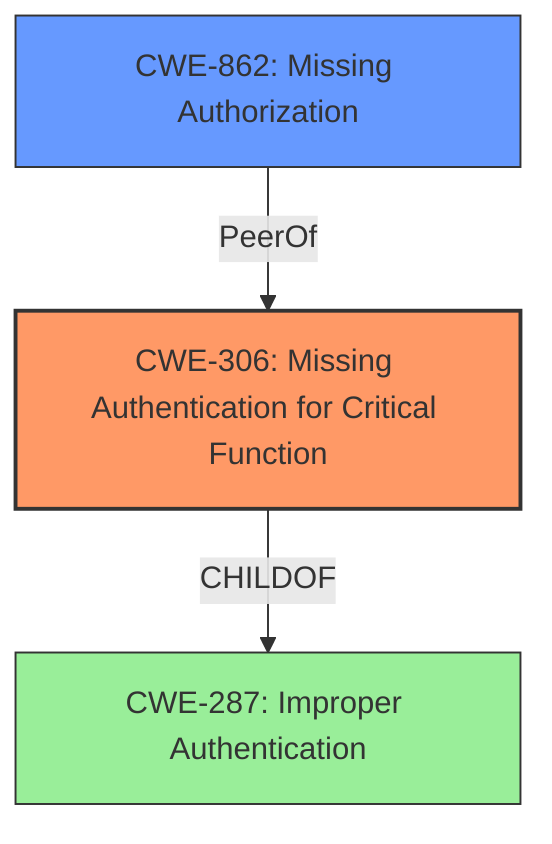

# Enhanced Analysis for CVE-2024-49757

# Summary
| CWE ID | CWE Name | Confidence | CWE Abstraction Level | CWE Vulnerability Mapping Label | CWE-Vulnerability Mapping Notes |
|---|---|---|---|---|---|
| CWE-306 | Missing Authentication for Critical Function | 1.0 | Base | Primary | Allowed |
| CWE-862 | Missing Authorization | 0.7 | Class | Secondary Candidate | Allowed-with-Review |

## Evidence and Confidence

*   **Confidence Score:** 0.9
*   **Evidence Strength:** HIGH

## Relationship Analysis
The primary relationship influencing my decision is the parent-child relationship. CWE-306 [Missing Authentication for Critical Function] is a child of CWE-287 [Improper Authentication]. Although CWE-287 was a strong candidate, the specific lack of *any* authentication makes CWE-306 a more precise fit. CWE-862 [Missing Authorization] is also a strong candidate as the registration function should be properly authorized.



## Vulnerability Chain
The vulnerability chain begins with the **missing security check** (lack of authentication) on the registration URL. This leads to the impact of allowing unauthorized user registration, bypassing the intended security control of disabling self-registration via the UI.

Missing Authentication -> Bypass of Intended Security Controls

## Summary of Analysis
My analysis is primarily based on the detailed information provided in the "CVE Reference Links Content Summary" section, which outlines the root cause and weaknesses. The vulnerability stems from a **missing security check**, allowing users to bypass the intended restriction by directly accessing the registration URL. This aligns strongly with CWE-306 [Missing Authentication for Critical Function], which describes a product not performing any authentication for functionality that requires a provable user identity. The retriever results also support this, with CWE-306 being a top candidate.

The relationship graph influenced my decision by highlighting the parent-child relationship between CWE-306 and CWE-287. While CWE-287 [Improper Authentication] is a broader category, CWE-306 specifically addresses the complete absence of authentication. Since the vulnerability involves a complete lack of authentication for the registration URL, CWE-306 is the more specific and accurate choice.

CWE-862 [Missing Authorization] is a plausible secondary candidate because the registration URL lacked proper authorization checks to ensure that only authorized users could access it, even when self-registration was disabled.

I am confident in my selection of CWE-306 as the primary CWE because it accurately reflects the root cause of the vulnerability, which is the complete absence of authentication for a critical function.

Relevant CWE Information:

# Enhanced Context (25 CWEs)
The following CWEs were identified as potentially relevant to this vulnerability:

## CWE-472: External Control of Assumed-Immutable Web Parameter
**Abstraction Level**: Base
**Similarity Score**: 0.76
**Source**: dense

**Description**:
The web application does not sufficiently verify inputs that are assumed to be immutable but are actually externally controllable, such as hidden form fields.

**Mapping Guidance**:
- Usage: Allowed
- Rationale: This CWE entry is at the Base level of abstraction, which is a preferred level of abstraction for mapping to the root causes of vulnerabilities.

*Not Selected:* This CWE is not selected because the issue is not related to the verification of assumed-immutable parameters, but rather the lack of authentication on a specific URL.

## CWE-288: Authentication Bypass Using an Alternate Path or Channel
**Abstraction Level**: Base
**Similarity Score**: 0.74
**Source**: dense

**Description**:
The product requires authentication, but the product has an alternate path or channel that does not require authentication.

**Mapping Guidance**:
- Usage: Allowed
- Rationale: This CWE entry is at the Base level of abstraction, which is a preferred level of abstraction for mapping to the root causes of vulnerabilities.

*Not Selected:* This CWE is similar, but not quite as accurate as CWE-306. The key is that there should *always* be authentication for the registration function, not that there is an alternate path to bypass existing authentication.

## CWE-303: Incorrect Implementation of Authentication Algorithm
**Abstraction Level**: Base
**Similarity Score**: 0.74
**Source**: dense

**Description**:
The requirements for the product dictate the use of an established authentication algorithm, but the implementation of the algorithm is incorrect.

**Mapping Guidance**:
- Usage: Allowed
- Rationale: This CWE entry is at the Base level of abstraction, which is a preferred level of abstraction for mapping to the root causes of vulnerabilities.

*Not Selected:* This CWE is not selected because there is no indication that the authentication algorithm was implemented incorrectly. The issue is that there was no authentication at all.

## CWE-639: Authorization Bypass Through User-Controlled Key
**Abstraction Level**: Base
**Similarity Score**: 0.74
**Source**: dense

**Description**:
The system's authorization functionality does not prevent one user from gaining access to another user's data or record by modifying the key value identifying the data.

**Mapping Guidance**:
- Usage: Allowed
- Rationale: This CWE entry is at the Base level of abstraction, which is a preferred level of abstraction for mapping to the root causes of vulnerabilities.

*Not Selected:* This CWE is not selected because the issue is not related to user-controlled keys, but rather the lack of authentication on a specific URL.

## CWE-267: Privilege Defined With Unsafe Actions
**Abstraction Level**: Base
**Similarity Score**: 0.74
**Source**: dense

**Description**:
A particular privilege, role, capability, or right can be used to perform unsafe actions that were not intended, even when it is assigned to the correct entity.

**Mapping Guidance**:
- Usage: Allowed
- Rationale: This CWE entry is at the Base level of abstraction, which is a preferred level of abstraction for mapping to the root causes of vulnerabilities.

*Not Selected:* This CWE is not selected because the issue is not related to unsafe actions being performed by a specific privilege, but rather the lack of authentication on a specific URL.

## CWE-1390: Weak Authentication
**Abstraction Level**: Class
**Similarity Score**: 0.74
**Source**: dense

**Description**:
The product uses an authentication mechanism to restrict access to specific users or identities, but the mechanism does not sufficiently prove that the claimed identity is correct.

**Mapping Guidance**:
- Usage: Allowed-with-Review
- Rationale: This CWE entry is a Class and might have Base-level children that would be more appropriate

*Not Selected:* The authentication is not weak, but rather missing entirely.

## CWE-425: Direct Request ('Forced Browsing')
**Abstraction Level**: Base
**Similarity Score**: 0.73
**Source**: dense

**Description**:
The web application does not adequately enforce appropriate authorization on all restricted URLs, scripts, or files.

**Mapping Guidance**:
- Usage: Allowed
- Rationale: This CWE entry is at the Base level of abstraction, which is a preferred level of abstraction for mapping to the root causes of vulnerabilities.

*Not Selected:* Authorization is related, but the complete *lack* of Authentication for a critical function is a more accurate description of the vulnerability.

## CWE-1391: Use of Weak Credentials
**Abstraction Level**: Class
**Similarity Score**: 0.73
**Source**: dense

**Description**:
The product uses weak credentials (such as a default key or hard-coded password) that can be calculated, derived, reused, or guessed by an attacker.

**Mapping Guidance**:
- Usage: Allowed-with-Review
- Rationale: This CWE entry is a Class and might have Base-level children that would be more appropriate

*Not Selected:* The authentication is not weak, but rather missing entirely.

## CWE-807: Reliance on Untrusted Inputs in a Security Decision
**Abstraction Level**: Base
**Similarity Score**: 0.73
**Source**: dense

**Description**:
The product uses a protection mechanism that relies on the existence or values of an input, but the input can be modified by an untrusted actor in a way that bypasses the protection mechanism.

**Mapping Guidance**:
- Usage: Allowed
- Rationale: This CWE entry is at the Base level of abstraction, which is a preferred level of abstraction for mapping to the root causes of vulnerabilities.

*Not Selected:* This CWE is not selected because the issue is not related to relying on untrusted inputs, but rather the lack of authentication on a specific URL.

## CWE-497: Exposure of Sensitive System Information to an Unauthorized Control Sphere


## CWE Relationship Analysis

Current CWEs represent these abstraction levels: .


### Vulnerability Chain Analysis

**Chain starting from CWE-288:**
- 288 (Authentication Bypass Using an Alternate Path or Channel) - ROOT


**Chain starting from CWE-1390:**
- 1390 (Weak Authentication) - ROOT


### CWE Relationship Diagram

```mermaid
graph TD
    classDef primary fill:#f96,stroke:#333,stroke-width:2px
    classDef secondary fill:#69f,stroke:#333
    classDef tertiary fill:#9e9,stroke:#333
```