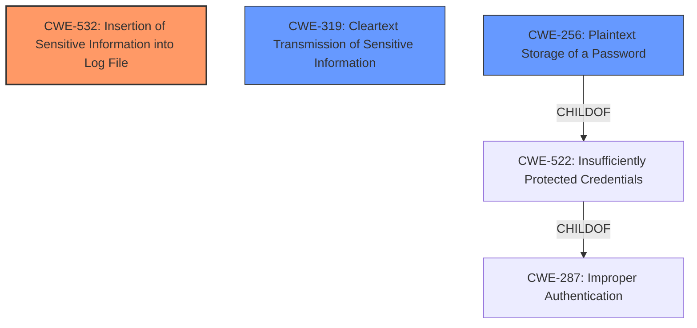

# Analysis Report for CVE-2024-49762

# Vulnerability Analysis Report: CVE-2024-49762

## Description

Pterodactyl is a free, open-source game server management panel. When a user disables two-factor authentication via the Panel, a `DELETE` request with their current password in a query parameter will be sent. While query parameters are encrypted when using TLS, many webservers (including ones officially documented for use with Pterodactyl) will log query parameters in plain-text, storing a users password in plain text. Prior to version 1.11.8, if a malicious user obtains access to these logs they could potentially authenticate against a users account assuming they are able to discover the accounts email address or username separately. This problem has been patched in version 1.11.8. There are no workarounds at this time. There is not a direct vulnerability within the software as it relates to logs generated by intermediate components such as web servers or Layer 7 proxies. Updating to `v1.11.8` or adding the linked patch manually are the only ways to avoid this problem. As this vulnerability relates to historical logging of sensitive data, users who have ever disabled 2FA on a Panel (self-hosted or operated by a company) should change their passwords and consider enabling 2FA if it was left disabled. While its unlikely that their account swill be compromised by this vulnerability, its not impossible. Panel administrators should consider clearing any access logs that may contain sensitive data.

## Vulnerability Description Key Phrases

- **Rootcause:** improper access control
- **Weakness:** plaintext password exposure
- **Attacker:** malicious user
- **Product:** Pterodactyl
- **Version:** prior to 1.11.8
- **Component:** Panel

## Analysis (with Relationship Data)

# Summary

| CWE ID   | CWE Name                                                                   | Confidence | CWE Abstraction Level | CWE Vulnerability Mapping Label | CWE-Vulnerability Mapping Notes |
| -------- | -------------------------------------------------------------------------- | ---------- | --------------------- | ------------------------------- | ------------------------------- |
| CWE-532  | Insertion of Sensitive Information into Log File                         | 0.9        | Base                  | Primary                         | Allowed                       |
| CWE-319  | Cleartext Transmission of Sensitive Information                         | 0.7        | Base                  | Secondary                       | Allowed                       |
| CWE-256  | Plaintext Storage of a Password                                          | 0.6        | Base                  | Secondary                       | Allowed                       |

## Evidence and Confidence

*   **Confidence Score:** 0.8
*   **Evidence Strength:** HIGH

## Relationship Analysis

The primary CWE is CWE-532, representing the core issue of logging sensitive information. CWE-319 is a related weakness describing the cleartext transmission, and CWE-256 is a further specific weakness of storing passwords in plaintext. CWE-532 is not a child of any other CWE. However, CWE-256 is a child of CWE-522 (Insufficiently Protected Credentials) which in turn is a child of CWE-287 (Improper Authentication). This suggests a potential authentication-related context.



## Vulnerability Chain

The vulnerability chain begins with the **improper** handling of passwords during the 2FA disabling process, leading to the transmission of the password in a query parameter. This is followed by the logging of the query parameter in plaintext by the web server, resulting in the storage of sensitive information in log files. The attacker gains access to these logs, retrieves the plaintext password, and uses it to compromise the user account.
  - Root Cause: **improper access control** leading to password in the query parameter
  - Weakness 1: Logging of query parameter containing password (CWE-532)
  - Weakness 2: Sensitive information sent in cleartext (CWE-319)
  - Impact: Account compromise

## Summary of Analysis

The initial assessment focused on identifying the root cause of the vulnerability and the specific weaknesses involved. The primary driver for the CWE selection was the evidence from the vulnerability description and the CVE Reference Links Content Summary, which highlighted the logging of plaintext passwords as the main issue.

The analysis considered the guidance provided, especially regarding authentication vs. authorization. However, the core issue is not about missing authentication or authorization checks within the Pterodactyl application itself, but rather the unintentional logging of sensitive data by intermediate components.

The selection of CWE-532 as the primary CWE is based on its direct relevance to the vulnerability description: "While query parameters are encrypted when using TLS, many webservers (including ones officially documented for use with Pterodactyl) will log query parameters in plain-text, storing a users password in plain text."

The selection of CWE-319 is based on the fact that the password was transmitted as a query parameter and was therefore in cleartext for the webserver.
The selection of CWE-256 is based on the fact that the passwords were found in plaintext.

The graph relationships influenced the consideration of related CWEs, such as those related to authentication and credential management. However, the final selection prioritizes the most direct and specific representation of the vulnerability: the **insertion of sensitive information into log files**.

The selected CWEs are at the optimal level of specificity because they accurately describe the technical details of the vulnerability and its potential impact. More generic CWEs, such as CWE-284 (Improper Access Control), would not provide sufficient information about the specific nature of the weakness.

Relevant CWE Information:

**CWE-532: Insertion of Sensitive Information into Log File**

*   **Description:** The product places sensitive information into log files.
*   This aligns with the vulnerability where passwords are logged in plain text.

**CWE-319: Cleartext Transmission of Sensitive Information**

*   **Description:** The product transmits sensitive or security-critical data in cleartext in a communication channel that can be sniffed by unauthorized actors.
*   This aligns with the vulnerability where passwords are sent as a query parameter.

**CWE-256: Plaintext Storage of a Password**

*   **Description:** The product stores user passwords in a format that is not properly protected, which makes it easier for an attacker to compromise the credentials.
*   This aligns with the vulnerability where passwords are logged in plain text.

**CWEs Considered but Not Used:**

*   **CWE-287 Improper Authentication:** While the vulnerability involves passwords, the root cause is not a failure in the authentication process itself. The application authenticates users correctly. The problem lies in the subsequent logging of sensitive data.
*   **CWE-306 Missing Authentication for Critical Function:** This CWE does not apply as the issue isn't related to missing authentication.
*   **CWE-863 Incorrect Authorization:** This CWE does not apply as the issue isn't related to incorrect authorization.


## CWE Relationship Analysis

Current CWEs represent these abstraction levels: .


### Vulnerability Chain Analysis

**Chain starting from CWE-863:**
- 863 (Incorrect Authorization) - ROOT


**Chain starting from CWE-319:**
- 319 (Cleartext Transmission of Sensitive Information) - ROOT


### CWE Relationship Diagram

```mermaid
graph TD
    classDef primary fill:#f96,stroke:#333,stroke-width:2px
    classDef secondary fill:#69f,stroke:#333
    classDef tertiary fill:#9e9,stroke:#333
```


*Report generated on 2025-07-13 19:34:11*
