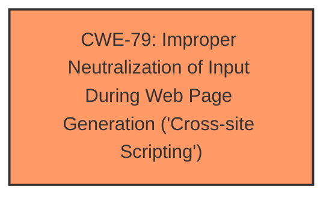

# Enhanced Analysis for CVE-2024-4977

# Summary
| CWE ID | CWE Name | Confidence | CWE Abstraction Level | CWE Vulnerability Mapping Label | CWE-Vulnerability Mapping Notes |
|---|---|---|---|---|---|
| CWE-79 | Improper Neutralization of Input During Web Page Generation ('Cross-site Scripting') | 1 | Base | Allowed | Primary CWE. The application does not neutralize user-controllable input before placing it in output used as a web page. |

## Evidence and Confidence

*   **Confidence Score:** 1
*   **Evidence Strength:** HIGH

## Relationship Analysis
The primary weakness is **CWE-79 [Improper Neutralization of Input During Web Page Generation ('Cross-site Scripting')]**, a Base level CWE. There are no child CWEs that are a better fit for the description, and it correctly captures the **improper input sanitization and escaping** that leads to the XSS vulnerability.



## Vulnerability Chain
The vulnerability chain starts with **improper input sanitization and escaping**, leading to **CWE-79 [Improper Neutralization of Input During Web Page Generation ('Cross-site Scripting')]**. This allows an attacker to inject malicious scripts into the web page, which can then be executed by other users.

## Summary of Analysis
The analysis indicates that the **rootcause** of the vulnerability is **improper input sanitization and escaping** which leads to **CWE-79 [Improper Neutralization of Input During Web Page Generation ('Cross-site Scripting')]**. The vulnerability description clearly states that the plugin "does not sanitise and escape a parameter before outputting it back in the page". This directly aligns with the definition of CWE-79, which is "The product does not neutralize or incorrectly neutralizes user-controllable input before it is placed in output that is used as a web page that is served to other users."

The selection of CWE-79 is at the optimal level of specificity because it is a Base level CWE that accurately represents the weakness. The retriever results also list CWE-79 as a potential candidate. Other CWEs, such as CWE-116 [Improper Encoding or Escaping of Output], are broader and don't specifically address the XSS aspect of the vulnerability.

The evidence from the "CVE Reference Links Content Summary" further supports this, stating "The plugin does not sanitize and escape a parameter before outputting it back into the page" and "Reflected Cross-Site Scripting (XSS)".

**CWEs Considered But Not Used:**

*   **CWE-116 [Improper Encoding or Escaping of Output]:** While encoding and escaping are related to sanitization, CWE-116 is too general and doesn't specifically address the XSS issue. The vulnerability is specifically related to the lack of neutralization of input used in a web page.
*   **CWE-80 [Improper Neutralization of Script-Related HTML Tags in a Web Page (Basic XSS)]:** This is a variant of XSS, but CWE-79 is more general and encompasses all types of XSS, including those not limited to HTML tags.
*   **CWE-352 [Cross-Site Request Forgery (CSRF)]:** This is not relevant as the vulnerability is a Reflected XSS, not a CSRF. CSRF is where the application can not verify if the request came from the user.


## CWE Relationship Analysis

Current CWEs represent these abstraction levels: .


### Vulnerability Chain Analysis

**Chain starting from CWE-352:**
- 352 (Cross-Site Request Forgery (CSRF)) - ROOT


**Chain starting from CWE-79:**
- 79 (Improper Neutralization of Input During Web Page Generation ('Cross-site Scripting')) - ROOT


### CWE Relationship Diagram

```mermaid
graph TD
    classDef primary fill:#f96,stroke:#333,stroke-width:2px
    classDef secondary fill:#69f,stroke:#333
    classDef tertiary fill:#9e9,stroke:#333
```