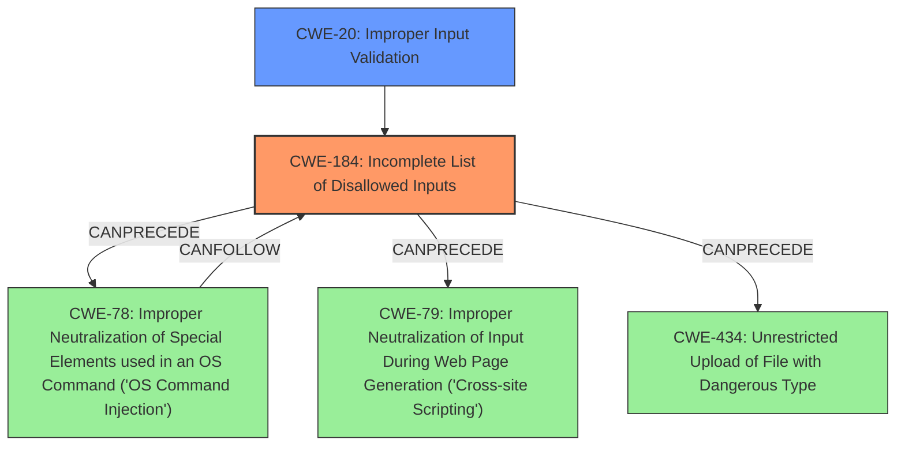

# Analysis Report for CVE-2024-49774

# Vulnerability Analysis Report: CVE-2024-49774

## Description

SuiteCRM is an open-source, enterprise-ready Customer Relationship Management (CRM) software application. SuiteCRM relies on the blacklist of functions/methods to prevent installation of malicious MLPs. But this checks can be bypassed with some syntax constructions. **SuiteCRM uses token_get_all to parse PHP scripts and check the resulted AST against blacklists. But it doesnt take into account all scenarios**. This issue has been addressed in versions 7.14.6 and 8.7.1. Users are advised to upgrade. There are no known workarounds for this vulnerability.

## Vulnerability Description Key Phrases

- **Rootcause:** SuiteCRM uses token_get_all to parse PHP scripts and check the resulted AST against blacklists. But it doesnt take into account all scenarios
- **Impact:** installation of malicious MLPs
- **Vector:** bypass the blacklist of functions/methods
- **Product:** SuiteCRM

## Analysis (with Relationship Data)

# Summary
| CWE ID | CWE Name | Confidence | CWE Abstraction Level | CWE Vulnerability Mapping Label | CWE-Vulnerability Mapping Notes |
|---|---|---|---|---|---|
| CWE-184 | Incomplete List of Disallowed Inputs | 0.9 | Base | Allowed | Primary CWE. The **rootcause** is that the blacklist is incomplete because the SuiteCRM parser doesn't take into account all scenarios, allowing bypasses |
| CWE-20 | Improper Input Validation | 0.6 | Class | Discouraged | Secondary CWE. The application fails to properly validate input, allowing malicious code to be installed. |

## Evidence and Confidence

*   **Confidence Score:** 0.8
*   **Evidence Strength:** MEDIUM

## Relationship Analysis
- CWE-184 is a Base level CWE, which is preferred. It describes the **incomplete** blacklist.
- CWE-20 is a Class level CWE, and the description indicates that it is often misused when lower-level CWEs are available.
- CWE-184 CanPrecede CWE-78 and CWE-79 which would result in OS Command Injection and Cross-site Scripting respectively.



## Vulnerability Chain
The vulnerability chain starts with the **incomplete** blacklist (CWE-184), which leads to improper input validation (CWE-20), and finally results in remote code execution by allowing the installation of malicious MLPs (impact).

## Summary of Analysis
The primary weakness is the **incomplete** blacklist, which leads to improper input validation and remote code execution. The evidence clearly supports the choice of CWE-184 as the primary CWE, as the vulnerability description explicitly mentions that the SuiteCRM parser "doesn't take into account all scenarios." This directly relates to the definition of CWE-184, which is an **incomplete** list of disallowed inputs. The relationships show that this weakness can lead to other vulnerabilities such as OS Command Injection, Cross-Site Scripting, and Unrestricted Upload of File with Dangerous Type. The vulnerability description mentions that successful exploitation leads to Remote Code Execution (RCE), which can result in "Network penetration, Privilege escalation, Sensitive data exposure, Denial of Service (DoS), Cryptomining, and Ransomware deployment".

CWE-20 was considered because the CVE description mentions "Improper Input Validation (CWE-20)". However, CWE-20 is too general and the root cause is the incomplete blacklist.
CWE-78 and CWE-79 were considered because CWE-184 can precede them. However, these are potential impacts of the vulnerability rather than the root cause.

The final selection of CWE-184 is at the optimal level of specificity because it directly addresses the **incomplete** blacklist, which is the root cause of the vulnerability.


## CWE Relationship Analysis

Current CWEs represent these abstraction levels: .


### Vulnerability Chain Analysis

**Chain starting from CWE-79:**
- 79 (Improper Neutralization of Input During Web Page Generation ('Cross-site Scripting')) - ROOT


**Chain starting from CWE-78:**
- 78 (Improper Neutralization of Special Elements used in an OS Command ('OS Command Injection')) - ROOT


### CWE Relationship Diagram

```mermaid
graph TD
    classDef primary fill:#f96,stroke:#333,stroke-width:2px
    classDef secondary fill:#69f,stroke:#333
    classDef tertiary fill:#9e9,stroke:#333
```


*Report generated on 2025-07-13 19:35:43*
