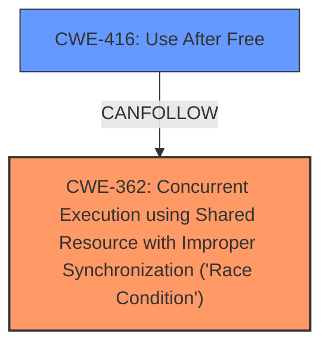

# Enhanced Analysis for CVE-2024-49903

# Summary

| CWE ID | CWE Name | Confidence | CWE Abstraction Level | CWE Vulnerability Mapping Label | CWE-Vulnerability Mapping Notes |
|---|---|---|---|---|---|
| CWE-362 | Concurrent Execution using Shared Resource with Improper Synchronization ('Race Condition') | 0.9 | Class | Allowed-with-Review | Primary CWE. The **race condition** between `dbUnmount` and `jfs_ioc_trim` due to **improper synchronization** when accessing `bmap` is the root cause. |
| CWE-416 | Use After Free | 0.9 | Variant | Allowed | Secondary CWE. The **race condition** leads to a **use-after-free** vulnerability, which is a direct consequence of the lack of synchronization. |

## Evidence and Confidence

*   **Confidence Score:** 0.9
*   **Evidence Strength:** HIGH

## Relationship Analysis
The primary relationship is that the **race condition** (CWE-362) can lead to a **use-after-free** vulnerability (CWE-416). CWE-362 is a Class, and there might be more specific Base-level children, but given the information provided, CWE-362 accurately describes the **improper synchronization** aspect. CWE-416 is a Variant and accurately describes the **use-after-free** condition.



## Vulnerability Chain
The vulnerability chain starts with the **improper synchronization** (CWE-362) between `dbUnmount` and `jfs_ioc_trim`, leading to a **race condition** when accessing the `bmap` structure. This **race condition** then results in a **use-after-free** vulnerability (CWE-416) because the `bmap` structure can be freed by `dbUnmount` while `jfs_ioc_trim` is still trying to access it.

## Summary of Analysis
The analysis is based on the provided evidence, which includes the vulnerability description, key phrases, and CVE reference links. The evidence clearly indicates a **race condition** due to **improper synchronization**, leading to a **use-after-free** vulnerability.

The key phrase "Race condition in JFS file system when accessing bmap leads to use-after-free" directly supports the selection of CWE-362 and CWE-416. The CVE reference links content summary confirms this by stating "A **race condition** exists in the JFS filesystem driver between the `dbUnmount` and `jfs_ioc_trim` functions when accessing the `bmap` structure" and "The core vulnerability is a **use-after-free**. The `bmap` structure can be freed by `dbUnmount` while `jfs_ioc_trim` is still trying to access it."

CWE-362 is at the Class level, but it accurately captures the essence of the synchronization issue. CWE-416, being a Variant, provides a more specific description of the resulting vulnerability.

Relevant CWE Information:

# Enhanced Context (25 CWEs)
The following CWEs were identified as potentially relevant to this vulnerability:

## CWE-362: Concurrent Execution using Shared Resource with Improper Synchronization ('Race Condition')
**Abstraction Level**: Class
**Similarity Score**: 0.78
**Source**: dense

**Description**:
The product contains a concurrent code sequence that requires temporary, exclusive access to a shared resource, but a timing window exists in which the shared resource can be modified by another code sequence operating concurrently.

**Mapping Guidance**:
- Usage: Allowed-with-Review
- Rationale: This CWE entry is a Class and might have Base-level children that would be more appropriate

## CWE-416: Use After Free
**Abstraction Level**: Variant
**Similarity Score**: 0.69
**Source**: dense

**Description**:
The product reuses or references memory after it has been freed. At some point afterward, the memory may be allocated again and saved in another pointer, while the original pointer references a location somewhere within the new allocation. Any operations using the original pointer are no longer valid because the memory "belongs" to the code that operates on the new pointer.

**Mapping Guidance**:
- Usage: Allowed
- Rationale: This CWE entry is at the Variant level of abstraction, which is a preferred level of abstraction for mapping to the root causes of vulnerabilities.

## CWE-667: Improper Locking
**Abstraction Level**: Class
**Similarity Score**: 0.75
**Source**: dense

**Description**:
The product does not properly acquire or release a lock on a resource, leading to unexpected resource state changes and behaviors.

**Mapping Guidance**:
- Usage: Allowed-with-Review
- Rationale: This CWE entry is a Class and might have Base-level children that would be more appropriate

## CWE-367: Time-of-check Time-of-use (TOCTOU) Race Condition
**Abstraction Level**: Base
**Similarity Score**: 0.75
**Source**: dense

**Description**:
The product checks the state of a resource before using that resource, but the resource's state can change between the check and the use in a way that invalidates the results of the check. This can cause the product to perform invalid actions when the resource is in an unexpected state.

**Mapping Guidance**:
- Usage: Allowed
- Rationale: This CWE entry is at the Base level of abstraction, which is a preferred level of abstraction for mapping to the root causes of vulnerabilities.

**CWEs Considered but not Used:**

*   **CWE-667 Improper Locking:** While **improper locking** could be a contributing factor to the **race condition**, the description explicitly mentions a **race condition** due to **improper synchronization**, making CWE-362 a more direct fit.
*   **CWE-367 Time-of-check Time-of-use (TOCTOU) Race Condition:** While a TOCTOU condition could be present, the primary issue is the general **race condition** due to **improper synchronization** rather than a specific TOCTOU scenario.
*   **CWE-833 Deadlock:** There is no evidence of a deadlock in the provided description.
*   **CWE-392 Missing Report of Error Condition:** While errors might not be properly reported, the core issue is the **race condition** leading to the **use-after-free**, not the error reporting.
*   **CWE-763 Release of Invalid Pointer or Reference:** While a pointer is being used after being freed, the root cause is the **race condition** that allowed the pointer to be freed in the first place.
*   **CWE-662 Improper Synchronization:** This is a parent of CWE-362, and since 362 is a better fit, using the parent is discouraged.
*   **CWE-909 Missing Initialization of Resource:** The issue is not the missing initialization, but the improper access to a resource that is being freed concurrently.
*   **CWE-364 Signal Handler Race Condition:** This is not relevant as the issue is within the JFS file system and not related to signal handlers.


## CWE Relationship Analysis

Current CWEs represent these abstraction levels: .


### Vulnerability Chain Analysis

**Chain starting from CWE-662:**
- 662 (Improper Synchronization) - ROOT


**Chain starting from CWE-392:**
- 392 (Missing Report of Error Condition) - ROOT


### CWE Relationship Diagram

```mermaid
graph TD
    classDef primary fill:#f96,stroke:#333,stroke-width:2px
    classDef secondary fill:#69f,stroke:#333
    classDef tertiary fill:#9e9,stroke:#333
```