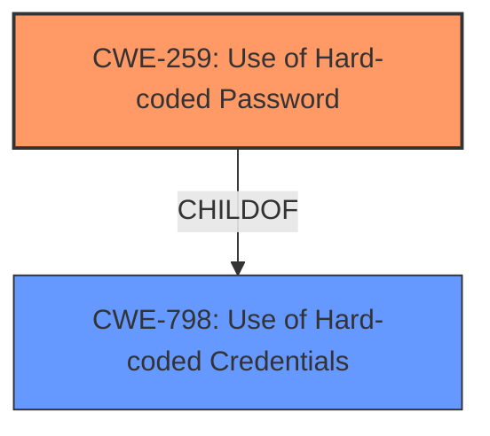

# Analysis for CVE-2024-4996

# Summary
| CWE ID  | CWE Name  | Confidence | CWE Abstraction Level | CWE Vulnerability Mapping Label | CWE-Vulnerability Mapping Notes |
|-----------------|---------------------------------------------------------------------------------|---------------------|---------------------------|-----------------------------------|-----------------------------------------------------------------------------------------------------------------------------------------------------------------------------------------------------------------|
| CWE-259 | Use of Hard-coded Password | 1 | Variant | Allowed | Primary CWE. Matches the description of the vulnerability exactly. |
| CWE-798 | Use of Hard-coded Credentials | 0.9 | Base | Allowed | Secondary Candidate. A broader category that encompasses hard-coded passwords, but CWE-259 is more specific. |

## Evidence and Confidence

*   **Confidence Score:** 1
*   **Evidence Strength:** HIGH

## Relationship Analysis
The primary relationship that influenced the decision was the ChildOf relationship between CWE-259 and CWE-798. CWE-259 is a more specific variant of CWE-798. Since the vulnerability description explicitly mentions a **hard-coded password**, selecting the more specific CWE-259 is appropriate.

## Vulnerability Chain
The vulnerability chain starts with the **hard-coded password**, leading to unauthorized access and the retrieval of sensitive data.

1.  **Root Cause:** CWE-259 (**Use of Hard-coded Password**) - The application uses a **hard-coded password** for a database administrator account.
2.  **Impact:** Unauthorized Access - An attacker can use the **hard-coded password** to gain access to the database.
3.  **Impact:** Data Breach - The attacker can then retrieve embedded sensitive data stored in the database.

## Summary of Analysis
The analysis is based on the provided vulnerability description and the CVE reference. The description clearly states the use of a **hard-coded password**, which directly maps to CWE-259.

The evidence supporting this is: "Use of a **hard-coded password** for a database administrator account created during Wapro ERPinstallation allows an attacker to retrieve embedded sensitive data stored in the database. The password is same among all Wapro ERPinstallations." and "The vulnerability stems from the use of hard-coded credentials within the Wapro ERP Desktop software. Specifically, a fixed password is used for a special database account across all installations of the software."

The relationship between CWE-259 and CWE-798 influenced the decision to choose CWE-259 because it is a more specific variant.

CWE-259 is at the optimal level of specificity because it directly describes the vulnerability.

**CWEs Considered but Not Used:**

*   **CWE-321: Use of Hard-coded Cryptographic Key**: This was considered but not used because the vulnerability description specifically mentions a password, not a cryptographic key.
*   **CWE-798: Use of Hard-coded Credentials**: While relevant, it's a broader category than CWE-259, which more accurately describes the specific vulnerability.
*   **CWE-916: Use of Password Hash With Insufficient Computational Effort**: This is not applicable because the vulnerability involves a **hard-coded password**, not a hashed password.
*   **CWE-1391: Use of Weak Credentials**: This is a class level CWE. While a **hard-coded password** is a type of weak credential, CWE-259 is more specific.
*   **CWE-1393: Use of Default Password**: This is not applicable as the password is not a default, it is **hard-coded**.