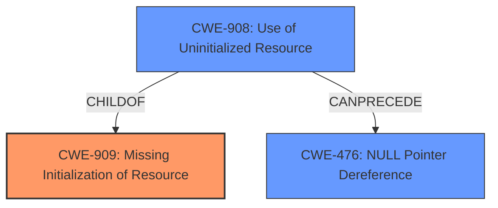

# Analysis for CVE-2024-49990

# Summary
| CWE ID | CWE Name | Confidence | CWE Abstraction Level | CWE Vulnerability Mapping Label | CWE-Vulnerability Mapping Notes |
|---|---|---|---|---|---|
| CWE-909 | Missing Initialization of Resource | 0.9 | Class | Primary | Allowed-with-Review |
| CWE-476 | NULL Pointer Dereference | 0.8 | Base | Secondary | Allowed |
| CWE-908 | Use of Uninitialized Resource | 0.7 | Base | Secondary | Allowed |

## Evidence and Confidence

*   **Confidence Score:** 0.9
*   **Evidence Strength:** HIGH

## Relationship Analysis
The primary weakness is the **missing initialization of a resource** (CWE-909), a Class-level CWE. A more specific Base-level CWE that results from this missing initialization is **NULL Pointer Dereference** (CWE-476). Another Base-level CWE that also results from the missing initialization is **Use of Uninitialized Resource** (CWE-908). CWE-909 is a parent of CWE-908.

## Vulnerability Chain
The vulnerability chain starts with the **missing initialization of the `xe_gsc` structure (CWE-909)**. Because the structure is not initialized, the code attempts to use it, leading to **use of uninitialized resource (CWE-908)**. This results in a **NULL pointer dereference (CWE-476)** when the code attempts to access a member of the uninitialized structure, ultimately causing a kernel crash and denial of service.

## Summary of Analysis
Based on the provided evidence, the primary **rootcause** of the vulnerability is the **missing initialization of the `xe_gsc` structure**, which aligns with CWE-909 (Missing Initialization of Resource). The vulnerability description clearly states "**xe_gsc is not initialized** when checked at HDCP capability check." This missing initialization leads to a null pointer dereference (CWE-476) when the code attempts to access members of the uninitialized structure, resulting in a kernel crash. The use of the uninitialized resource is CWE-908.

The retriever results also support this assessment, with CWE-909 being a top candidate.

I considered other CWEs, particularly CWE-665 (Improper Initialization), but CWE-909 is more accurate because it specifically describes the missing initialization of a resource, rather than improper initialization.

CWE-457 (Use of Uninitialized Variable) was considered, but it is more specific to variables, whereas CWE-909 addresses resources more broadly.

The selected CWEs are at the optimal level of specificity, with CWE-909 capturing the root cause and CWE-476 and CWE-908 representing the direct consequences of the missing initialization.