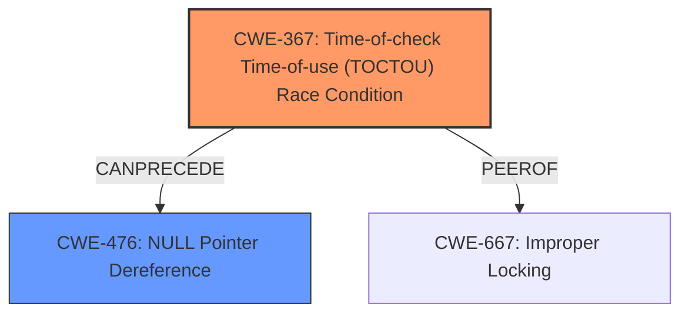

# Raw Analyzer Response for CVE-2024-50005

# Summary
| CWE ID  | CWE Name                                                                                               | Confidence | CWE Abstraction Level | CWE Vulnerability Mapping Label | CWE-Vulnerability Mapping Notes |
| :-------- | :------------------------------------------------------------------------------------------------------- | :---------- | :---------------------- | :------------------------------ | :------------------------------ |
| CWE-367  | Time-of-check Time-of-use (TOCTOU) Race Condition                                                              | 0.75        | Base                    | Primary                         | Allowed                         |
| CWE-476 | NULL Pointer Dereference                                                                                 | 0.60        | Base                    | Secondary                        | Allowed                         |

## Evidence and Confidence

*   **Confidence Score:** 0.70
*   **Evidence Strength:** MEDIUM

## Relationship Analysis
The primary CWE selected is CWE-367 Time-of-check Time-of-use (TOCTOU) Race Condition because it directly relates to accessing a resource (`scan_req->type`) after a check (RCU read-side critical section), where the resource's state can change, leading to unpredictable behavior. A secondary CWE, CWE-476 NULL Pointer Dereference, is also considered since accessing the resource after the RCU lock is released could lead to dereferencing a NULL pointer if the `scan_req` structure has been freed. These two CWEs are related in that CWE-367 can precede CWE-476. The abstraction level for both is Base, which is preferred.

## Vulnerability Chain
The vulnerability chain starts with **improper RCU usage** leading to a Time-of-check Time-of-use (TOCTOU) Race Condition (CWE-367), which can then result in a NULL Pointer Dereference (CWE-476) or data corruption. The root cause is accessing `scan_req->type` after the RCU lock is released, creating a window where the data can change.

## Summary of Analysis
The analysis is based on the provided vulnerability description and CVE reference summary. The key point is the **improper RCU usage** in the `mac802154_scan_worker` function, where `scan_req->type` is accessed after the RCU read-side critical section is unlocked. This creates a race condition where the value of `scan_req->type` can change between the time the RCU lock is released and the time the value is accessed.

The evidence from the "Vulnerability Description Key Phrases" and "CVE Reference Links Content Summary" strongly supports this:

*   "**rootcause:** **improper RCU usage**"
*   "accessing scan_req->type after RCU unlock"
*   "RCU Dereference Issue: Accessing `scan_req->type` outside of the RCU read-side critical section is a dereference violation."

The selection of CWE-367 is optimal because it directly addresses the Time-of-check Time-of-use issue introduced by the **improper RCU usage**. CWE-476 is considered a potential consequence (NULL pointer dereference) if the race condition leads to accessing freed memory.

**CWEs Considered But Not Used:**

*   **CWE-667 Improper Locking:** While RCU is a locking mechanism, the core issue is not the locking itself but the timing of accessing the data after the "lock" (RCU read-side critical section) is released. Therefore, this is a PEEROF relationship.
*   **CWE-362 Concurrent Execution using Shared Resource with Improper Synchronization ('Race Condition'):** This is a broader category, and CWE-367 is a more specific type of race condition.
*   **CWE-476 NULL Pointer Dereference:** This is a potential *result* of the race condition, not the root cause itself.
*   **CWE-125 Out-of-bounds Read:** While data corruption is mentioned, there is no clear evidence of an out-of-bounds read.
*   **CWE-824 Access of Uninitialized Pointer:** The pointer isn't necessarily uninitialized, but its contents become invalid after the RCU section.
*   **CWE-770 Allocation of Resources Without Limits or Throttling** Not applicable

# Enhanced Context (25 CWEs)
The following CWEs were identified as potentially relevant to this vulnerability:

## CWE-667: Improper Locking
**Abstraction Level**: Class
**Similarity Score**: 0.77
**Source**: dense

**Description**:
The product does not properly acquire or release a lock on a resource, leading to unexpected resource state changes and behaviors.

**Mapping Guidance**:
- Usage: Allowed-with-Review
- Rationale: This CWE entry is a Class and might have Base-level children that would be more appropriate

## CWE-824: Access of Uninitialized Pointer
**Abstraction Level**: Base
**Similarity Score**: 0.77
**Source**: dense

**Description**:
The product accesses or uses a pointer that has not been initialized.

**Mapping Guidance**:
- Usage: Allowed
- Rationale: This CWE entry is at the Base level of abstraction, which is a preferred level of abstraction for mapping to the root causes of vulnerabilities.

## CWE-843: Access of Resource Using Incompatible Type ('Type Confusion')
**Abstraction Level**: Base
**Similarity Score**: 0.77
**Source**: dense

**Description**:
The product allocates or initializes a resource such as a pointer, object, or variable using one type, but it later accesses that resource using a type that is incompatible with the original type.

**Mapping Guidance**:
- Usage: Allowed
- Rationale: This CWE entry is at the Base level of abstraction, which is a preferred level of abstraction for mapping to the root causes of vulnerabilities.

## CWE-362: Concurrent Execution using Shared Resource with Improper Synchronization ('Race Condition')
**Abstraction Level**: Class
**Similarity Score**: 0.76
**Source**: dense

**Description**:
The product contains a concurrent code sequence that requires temporary, exclusive access to a shared resource, but a timing window exists in which the shared resource can be modified by another code sequence operating concurrently.

**Mapping Guidance**:
- Usage: Allowed-with-Review
- Rationale: This CWE entry is a Class and might have Base-level children that would be more appropriate

## CWE-755: Improper Handling of Exceptional Conditions
**Abstraction Level**: Class
**Similarity Score**: 0.75
**Source**: dense

**Description**:
The product does not handle or incorrectly handles an exceptional condition.

**Mapping Guidance**:
- Usage: Discouraged
- Rationale: This CWE entry is a level-1 Class (i.e., a child of a Pillar). It might have lower-level children that would be more appropriate

## CWE-252: Unchecked Return Value
**Abstraction Level**: Base
**Similarity Score**: 0.75
**Source**: dense

**Description**:
The product does not check the return value from a method or function, which can prevent it from detecting unexpected states and conditions.

**Mapping Guidance**:
- Usage: Allowed
- Rationale: This CWE entry is at the Base level of abstraction, which is a preferred level of abstraction for mapping to the root causes of vulnerabilities.

## CWE-367: Time-of-check Time-of-use (TOCTOU) Race Condition
**Abstraction Level**: Base
**Similarity Score**: 0.75
**Source**: dense

**Description**:
The product checks the state of a resource before using that resource, but the resource's state can change between the check and the use in a way that invalidates the results of the check. This can cause the product to perform invalid actions when the resource is in an unexpected state.

**Mapping Guidance**:
- Usage: Allowed
- Rationale: This CWE entry is at the Base level of abstraction, which is a preferred level of abstraction for mapping to the root causes of vulnerabilities.

## CWE-703: Improper Check or Handling of Exceptional Conditions
**Abstraction Level**: Pillar
**Similarity Score**: 0.74
**Source**: dense

**Description**:
The product does not properly anticipate or handle exceptional conditions that rarely occur during normal operation of the product.

**Mapping Guidance**:
- Usage: Discouraged
- Rationale: This CWE entry is extremely high-level, a Pillar.

## CWE-476: NULL Pointer Dereference
**Abstraction Level**: Base
**Similarity Score**: 0.74
**Source**: dense

**Description**:
The product dereferences a