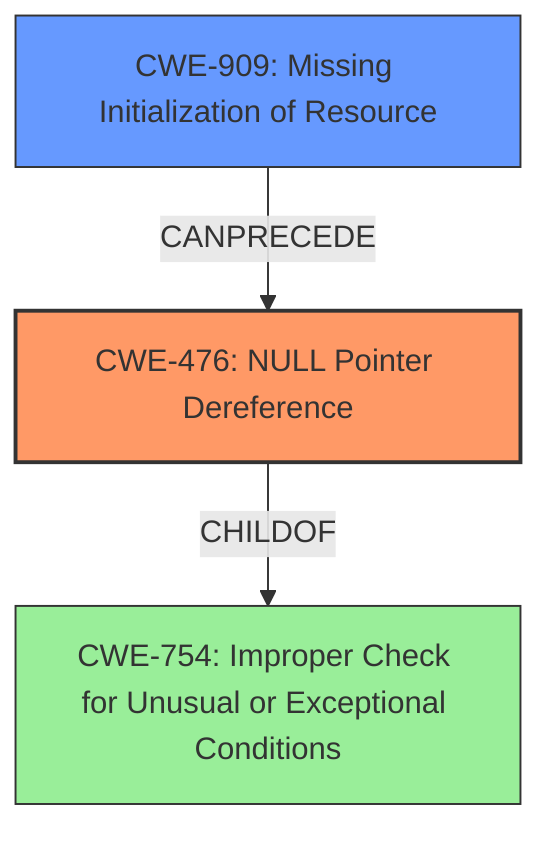

# Analysis Report for CVE-2024-50034

# Vulnerability Analysis Report: CVE-2024-50034

## Description

In the Linux kernel, the following vulnerability has been resolved net/smc fix lacks of icsk_syn_mss with IPPROTO_SMC Eric report a panic on IPPROTO_SMC, and give the facts that when INET_PROTOSW_ICSK was set, icsk->icsk_sync_mss must be set too. Bug Unable to handle **kernel NULL pointer dereference** at virtual address 0000000000000000 Mem abort info ESR = 0x0000000086000005 EC = 0x21 IABT (current EL), IL = 32 bits SET = 0, FnV = 0 EA = 0, S1PTW = 0 FSC = 0x05 level 1 translation fault user pgtable 4k pages, 48-bit VAs, pgdp=00000001195d1000 [0000000000000000] pgd=0800000109c46003, p4d=0800000109c46003, pud=0000000000000000 Internal error Oops 0000000086000005 [#1] PREEMPT SMP Modules linked in CPU 1 UID 0 PID 8037 Comm syz.3.265 Not tainted 6.11.0-rc7-syzkaller-g5f5673607153 #0 Hardware name Google Google Compute Engine/Google Compute Engine, BIOS Google 08/06/2024 pstate 80400005 (Nzcv daif +PAN -UAO -TCO -DIT -SSBS BTYPE=--) pc 0x0 lr cipso_v4_sock_setattr+0x2a8/0x3c0 net/ipv4/cipso_ipv4.c1910 sp ffff80009b887a90 x29 ffff80009b887aa0 x28 ffff80008db94050 x27 0000000000000000 x26 1fffe0001aa6f5b3 x25 dfff800000000000 x24 ffff0000db75da00 x23 0000000000000000 x22 ffff0000d8b78518 x21 0000000000000000 x20 ffff0000d537ad80 x19 ffff0000d8b78000 x18 1fffe000366d79ee x17 ffff8000800614a8 x16 ffff800080569b84 x15 0000000000000001 x14 000000008b336894 x13 00000000cd96feaa x12 0000000000000003 x11 0000000000040000 x10 00000000000020a3 x9

## Vulnerability Description Key Phrases

- **Rootcause:** kernel NULL pointer dereference
- **Impact:** ['Oops', 'panic']
- **Product:** Linux kernel
- **Component:** net/smc fix

## Analysis (with Relationship Data)

# Summary

| CWE ID | CWE Name | Confidence | CWE Abstraction Level | CWE Vulnerability Mapping Label | CWE-Vulnerability Mapping Notes |
|---|---|---|---|---|---|
| CWE-476 | **CWE-476: NULL Pointer Dereference** | 1.0 | Base | Primary | Allowed |
| CWE-909 | **CWE-909: Missing Initialization of Resource** | 0.7 | Class | Secondary | Allowed-with-Review |

## Evidence and Confidence

*   **Confidence Score:** 0.9
*   **Evidence Strength:** HIGH

## Relationship Analysis
The primary relationship is that **CWE-476: NULL Pointer Dereference** is a common consequence of **CWE-909: Missing Initialization of Resource**. While **CWE-909: Missing Initialization of Resource** is a Class-level CWE, the direct consequence is a **NULL** pointer dereference, making **CWE-476: NULL Pointer Dereference** the more specific and directly relevant choice. The retriever results and the vulnerability description both strongly suggest **CWE-476: NULL Pointer Dereference** as the primary issue, with **CWE-909: Missing Initialization of Resource** contributing to the root cause.



## Vulnerability Chain
The vulnerability chain starts with the **missing initialization** of `icsk->icsk_sync_mss` (the **ROOT CAUSE**). This leads to a **NULL** pointer dereference when the kernel attempts to call the uninitialized function pointer, and finally, this results in a kernel panic.

Missing Initialization -> **NULL** Pointer Dereference -> Kernel Panic

The **Primary CWE** is **CWE-476: NULL Pointer Dereference** because it represents the direct coding error that triggers the vulnerability.

## Summary of Analysis
The initial analysis focused on identifying the most direct cause of the kernel panic. The evidence clearly points to a **kernel NULL pointer dereference** as the primary issue. The "**rootcause:** **kernel NULL pointer dereference**" phrase in the vulnerability description key phrases section, and the "**NULL Pointer Dereference:** The primary vulnerability is a null pointer dereference when the kernel attempts to call `icsk->icsk_sync_mss` which was not initialized" statement in the CVE Reference Links Content Summary section both are direct evidence of the **CWE-476: NULL Pointer Dereference**. While there's a **missing initialization** aspect (**CWE-909: Missing Initialization of Resource**), the dereference itself is the more immediate and specific cause. The graph relationships confirm that **CWE-476: NULL Pointer Dereference** can be preceded by **CWE-909: Missing Initialization of Resource**, but the dereference is the key coding flaw. The selection of **CWE-476: NULL Pointer Dereference** is at the optimal level of specificity because it's a Base-level CWE that directly describes the observed error.

Relevant CWE Information:

# Enhanced Context (25 CWEs)
The following CWEs were identified as potentially relevant to this vulnerability:

## CWE-476: NULL Pointer Dereference
**Abstraction Level**: Base
**Similarity Score**: 0.76
**Source**: dense

**Description**:
The product dereferences a pointer that it expects to be valid but is NULL.

**Mapping Guidance**:
- Usage: Allowed
- Rationale: This CWE entry is at the Base level of abstraction, which is a preferred level of abstraction for mapping to the root causes of vulnerabilities.


## CWE-824: Access of Uninitialized Pointer
**Abstraction Level**: Base
**Similarity Score**: 0.75
**Source**: dense

**Description**:
The product accesses or uses a pointer that has not been initialized.

**Mapping Guidance**:
- Usage: Allowed
- Rationale: This CWE entry is at the Base level of abstraction, which is a preferred level of abstraction for mapping to the root causes of vulnerabilities.


## CWE-755: Improper Handling of Exceptional Conditions
**Abstraction Level**: Class
**Similarity Score**: 0.75
**Source**: dense

**Description**:
The product does not handle or incorrectly handles an exceptional condition.

**Mapping Guidance**:
- Usage: Discouraged
- Rationale: This CWE entry is a level-1 Class (i.e., a child of a Pillar). It might have lower-level children that would be more appropriate


## CWE-667: Improper Locking
**Abstraction Level**: Class
**Similarity Score**: 0.75
**Source**: dense

**Description**:
The product does not properly acquire or release a lock on a resource, leading to unexpected resource state changes and behaviors.

**Mapping Guidance**:
- Usage: Allowed-with-Review
- Rationale: This CWE entry is a Class and might have Base-level children that would be more appropriate


## CWE-665: Improper Initialization
**Abstraction Level**: Class
**Similarity Score**: 0.74
**Source**: dense

**Description**:
The product does not initialize or incorrectly initializes a resource, which might leave the resource in an unexpected state when it is accessed or used.

**Mapping Guidance**:
- Usage: Discouraged
- Rationale: This CWE entry is a level-1 Class (i.e., a child of a Pillar). It might have lower-level children that would be more appropriate


## CWE-822: Untrusted Pointer Dereference
**Abstraction Level**: Base
**Similarity Score**: 0.74
**Source**: dense

**Description**:
The product obtains a value from an untrusted source, converts this value to a pointer, and dereferences the resulting pointer.

**Mapping Guidance**:
- Usage: Allowed
- Rationale: This CWE entry is at the Base level of abstraction, which is a preferred level of abstraction for mapping to the root causes of vulnerabilities.


## CWE-131: Incorrect Calculation of Buffer Size
**Abstraction Level**: Base
**Similarity Score**: 0.74
**Source**: dense

**Description**:
The product does not correctly calculate the size to be used when allocating a buffer, which could lead to a buffer overflow.

**Mapping Guidance**:
- Usage: Allowed
- Rationale: This CWE entry is at the Base level of abstraction, which is a preferred level of abstraction for mapping to the root causes of vulnerabilities.


## CWE-252: Unchecked Return Value
**Abstraction Level**: Base
**Similarity Score**: 0.74
**Source**: dense

**Description**:
The product does not check the return value from a method or function, which can prevent it from detecting unexpected states and conditions.

**Mapping Guidance**:
- Usage: Allowed
- Rationale: This CWE entry is at the Base level of abstraction, which is a preferred level of abstraction for mapping to the root causes of vulnerabilities.


## CWE-1285: Improper Validation of Specified Index, Position, or Offset in Input
**Abstraction Level**: Base
**Similarity Score**: 0.74
**Source**: dense

**Description**:
The product receives input that is expected to specify an index, position, or offset into an indexable resource such as a buffer or file, but it does not validate or incorrectly validates that the specified index/position/offset has the required properties.

**Mapping Guidance**:
- Usage: Allowed
- Rationale: This CWE entry is at the Base level of abstraction, which is a preferred level of abstraction for mapping to the root causes of vulnerabilities.


## CWE-909: Missing Initialization of Resource
**Abstraction Level**: Class
**Similarity Score**: 0.73
**Source**: dense

**Description**:
The product does not initialize a critical resource.

**Mapping Guidance**:
- Usage: Allowed-with-Review
- Rationale: This CWE entry is a Class and might have Base-level children that would be more appropriate


## CWE-476: NULL Pointer Dereference
**Abstraction Level**: Base
**Similarity Score**: 955.23
**Source**: sparse

**Description**:
The product dereferences a pointer that it expects to be valid but is NULL.

**Mapping Guidance**:
- Usage: Allowed
- Rationale: This CWE entry is at the Base level of abstraction, which is a preferred level of abstraction for mapping to the root causes of vulnerabilities.


## CWE-252: Unchecked Return Value
**Abstraction Level**: Base
**Similarity Score**: 860.62
**Source**: sparse

**Description**:
The product does not check the return value from a method or function, which can prevent


## CWE Relationship Analysis

Current CWEs represent these abstraction levels: .


### Vulnerability Chain Analysis

**Chain starting from CWE-665:**
- 665 (Improper Initialization) - ROOT


**Chain starting from CWE-476:**
- 476 (NULL Pointer Dereference) - ROOT


### CWE Relationship Diagram

```mermaid
graph TD
    classDef primary fill:#f96,stroke:#333,stroke-width:2px
    classDef secondary fill:#69f,stroke:#333
    classDef tertiary fill:#9e9,stroke:#333
```


*Report generated on 2025-07-13 19:47:05*
