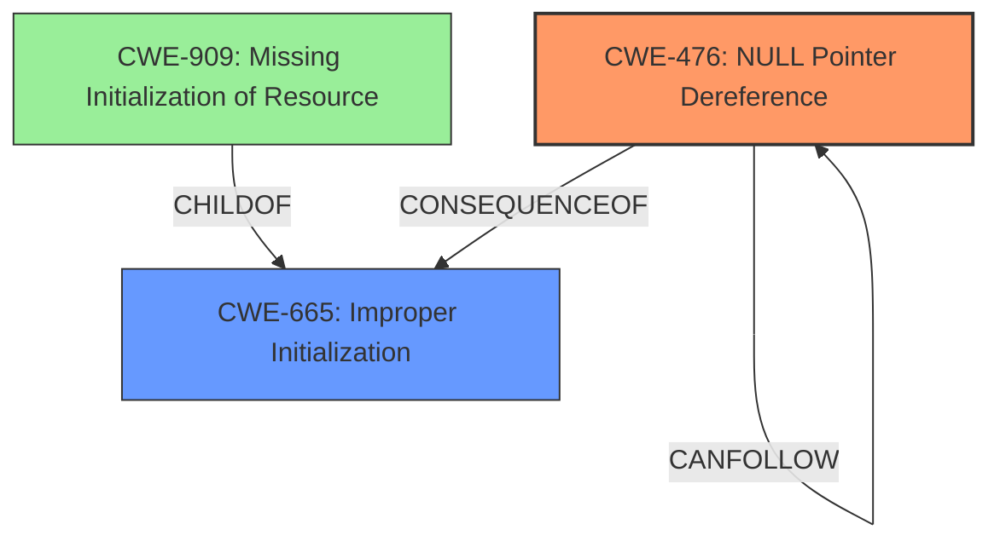

# Analysis Report for CVE-2024-50037

# Vulnerability Analysis Report: CVE-2024-50037

## Description

In the Linux kernel, the following vulnerability has been resolved drm/fbdev-dma Only cleanup deferred I/O if necessary Commit 5a498d4d06d6 (drm/fbdev-dma Only install deferred I/O if necessary) initializes deferred I/O only if it is used. drm_fbdev_dma_fb_destroy() however calls fb_deferred_io_cleanup() unconditionally with struct fb_info.fbdefio == NULL. KASAN with the out-of-tree Apple silicon display driver posts following warning from __flush_work() of a random struct work_struct instead of the expected NULL pointer derefs. [ 22.053799] ------------[ cut here ]------------ [ 22.054832] WARNING CPU 2 PID 1 at kernel/workqueue.c4177 __flush_work+0x4d8/0x580 [ 22.056597] Modules linked in uhid bnep uinput nls_ascii ip6_tables ip_tables i2c_dev loop fuse dm_multipath nfnetlink zram hid_magicmouse btrfs xor xor_neon brcmfmac_wcc raid6_pq hci_bcm4377 bluetooth brcmfmac hid_apple brcmutil nvmem_spmi_mfd simple_mfd_spmi dockchannel_hid cfg80211 joydev regmap_spmi nvme_apple ecdh_generic ecc macsmc_hid rfkill dwc3 appledrm snd_soc_macaudio macsmc_power nvme_core apple_isp phy_apple_atc apple_sart apple_rtkit_helper apple_dockchannel tps6598x macsmc_hwmon snd_soc_cs42l84 videobuf2_v4l2 spmi_apple_controller nvmem_apple_efuses videobuf2_dma_sg apple_z2 videobuf2_memops spi_nor panel_summit videobuf2_common asahi videodev pwm_apple apple_dcp snd_soc_apple_mca apple_admac spi_apple clk_apple_nco i2c_pasemi_platform snd_pcm_dmaengine mc i2c_pasemi_core mux_core ofpart adpdrm drm_dma_helper apple_dart apple_soc_cpufreq leds_pwm phram [ 22.073768] CPU 2 UID 0 PID 1 Comm systemd-shutdow Not tainted 6.11.2-asahi+ #asahi-dev [ 22.075612] Hardware name Apple MacBook Pro (13-inch, M2, 2022) (DT) [ 22.077032] pstate 01400005 (nzcv daif +PAN -UAO -TCO +DIT -SSBS BTYPE=--) [ 22.078567] pc __flush_work+0x4d8/0x580 [ 22.079471] lr __flush_work+0x54/0x580 [ 22.080345] sp ffffc000836ef820 [ 22.081089] x29 ffffc000836ef880 x28 0000000000000000 x27 ffff80002ddb7128 [ 22.082678] x26 dfffc00000000000 x25 1ffff000096f0c57 x24 ffffc00082d3e358 [ 22.084263] x23 ffff80004b7862b8 x22 dfffc00000000000 x21 ffff80005aa1d470 [ 22.085855] x20 ffff80004b786000 x19 ffff80004b7862a0 x18 0000000000000000 [ 22.087439] x17 0000000000000000 x16 0000000000000000 x15 0000000000000005 [ 22.089030] x14 1ffff800106ddf0a x13 0000000000000000 x12 0000000000000000 [ 22.090618] x11 ffffb800106ddf0f x10 dfffc00000000000 x9 1ffff800106ddf0e [ 22.092206] x8 0000000000000000 x7 aaaaaaaaaaaaaaaa x6 0000000000000001 [ 22.093790] x5 ffffc000836ef728 x4 0000000000000000 x3 0000000000000020 [ 22.095368] x2 0000000000000008 x1 00000000000000aa x0 0000000000000000 [ 22.096955] Call trace [ 22.097505] __flush_work+0x4d8/0x580 [ 22.098330] flush_delayed_work+0x80/0xb8 [ 22.099231] fb_deferred_io_cleanup+0x3c/0x130 [ 22.100217] drm_fbdev_dma_fb_destroy+0x6c/0xe0 [drm_dma_helper] [ 22.101559] unregister_framebuffer+0x210/0x2f0 [ 22.102575] drm_fb_helper_unregister_info+0x48/0x60 [ 22.103683] drm_fbdev_dma_client_unregister+0x4c/0x80 [drm_dma_helper] [ 22.105147] drm_client_dev_unregister+0x1cc/0x230 [ 22.106217] drm_dev_unregister+0x58/0x570 [ 22.107125] apple_drm_unbind+0x50/0x98 [appledrm] [ 22.108199] component_del+0x1f8/0x3a8 [ 22.109042] dcp_platform_shutdown+0x24/0x38 [apple_dcp] [ 22.110357] platform_shutdown+0x70/0x90 [ 22.111219] device_shutdown+0x368/0x4d8 [ 22.112095] kernel_restart+0x6c/0x1d0 [ 22.112946] __arm64_sys_reboot+0x1c8/0x328 [ 22.113868] invoke_syscall+0x78/0x1a8 [ 22.114703] do_el0_svc+0x124/0x1a0 [ 22.115498] el0_svc+0x3c/0xe0 [ 22.116181] el0t_64_sync_handler+0x70/0xc0 [ 22.117110] el0t_64_sync+0x190/0x198 [ 22.117931] ---[ end trace 0000000000000000 ]---

## Vulnerability Description Key Phrases

- **Rootcause:** The function `drm_fbdev_dma_fb_destroy()` calls `fb_deferred_io_cleanup()` unconditionally, even when `struct fb_info.fbdefio` is NULL, leading to a crash during workqueue flushing.
- **Weakness:** The code does not check if deferred I/O is initialized before attempting to clean it up.
- **Impact:** Kernel crash due to use of a NULL pointer, resulting in system instability.
- **Vector:** The vulnerability can be triggered when a framebuffer device using deferred I/O is destroyed.
- **Attacker:** A local attacker with the ability to unregister the framebuffer device could trigger this vulnerability.
- **Product:** Linux Kernel
- **Version:** 6.11.2-asahi
- **Component:** drm/fbdev-dma

## Analysis (with Relationship Data)

# Summary
| CWE ID | CWE Name | Confidence | CWE Abstraction Level | CWE Vulnerability Mapping Label | CWE-Vulnerability Mapping Notes |
|---|---|---|---|---|---|
| CWE-476 | NULL Pointer Dereference | 1.0 | Base | Allowed | Primary CWE |
| CWE-665 | Improper Initialization | 0.6 | Class | Discouraged | Secondary Candidate |

## Evidence and Confidence

*   **Confidence Score:** 0.9
*   **Evidence Strength:** HIGH

## Relationship Analysis
The primary CWE is CWE-476, which is a Base level CWE. The secondary CWE, CWE-665, is a Class level CWE and a parent of CWE-909 (Missing Initialization of Resource). CWE-476 can be a consequence of CWE-665 if a pointer is not initialized and then dereferenced.



## Vulnerability Chain
The vulnerability chain starts with a **missing initialization** (or perhaps improper conditional initialization) of the `fbdefio` member of the `fb_info` struct. This leads to a **NULL pointer dereference** when `fb_deferred_io_cleanup()` is called unconditionally, resulting in a kernel crash.

## Summary of Analysis
The vulnerability is a **NULL pointer dereference** because the `fb_deferred_io_cleanup()` function is called unconditionally, even when the associated `fb_info.fbdefio` member is NULL.

The **rootcause** is that the code **does not check if deferred I/O is initialized before attempting to clean it up.** This aligns well with CWE-476 (NULL Pointer Dereference), which occurs when the product dereferences a pointer that it expects to be valid but is NULL.

CWE-665 (Improper Initialization) was considered as a possible root cause because the issue arises from a failure to properly initialize the `fbdefio` member. However, since the immediate cause of the crash is the dereference of a NULL pointer, CWE-476 is a more precise classification.

The evidence from the vulnerability description key phrases indicates the **rootcause** is the unconditional calling of `fb_deferred_io_cleanup()` when `fb_info.fbdefio` is NULL. The crash occurs because of this **NULL pointer dereference**.

Relevant CWE Information:

# Enhanced Context (25 CWEs)
The following CWEs were identified as potentially relevant to this vulnerability:

## CWE-667: Improper Locking
**Abstraction Level**: Class
**Similarity Score**: 0.80
**Source**: dense

**Description**:
The product does not properly acquire or release a lock on a resource, leading to unexpected resource state changes and behaviors.

**Mapping Guidance**:
- Usage: Allowed-with-Review
- Rationale: This CWE entry is a Class and might have Base-level children that would be more appropriate

This is not the correct CWE because the described vulnerability does not involve improper locking.

## CWE-1285: Improper Validation of Specified Index, Position, or Offset in Input
**Abstraction Level**: Base
**Similarity Score**: 0.78
**Source**: dense

**Description**:
The product receives input that is expected to specify an index, position, or offset into an indexable resource such as a buffer or file, but it does not validate or incorrectly validates that the specified index/position/offset has the required properties.

**Mapping Guidance**:
- Usage: Allowed
- Rationale: This CWE entry is at the Base level of abstraction, which is a preferred level of abstraction for mapping to the root causes of vulnerabilities.

This is not the correct CWE because the described vulnerability does not involve improper validation of input.

## CWE-362: Concurrent Execution using Shared Resource with Improper Synchronization ('Race Condition')
**Abstraction Level**: Class
**Similarity Score**: 0.78
**Source**: dense

**Description**:
The product contains a concurrent code sequence that requires temporary, exclusive access to a shared resource, but a timing window exists in which the shared resource can be modified by another code sequence operating concurrently.

**Mapping Guidance**:
- Usage: Allowed-with-Review
- Rationale: This CWE entry is a Class and might have Base-level children that would be more appropriate

This is not the correct CWE because the described vulnerability does not involve race conditions.

## CWE-125: Out-of-bounds Read
**Abstraction Level**: Base
**Similarity Score**: 0.78
**Source**: dense

**Description**:
The product reads data past the end, or before the beginning, of the intended buffer.

**Mapping Guidance**:
- Usage: Allowed
- Rationale: This CWE entry is at the Base level of abstraction, which is a preferred level of abstraction for mapping to the root causes of vulnerabilities.

This is not the correct CWE because the described vulnerability does not involve out-of-bounds reads.

## CWE-252: Unchecked Return Value
**Abstraction Level**: Base
**Similarity Score**: 0.77
**Source**: dense

**Description**:
The product does not check the return value from a method or function, which can prevent it from detecting unexpected states and conditions.

**Mapping Guidance**:
- Usage: Allowed
- Rationale: This CWE entry is at the Base level of abstraction, which is a preferred level of abstraction for mapping to the root causes of vulnerabilities.

This is not the correct CWE because the described vulnerability does not involve an unchecked return value.

## CWE-476: NULL Pointer Dereference
**Abstraction Level**: Base
**Similarity Score**: 0.77
**Source**: dense

**Description**:
The product dereferences a pointer that it expects to be valid but is NULL.

**Mapping Guidance**:
- Usage: Allowed
- Rationale: This CWE entry is at the Base level of abstraction, which is a preferred level of abstraction for mapping to the root causes of vulnerabilities.

This is the correct CWE because the described vulnerability occurs because `fb_deferred_io_cleanup()` is called unconditionally when `fb_info.fbdefio` is NULL, causing a **NULL pointer dereference**.

## CWE-119: Improper Restriction of Operations within the Bounds of a Memory Buffer
**Abstraction Level**: Class
**Similarity Score**: 0.77
**Source**: dense

**Description**:
The product performs operations on a memory buffer, but it reads from or writes to a memory location outside the buffer's intended boundary. This may result in read or write operations on unexpected memory locations that could be linked to other variables, data structures, or internal program data.

**Mapping Guidance**:
- Usage: Discouraged
- Rationale: CWE-119 is commonly misused in low-information vulnerability reports when lower-level CWEs could be used instead, or when more details about the vulnerability are available.

This is not the correct CWE because the described vulnerability does not involve memory buffer operations or out-of-bounds reads/writes.

## CWE-665: Improper Initialization
**Abstraction Level**: Class
**Similarity Score**: 0.77
**Source**: dense

**Description**:
The product does not initialize or incorrectly initializes a resource, which might leave the resource in an unexpected state when it is accessed or used.

**Mapping Guidance**:
- Usage: Discouraged
- Rationale: This CWE entry is a level-1 Class (i.e., a child of a Pillar). It might have lower-level children that would be more appropriate

This is a plausible secondary CWE. The **rootcause** could be due to **improper initialization**, but the immediate cause of the crash is the **NULL pointer dereference** due to the unconditional call to the cleanup function.

## CWE-909: Missing Initialization of Resource
**Abstraction Level**: Class
**Similarity Score**: 0.77
**Source**: dense

**Description**:
The product does not initialize a critical resource.

**Mapping Guidance**:
- Usage: Allowed-with-Review
- Rationale: This CWE entry is a Class and might have Base-level children that would be more appropriate

This is not as precise as CWE-476.

## CWE-755: Improper Handling of Exceptional Conditions
**Abstraction Level**: Class
**Similarity Score**: 0.77
**Source**: dense

**Description**:
The product does not handle or incorrectly handles an exceptional condition.

**Mapping Guidance**:
- Usage: Discouraged
- Rationale: This CWE entry is a level-1 Class (i.e., a child of a Pillar). It might have lower-level children that would


## CWE Relationship Analysis

Current CWEs represent these abstraction levels: .


### Vulnerability Chain Analysis

**Chain starting from CWE-476:**
- 476 (NULL Pointer Dereference) - ROOT


**Chain starting from CWE-125:**
- 125 (Out-of-bounds Read) - ROOT


### CWE Relationship Diagram

```mermaid
graph TD
    classDef primary fill:#f96,stroke:#333,stroke-width:2px
    classDef secondary fill:#69f,stroke:#333
    classDef tertiary fill:#9e9,stroke:#333
```


*Report generated on 2025-07-13 19:47:48*
