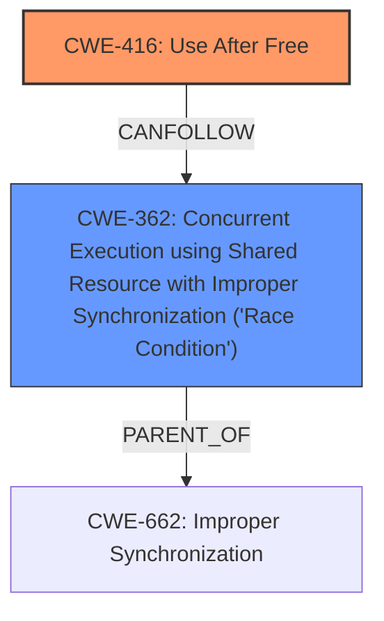

# Raw Analyzer Response for CVE-2024-50059

# Summary
| CWE ID    | CWE Name                                                                      | Confidence | CWE Abstraction Level | CWE Vulnerability Mapping Label | CWE-Vulnerability Mapping Notes |
| --------- | ----------------------------------------------------------------------------- | ---------- | --------------------- | ------------------------------- | ------------------------------- |
| CWE-416   | Use After Free                                                                | 0.9        | Variant               | Primary                         | Allowed                         |
| CWE-362   | Concurrent Execution using Shared Resource with Improper Synchronization ('Race Condition') | 0.8        | Class                 | Secondary                       | Allowed-with-Review             |

## Evidence and Confidence

*   **Confidence Score:** 0.85
*   **Evidence Strength:** HIGH

## Relationship Analysis

The primary weakness is CWE-416 **Use After Free**, which occurs due to a **race condition** (CWE-362). The **race condition** allows the `sndev` resource to be freed while it is still being accessed by another thread, leading to the **use-after-free** vulnerability. CWE-416 is a variant of a memory corruption issue, while CWE-362 describes the concurrent execution problem that enables it. Both CWEs are related, with the **race condition** (CWE-362) potentially preceding the **use-after-free** (CWE-416).

## Vulnerability Chain

The vulnerability chain starts with a **race condition** (CWE-362) in the `switchtec_ntb_remove` function. This **race condition** allows the `sndev` resource to be freed prematurely while the `check_link_status_work` function is still trying to access it. This premature freeing leads to a **use-after-free** vulnerability (CWE-416) when `check_link_status_work` attempts to use the freed `sndev` resource.

CWE-362 (Race Condition) -> CWE-416 (Use After Free)

## Summary of Analysis

The analysis indicates that the primary vulnerability is a **use-after-free** (CWE-416) that is triggered by a **race condition** (CWE-362). The description states "Fix **use after free** vulnerability in switchtec_ntb_remove due to **race condition**". The code frees `sndev` through `kfree(sndev)` while a work queue `check_link_status_work` might still be using it. This confirms the **use-after-free** condition. The fix involves canceling the work before cleanup in `switchtec_ntb_remove`, which addresses the **race condition**.

The relationship graph shows how a **race condition** can lead to a **use-after-free**. CWE-362 (Race Condition) can precede CWE-416 (Use After Free).

CWE-416 is chosen as the primary CWE because it represents the direct coding error, the **use-after-free**. CWE-362 is a contributing factor, enabling the vulnerability.

Relevant CWE Information:

**CWE-416: Use After Free**
The product attempts to use memory after it has been freed, which can lead to various problems, such as crashes, unexpected behavior, or potentially the execution of arbitrary code.

**CWE-362: Concurrent Execution using Shared Resource with Improper Synchronization ('Race Condition')**
The product contains a concurrent code sequence that requires temporary, exclusive access to a shared resource, but a timing window exists in which the shared resource can be modified by another code sequence operating concurrently.