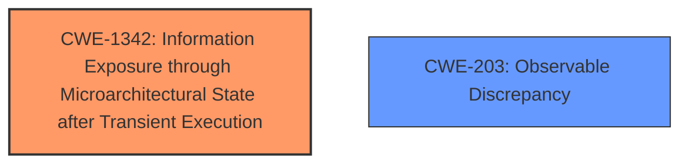

# Raw Analyzer Response for CVE-2024-50102

# Summary
| CWE ID | CWE Name | Confidence | CWE Abstraction Level | CWE Vulnerability Mapping Label | CWE-Vulnerability Mapping Notes |
|---|---|---|---|---|---|
| CWE-1342 | Information Exposure through Microarchitectural State after Transient Execution | 0.9 | Base | Allowed | Primary CWE. This CWE accurately captures the **speculative execution** issue leading to information exposure. |
| CWE-203 | Observable Discrepancy | 0.6 | Base | Allowed | Secondary candidate. The **non-canonical speculation issue** may also manifest as an observable discrepancy. |

## Evidence and Confidence

*   **Confidence Score:** 0.9
*   **Evidence Strength:** HIGH

## Relationship Analysis
The primary relationship influencing the decision is the direct match between the vulnerability description and CWE-1342, which details information exposure via **transient execution** due to microarchitectural state issues. CWE-203 is considered a secondary candidate due to the potential for observable timing differences as a result of the **speculative execution**.

## Vulnerability Chain
The vulnerability chain begins with a **non-canonical speculation issue** that leads to **speculative execution**, ultimately resulting in information leakage. The root cause is the insufficient validation of user addresses, compounded by changes in CPU architecture affecting STAC/CLAC instruction behavior.

## Summary of Analysis
The primary assessment is based on the vulnerability description's emphasis on **speculative execution** and its consequences, with the key phrase "**non-canonical speculation issue**" pointing directly to issues related to microarchitectural state and **transient execution**. The description states that "using just the high bit to decide whether an access is in user space or kernel space ends up with the good old leak speculative data if you have the right gadget using the result". This aligns precisely with CWE-1342's focus on information exposure through **transient execution**.

The retriever results strongly support CWE-1342, assigning it the highest score. The evidence provided in the CVE Reference Links Content Summary confirms the architecture-specific nature of the vulnerability and its connection to **speculative execution**.

CWE-1342 is selected because it operates at the Base level of abstraction and directly addresses the **rootcause** described in the vulnerability. Other CWEs were considered but deemed less suitable. For example, CWE-362 (Race Condition) is a Class and less specific, while CWE-201 (Insertion of Sensitive Information Into Sent Data) does not accurately capture the speculative nature of the vulnerability.

Relevant CWE Information:

# Enhanced Context (25 CWEs)
The following CWEs were identified as potentially relevant to this vulnerability:

## CWE-667: Improper Locking
**Abstraction Level**: Class
**Similarity Score**: 0.77
**Source**: dense

**Description**:
The product does not properly acquire or release a lock on a resource, leading to unexpected resource state changes and behaviors.

**Mapping Guidance**:
- Usage: Allowed-with-Review
- Rationale: This CWE entry is a Class and might have Base-level children that would be more appropriate

*Not chosen*: This CWE does not apply because the vulnerability is not related to improper locking.

## CWE-362: Concurrent Execution using Shared Resource with Improper Synchronization ('Race Condition')
**Abstraction Level**: Class
**Similarity Score**: 0.77
**Source**: dense

**Description**:
The product contains a concurrent code sequence that requires temporary, exclusive access to a shared resource, but a timing window exists in which the shared resource can be modified by another code sequence operating concurrently.

**Mapping Guidance**:
- Usage: Allowed-with-Review
- Rationale: This CWE entry is a Class and might have Base-level children that would be more appropriate

*Not chosen*: This CWE is too broad. While **speculative execution** involves timing issues, it is more precisely related to microarchitectural state, as described in CWE-1342.

## CWE-1342: Information Exposure through Microarchitectural State after Transient Execution
**Abstraction Level**: Base
**Similarity Score**: 0.76
**Source**: dense

**Description**:
The processor does not properly clear microarchitectural state after incorrect microcode assists or speculative execution, resulting in transient execution.

**Mapping Guidance**:
- Usage: Allowed
- Rationale: This CWE entry is at the Base level of abstraction, which is a preferred level of abstraction for mapping to the root causes of vulnerabilities.

*Chosen*: This is the primary CWE because it directly addresses the **speculative execution** leading to information exposure.

## CWE-1285: Improper Validation of Specified Index, Position, or Offset in Input
**Abstraction Level**: Base
**Similarity Score**: 0.76
**Source**: dense

**Description**:
The product receives input that is expected to specify an index, position, or offset into an indexable resource such as a buffer or file, but it does not validate or incorrectly validates that the specified index/position/offset has the required properties.

**Mapping Guidance**:
- Usage: Allowed
- Rationale: This CWE entry is at the Base level of abstraction, which is a preferred level of abstraction for mapping to the root causes of vulnerabilities.

*Not chosen*: While there is an element of improper address masking, this CWE is not the primary issue. The core problem is the **speculative execution**, not simply the validation of indices.

## CWE-824: Access of Uninitialized Pointer
**Abstraction Level**: Base
**Similarity Score**: 0.76
**Source**: dense

**Description**:
The product accesses or uses a pointer that has not been initialized.

**Mapping Guidance**:
- Usage: Allowed
- Rationale: This CWE entry is at the Base level of abstraction, which is a preferred level of abstraction for mapping to the root causes of vulnerabilities.

*Not chosen*: This CWE does not apply as the vulnerability does not involve access of uninitialized pointers.

## CWE-203: Observable Discrepancy
**Abstraction Level**: Base
**Similarity Score**: 0.76
**Source**: dense

**Description**:
The product behaves differently or sends different responses under different circumstances in a way that is observable to an unauthorized actor, which exposes security-relevant information about the state of the product, such as whether a particular operation was successful or not.

**Mapping Guidance**:
- Usage: Allowed
- Rationale: This CWE entry is at the Base level of abstraction, which is a preferred level of abstraction for mapping to the root causes of vulnerabilities.

*Chosen as Secondary*: The **non-canonical speculation issue** may also manifest as an observable discrepancy, making this a secondary candidate.

## CWE-367: Time-of-check Time-of-use (TOCTOU) Race Condition
**Abstraction Level**: Base
**Similarity Score**: 0.76
**Source**: dense

**Description**:
The product checks the state of a resource before using that resource, but the resource's state can change between the check and the use in a way that invalidates the results of the check. This can cause the product to perform invalid actions when the resource is in an unexpected state.

*Not chosen*: While there is a time-based aspect to **speculative execution**, this CWE does not fully capture the microarchitectural state issue.

## CWE-909: Missing Initialization of Resource
**Abstraction Level**: Class
**Similarity Score**: 0.76
**Source**: dense

**Description**:
The product does not initialize a critical resource.

**Mapping Guidance**:
- Usage: Allowed-with-Review
- Rationale: This CWE entry is a Class and might have Base-level children that would be more appropriate

*Not chosen*: This CWE does not apply, as it's not about missing resource initialization.

## CWE-908: Use of Uninitialized Resource
**Abstraction Level**: Base
**Similarity Score**: 0.75
**Source**: dense

**Description**:
The product uses or accesses a resource that has not been initialized.

**Mapping Guidance**:
- Usage: Allowed
- Rationale: This CWE entry is at the Base level of abstraction, which is a preferred level of abstraction for mapping to the root causes of vulnerabilities.

*Not chosen*: The vulnerability does not involve using uninitialized resources.

## CWE-201: Insertion of Sensitive Information Into Sent Data
**Abstraction Level**: base
**Similarity Score**: 4.33
**Source**: graph

**Description**:
CWE-201: Insertion of Sensitive Information Into Sent Data

**Mapping Guidance**:
- Usage: Allowed
- Rationale: This CWE entry is at the Base level of abstraction, which is a preferred level of abstraction for mapping to the root causes of vulnerabilities.

*Not chosen*: The issue is not about inserting sensitive data, but rather leaking it due to **speculative execution**.