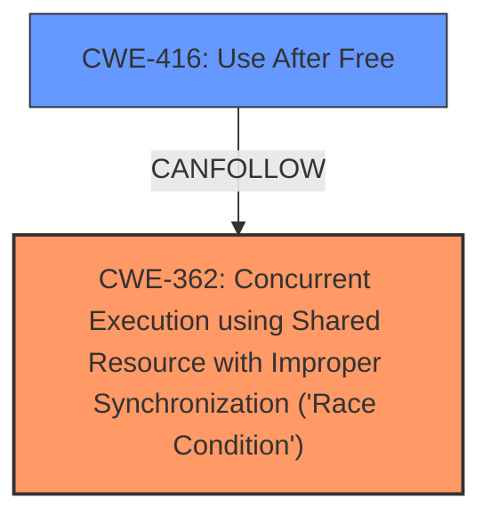

# Analysis Report for CVE-2024-50121

# Vulnerability Analysis Report: CVE-2024-50121

## Description

In the Linux kernel, the following vulnerability has been resolved nfsd cancel nfsd_shrinker_work using sync mode in nfs4_state_shutdown_net In the normal case, when we excute `echo 0 > /proc/fs/nfsd/threads`, the function `nfs4_state_destroy_net` in `nfs4_state_shutdown_net` will release all resources related to the hashed `nfs4_client`. If the `nfsd_client_shrinker` is running concurrently, the `expire_client` function will first unhash this client and then destroy it. This can lead to the following warning. Additionally, numerous use-after-free errors may occur as well. nfsd_client_shrinker echo 0 > /proc/fs/nfsd/threads expire_client nfsd_shutdown_net unhash_client ... nfs4_state_shutdown_net /* wont wait shrinker exit */ /* cancel_work(&nn->nfsd_shrinker_work) * nfsd_file for this /* wont destroy unhashed client1 */ * client1 still alive nfs4_state_destroy_net */ nfsd_file_cache_shutdown /* trigger warning */ kmem_cache_destroy(nfsd_file_slab) kmem_cache_destroy(nfsd_file_mark_slab) /* release nfsd_file and mark */ __destroy_client ==================================================================== BUG nfsd_file (Not tainted) Objects remaining in nfsd_file on __kmem_cache_shutdown() -------------------------------------------------------------------- CPU 4 UID 0 PID 764 Comm sh Not tainted 6.12.0-rc3+ #1 dump_stack_lvl+0x53/0x70 slab_err+0xb0/0xf0 __kmem_cache_shutdown+0x15c/0x310 kmem_cache_destroy+0x66/0x160 nfsd_file_cache_shutdown+0xac/0x210 [nfsd] nfsd_destroy_serv+0x251/0x2a0 [nfsd] nfsd_svc+0x125/0x1e0 [nfsd] write_threads+0x16a/0x2a0 [nfsd] nfsctl_transaction_write+0x74/0xa0 [nfsd] vfs_write+0x1a5/0x6d0 ksys_write+0xc1/0x160 do_syscall_64+0x5f/0x170 entry_SYSCALL_64_after_hwframe+0x76/0x7e ==================================================================== BUG nfsd_file_mark (Tainted G B W ) Objects remaining nfsd_file_mark on __kmem_cache_shutdown() -------------------------------------------------------------------- dump_stack_lvl+0x53/0x70 slab_err+0xb0/0xf0 __kmem_cache_shutdown+0x15c/0x310 kmem_cache_destroy+0x66/0x160 nfsd_file_cache_shutdown+0xc8/0x210 [nfsd] nfsd_destroy_serv+0x251/0x2a0 [nfsd] nfsd_svc+0x125/0x1e0 [nfsd] write_threads+0x16a/0x2a0 [nfsd] nfsctl_transaction_write+0x74/0xa0 [nfsd] vfs_write+0x1a5/0x6d0 ksys_write+0xc1/0x160 do_syscall_64+0x5f/0x170 entry_SYSCALL_64_after_hwframe+0x76/0x7e To resolve this issue, cancel `nfsd_shrinker_work` using synchronous mode in nfs4_state_shutdown_net.

## Vulnerability Description Key Phrases

- **Rootcause:** The `nfsd_client_shrinker` can concurrently unhash and destroy an `nfs4_client` while `nfs4_state_shutdown_net` is releasing resources related to the hashed `nfs4_client`. This race condition leads to a use-after-free vulnerability and warnings due to objects remaining in `nfsd_file` and `nfsd_file_mark` on shutdown.
- **Weakness:** Race condition between `nfsd_client_shrinker` and `nfs4_state_shutdown_net` during resource cleanup.
- **Impact:** Use-after-free errors and warnings due to inconsistent state of the `nfs4_client` and related resources during shutdown. The system can become unstable and crash.
- **Vector:** The vulnerability can be triggered by writing to `/proc/fs/nfsd/threads` to initiate the shutdown process, while the `nfsd_client_shrinker` is also active.
- **Attacker:** Local user with write access to `/proc/fs/nfsd/threads`
- **Product:** Linux Kernel
- **Version:** 6.12.0-rc3+
- **Component:** nfsd

## Analysis (with Relationship Data)

# Summary

| CWE ID | CWE Name | Confidence | CWE Abstraction Level | CWE Vulnerability Mapping Label | CWE-Vulnerability Mapping Notes |
|---|---|---|---|---|---|
| CWE-362 | Concurrent Execution using Shared Resource with Improper Synchronization ('Race Condition') | 0.9 | Class | Primary | Allowed-with-Review |
| CWE-416 | Use After Free | 0.8 | Variant | Secondary | Allowed |

## Evidence and Confidence

*   **Confidence Score:** 0.85
*   **Evidence Strength:** HIGH

## Relationship Analysis

The primary weakness is a **race condition** (CWE-362) that leads to a **use-after-free** (CWE-416). CWE-362 is a Class, but accurately captures the concurrent access issue. CWE-416 is a Variant, which is more specific and accurately describes the result of the race condition. CWE-362 can precede CWE-416, indicating a chain relationship. The selection of CWE-362 as the primary weakness and CWE-416 as a secondary weakness is based on the root cause and resulting impact.



## Vulnerability Chain

The vulnerability chain starts with a **race condition** (CWE-362) between `nfsd_client_shrinker` and `nfs4_state_shutdown_net`. This **race condition** results in a situation where resources are freed by one thread while another thread is still using them, leading to a **use-after-free** (CWE-416) vulnerability.
  - **Root Cause:** CWE-362: Concurrent Execution using Shared Resource with Improper Synchronization ('Race Condition')
  - **Impact:** CWE-416: Use After Free

## Summary of Analysis

The analysis is based on the provided vulnerability description and CVE reference links. The evidence clearly points to a **race condition** as the root cause, which leads to a **use-after-free** vulnerability. The vulnerability description states: "**The `nfsd_client_shrinker` can concurrently unhash and destroy an `nfs4_client` while `nfs4_state_shutdown_net` is releasing resources related to the hashed `nfs4_client`. This race condition leads to a use-after-free vulnerability and warnings due to objects remaining in `nfsd_file` and `nfsd_file_mark` on shutdown.**" The CVE reference links further confirm this by highlighting the race between `nfsd_client_shrinker` and `nfs4_state_shutdown_net` during resource cleanup and the resulting use-after-free.

The selection of CWE-362 and CWE-416 is at the optimal level of specificity. CWE-362 accurately describes the **concurrent execution** issue, while CWE-416 precisely describes the **use-after-free** vulnerability that results from the **race condition**.

Relevant CWE Information:

# Enhanced Context (25 CWEs)
The following CWEs were identified as potentially relevant to this vulnerability:

## CWE-362: Concurrent Execution using Shared Resource with Improper Synchronization ('Race Condition')
**Abstraction Level**: Class
**Similarity Score**: 0.76
**Source**: dense

**Description**:
The product contains a concurrent code sequence that requires temporary, exclusive access to a shared resource, but a timing window exists in which the shared resource can be modified by another code sequence operating concurrently.

**Mapping Guidance**:
- Usage: Allowed-with-Review
- Rationale: This CWE entry is a Class and might have Base-level children that would be more appropriate

**Explanation:** This CWE matches the **race condition** described in the vulnerability where two threads are accessing the same resource without proper synchronization, leading to unexpected behavior.

## CWE-367: Time-of-check Time-of-use (TOCTOU) Race Condition
**Abstraction Level**: Base
**Similarity Score**: 0.73
**Source**: dense

**Description**:
The product checks the state of a resource before using that resource, but the resource's state can change between the check and the use in a way that invalidates the results of the check. This can cause the product to perform invalid actions when the resource is in an unexpected state.

**Mapping Guidance**:
- Usage: Allowed
- Rationale: This CWE entry is at the Base level of abstraction, which is a preferred level of abstraction for mapping to the root causes of vulnerabilities.

**Explanation:** While a TOCTOU **race condition** is possible, the primary issue here is the lack of synchronization between the two threads, making CWE-362 a better fit.

## CWE-667: Improper Locking
**Abstraction Level**: Class
**Similarity Score**: 0.73
**Source**: dense

**Description**:
The product does not properly acquire or release a lock on a resource, leading to unexpected resource state changes and behaviors.

**Mapping Guidance**:
- Usage: Allowed-with-Review
- Rationale: This CWE entry is a Class and might have Base-level children that would be more appropriate

**Explanation:** While **improper locking** could contribute to a **race condition**, the core issue described is the **concurrent execution** without proper synchronization, making CWE-362 a better fit.

## CWE-366: Race Condition within a Thread
**Abstraction Level**: Base
**Similarity Score**: 0.73
**Source**: dense

**Description**:
If two threads of execution use a resource simultaneously, there exists the possibility that resources may be used while invalid, in turn making the state of execution undefined.

**Mapping Guidance**:
- Usage: Allowed
- Rationale: This CWE entry is at the Base level of abstraction, which is a preferred level of abstraction for mapping to the root causes of vulnerabilities.

**Explanation:** This CWE is too specific since the race condition is between two independent execution paths.

## CWE-404: Improper Resource Shutdown or Release
**Abstraction Level**: Class
**Similarity Score**: 0.72
**Source**: dense

**Description**:
The product does not release or incorrectly releases a resource before it is made available for re-use.

**Mapping Guidance**:
- Usage: Allowed-with-Review
- Rationale: This CWE entry is a Class and might have Base-level children that would be more appropriate

**Explanation:** While there's a problem during resource shutdown, the root cause is the **race condition**, not the shutdown process itself.

## CWE-755: Improper Handling of Exceptional Conditions
**Abstraction Level**: Class
**Similarity Score**: 0.71
**Source**: dense

**Description**:
The product does not handle or incorrectly handles an exceptional condition.

**Mapping Guidance**:
- Usage: Discouraged
- Rationale: This CWE entry is a level-1 Class (i.e., a child of a Pillar). It might have lower-level children that would be more appropriate

**Explanation:** This CWE is too general and doesn't accurately reflect the specific **race condition** and **use-after-free** vulnerability.

## CWE-833: Deadlock
**Abstraction Level**: Base
**Similarity Score**: 0.70
**Source**: dense

**Description**:
The product contains multiple threads or executable segments that are waiting for each other to release a necessary lock, resulting in deadlock.

**Mapping Guidance**:
- Usage: Allowed
- Rationale: This CWE entry is at the Base level of abstraction, which is a preferred level of abstraction for mapping to the root causes of vulnerabilities.

**Explanation:** A deadlock is not present in this scenario.

## CWE-617: Reachable Assertion
**Abstraction Level**: Base
**Similarity Score**: 0.70
**Source**: dense

**Description**:
The product contains an assert() or similar statement that can be triggered by an attacker, which leads to an application exit or other behavior that is more severe than necessary.

**Mapping Guidance**:
- Usage: Allowed
- Rationale: This CWE entry is at the Base level of abstraction, which is a preferred level of abstraction for mapping to the root causes of vulnerabilities.

**Explanation:** An assertion is not the primary issue.

## CWE-908: Use of Uninitialized Resource
**Abstraction Level**: Base
**Similarity Score**: 0.69
**Source**: dense

**Description**:
The product uses or accesses a resource that has not been initialized.

**Mapping Guidance**:
- Usage: Allowed
- Rationale: This CWE entry is at the Base level of abstraction, which is a preferred level of abstraction for mapping to the root causes of vulnerabilities.

**Explanation:** The resource is not uninitialized, it is being freed and then accessed.

## CWE-909: Missing Initialization of Resource
**Abstraction Level**: Class
**Similarity Score**: 0.69
**Source**:


## CWE Relationship Analysis

Current CWEs represent these abstraction levels: .


### Vulnerability Chain Analysis

**Chain starting from CWE-416:**
- 416 (Use After Free) - ROOT


**Chain starting from CWE-404:**
- 404 (Improper Resource Shutdown or Release) - ROOT


### CWE Relationship Diagram

```mermaid
graph TD
    classDef primary fill:#f96,stroke:#333,stroke-width:2px
    classDef secondary fill:#69f,stroke:#333
    classDef tertiary fill:#9e9,stroke:#333
```


*Report generated on 2025-07-13 19:53:58*
