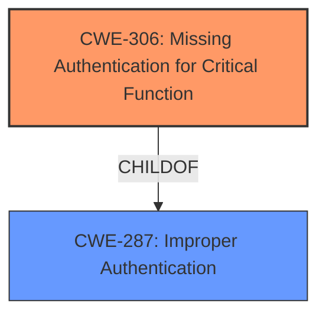

# Enhanced Analysis for CVE-2024-5013

# Summary
| CWE ID | CWE Name | Confidence | CWE Abstraction Level | CWE Vulnerability Mapping Label | CWE-Vulnerability Mapping Notes |
|---|---|---|---|---|---|
| CWE-306 | Missing Authentication for Critical Function | 0.75 | Base | Allowed | Primary CWE. The vulnerability allows an unauthenticated attacker to trigger the "SetAdminPassword" installation step, indicating a **missing authentication** check for a critical function. |

## Evidence and Confidence

*   **Confidence Score:** 0.75
*   **Evidence Strength:** MEDIUM

## Relationship Analysis
The primary identified weakness is CWE-306 (**Missing Authentication for Critical Function**). This is a base-level CWE that directly addresses the core issue: the absence of authentication for a critical function. The retriever results also list several CWEs related to authentication bypass or improper access control. While other CWEs like CWE-20 (**Improper Input Validation**) or CWE-74 (**Improper Neutralization of Special Elements in Output Used by a Downstream Component ('Injection')**) could be indirectly related, CWE-306 most accurately captures the **missing authentication** aspect described in the vulnerability.



## Vulnerability Chain
The vulnerability chain is relatively simple:

1.  **Root Cause:** CWE-306 (**Missing Authentication for Critical Function**) - The application **lacks authentication** for a critical function, specifically the "SetAdminPassword" installation step.
2.  **Impact:** Denial of Service - An unauthenticated attacker can trigger this step, rendering the application inaccessible.

## Summary of Analysis
The primary focus is on the **missing authentication** for the critical "SetAdminPassword" installation step. The vulnerability description clearly states that an "unauthenticated attacker" can trigger this step, leading to a denial of service. The "CVE Reference Links Content Summary" provides no additional information. The selection of CWE-306 is based on the direct evidence of **missing authentication** and its impact on application availability.

The other CWEs from the retriever results, such as CWE-20 (**Improper Input Validation**) or CWE-74 (**Improper Neutralization of Special Elements in Output Used by a Downstream Component ('Injection')**), are less relevant because the core issue is not about input validation or injection, but rather the **absence of authentication** for a critical function. CWE-306 is the most specific and accurate representation of the vulnerability based on the available evidence.


## CWE Relationship Analysis

Current CWEs represent these abstraction levels: .


### Vulnerability Chain Analysis

**Chain starting from CWE-306:**
- 306 (Missing Authentication for Critical Function) - ROOT


**Chain starting from CWE-287:**
- 287 (Improper Authentication) - ROOT


### CWE Relationship Diagram

```mermaid
graph TD
    classDef primary fill:#f96,stroke:#333,stroke-width:2px
    classDef secondary fill:#69f,stroke:#333
    classDef tertiary fill:#9e9,stroke:#333
```