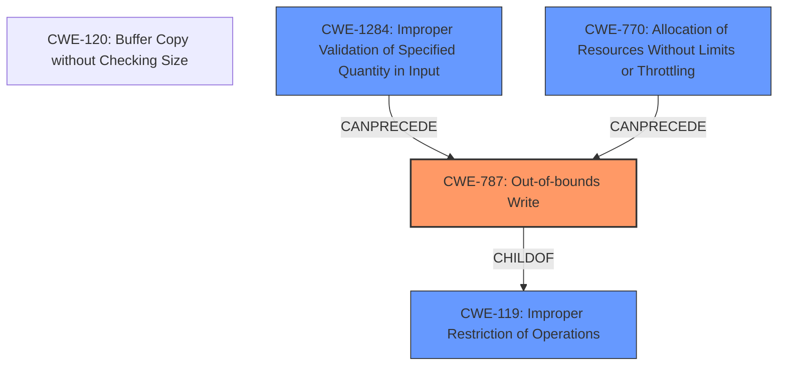

# Raw Analyzer Response for CVE-2024-50151

# Summary
| CWE ID    | CWE Name                                                                      | Confidence | CWE Abstraction Level | CWE Vulnerability Mapping Label | CWE-Vulnerability Mapping Notes |
| :---------- | :---------------------------------------------------------------------------- | :--------- | :---------------------- | :------------------------------ | :------------------------------ |
| CWE-787   | Out-of-bounds Write                                                           | 0.9        | Base                    | Primary                         | Allowed                       |
| CWE-119   | Improper Restriction of Operations within the Bounds of a Memory Buffer | 0.7        | Class                   | Secondary                       | Discouraged                   |
| CWE-770   | Allocation of Resources Without Limits or Throttling                      | 0.6        | Base                    | Secondary                       | Allowed                       |
| CWE-1284  | Improper Validation of Specified Quantity in Input                        | 0.5        | Base                    | Secondary                       | Allowed                       |

## Evidence and Confidence

*   **Confidence Score:** 0.8
*   **Evidence Strength:** HIGH

## Relationship Analysis
The primary weakness is CWE-787 (Out-of-bounds Write), a base-level CWE that directly describes the **writing off the end of a buffer**. This is a child of CWE-119 (Improper Restriction of Operations within the Bounds of a Memory Buffer), a more general class-level CWE. CWE-1284 (Improper Validation of Specified Quantity in Input) can precede CWE-787, as **missing input validation** could lead to an out-of-bounds write. CWE-770 (Allocation of Resources Without Limits or Throttling) is relevant because the initial buffer allocation is too small, and there are no checks to prevent writing beyond its boundaries when handling large user inputs.

## Vulnerability Chain
1.  The CIFS client allocates a fixed-size buffer (448 bytes) for SMB2 IOCTL requests (**ROOT CAUSE**).
2.  The user provides an input buffer larger than 328 bytes (**ROOT CAUSE**).
3.  The `smb2_set_next_command()` function **writes data beyond the allocated buffer**, resulting in an **out-of-bounds write** (CWE-787).
4.  This leads to **memory corruption** and potentially a **system crash or arbitrary code execution**.

## Summary of Analysis
The analysis identifies CWE-787 (Out-of-bounds Write) as the primary weakness because the core issue is the **writing of data beyond the allocated buffer**. The evidence clearly states that "smb2_set_next_command() will end up writing off the end of @rqst->iov[0].iov_base." This aligns directly with the definition of an out-of-bounds write. While CWE-119 (Improper Restriction of Operations within the Bounds of a Memory Buffer) is related, it's a broader category. CWE-787 is more specific and therefore a better fit.

CWE-1284 (Improper Validation of Specified Quantity in Input) is considered since the **user-provided input size isn't validated** against the buffer's capacity. This missing validation directly contributes to the out-of-bounds write. CWE-770 (Allocation of Resources Without Limits or Throttling) is also relevant because the code **allocates a small buffer without proper size checks**, leading to the overflow.

The retriever results, particularly the keyphrase analysis, supports the selection of CWE-787, CWE-119, CWE-1284 and CWE-770. The graph relationships further clarify how these CWEs are interconnected, with CWE-787 being a specific case of CWE-119, and CWE-1284/CWE-770 potentially preceding it.

CWE-125 (Out-of-bounds Read) was considered, but the vulnerability description explicitly mentions a **write**, not a read. Other CWEs like CWE-266, CWE-532, and CWE-88 are not directly related to the **memory corruption** aspect of this vulnerability.

The chosen CWEs are at the optimal level of specificity because they accurately reflect the root cause (**out-of-bounds write**), the contributing factor (**lack of input validation**), and the memory allocation issue, providing a comprehensive understanding of the vulnerability.